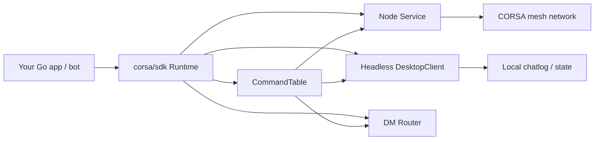
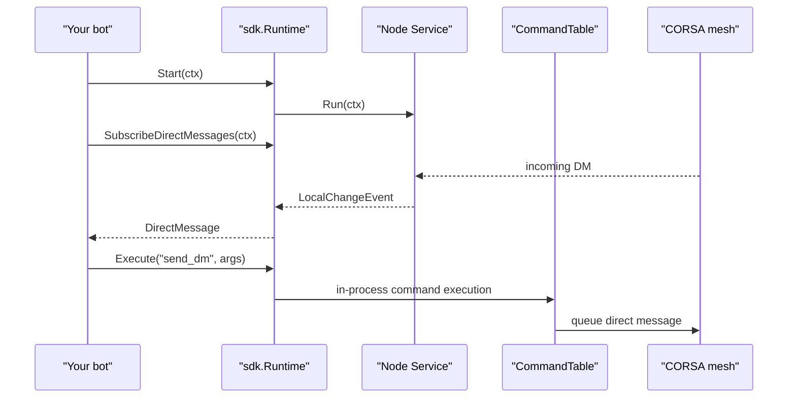
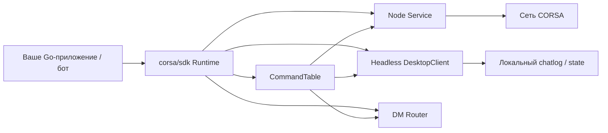
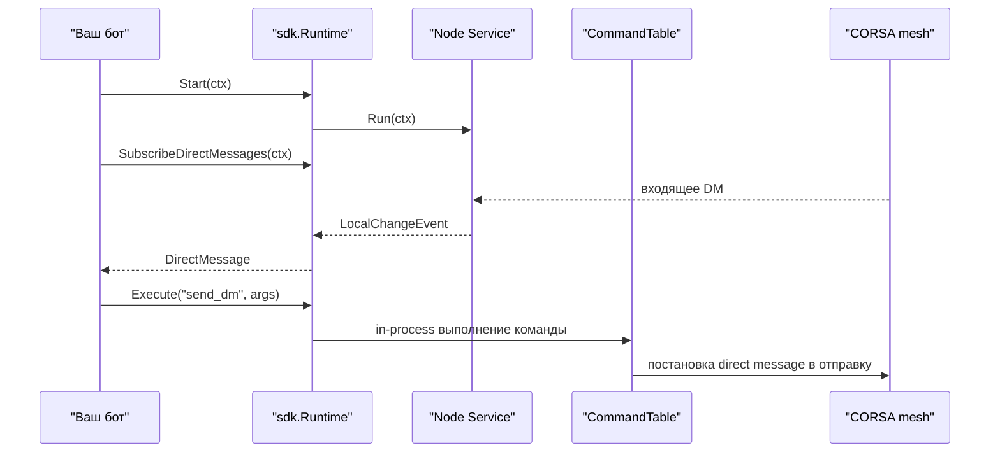

# CORSA SDK

## English

`corsa/sdk` turns this repository into an embeddable Go SDK.

What the SDK gives you:

- start a CORSA node from Go code
- configure the node via Go structs instead of environment variables
- execute the same command layer used by the desktop console, but in-process
- subscribe to decrypted incoming direct messages
- build bots and services on top of the existing mesh

### Installation

The SDK is available as a public Go module.

Install it in another project with:

```bash
go get github.com/piratecash/corsa@latest
```

The repository module path is:

```go
module github.com/piratecash/corsa
```

Import the SDK package:

```go
import "github.com/piratecash/corsa/sdk"
```

Important:

- use `go get` to add a module dependency to your project
- use `go install` only when you want to install a binary command such as `cmd/corsa-node`
- for SDK usage, import `github.com/piratecash/corsa/sdk`

### Using From Another Project

Example external project:

```go
module mybot

go 1.26.1

require github.com/piratecash/corsa v0.0.0
```

```go
package main

import (
	"context"
	"log"

	"github.com/piratecash/corsa/sdk"
)

func main() {
	cfg := sdk.DefaultConfig()
	cfg.Node.ListenAddress = ":64648"
	cfg.Node.AdvertiseAddress = "127.0.0.1:64648"

	runtime, err := sdk.New(cfg)
	if err != nil {
		log.Fatal(err)
	}

	if err := runtime.Start(context.Background()); err != nil {
		log.Fatal(err)
	}
}
```

### Architecture



### Runtime Flow



### Quick Start

```go
package main

import (
	"context"
	"log"

	"github.com/piratecash/corsa/sdk"
)

func main() {
	cfg := sdk.DefaultConfig()
	cfg.Node.ListenAddress = ":64648"
	cfg.Node.AdvertiseAddress = "127.0.0.1:64648"
	cfg.Node.ChatLogDir = ".corsa-bot"
	cfg.Node.IdentityPath = ".corsa-bot/identity-64648.json"
	cfg.Node.TrustStorePath = ".corsa-bot/trust-64648.json"
	cfg.Node.QueueStatePath = ".corsa-bot/queue-64648.json"
	cfg.Node.PeersStatePath = ".corsa-bot/peers-64648.json"

	runtime, err := sdk.New(cfg)
	if err != nil {
		log.Fatal(err)
	}

	if err := runtime.Start(context.Background()); err != nil {
		log.Fatal(err)
	}
}
```

### Command Execution

The SDK uses the same command handlers as the desktop console and RPC layer, but without an HTTP hop.

Structured execution:

```go
result, err := runtime.Execute("send_dm", map[string]interface{}{
	"to":   peerAddress,
	"body": "Sic Parvis Magna",
})
```

Console-style execution:

```go
result, err := runtime.ExecuteCommand(`send_dm to=` + peerAddress + ` body="Sic Parvis Magna"`)
```

Both paths hit the same in-process `CommandTable`.

### Incoming Messages

```go
messages := runtime.SubscribeDirectMessages(ctx)
for msg := range messages {
	_, err := runtime.Execute("send_dm", map[string]interface{}{
		"to":   msg.Sender,
		"body": "Sic Parvis Magna",
	})
	if err != nil {
		log.Printf("reply failed: %v", err)
	}
}
```

### Example Bot

See: `examples/sic-parvis-magna-bot/main.go`

This example:

- starts a local node
- listens for decrypted incoming DMs
- replies to every incoming message with `Sic Parvis Magna`

---

## Русский

`corsa/sdk` делает этот репозиторий встраиваемым Go SDK.

Что даёт SDK:

- запуск CORSA-ноды из Go-кода
- настройку через Go-структуры, а не через `env`
- выполнение того же слоя команд, который использует desktop-консоль, но in-process
- подписку на расшифрованные входящие direct messages
- возможность писать своих ботов и сервисы поверх mesh-сети

### Установка

SDK доступен как публичный Go-модуль.

Подключение из другого проекта:

```bash
go get github.com/piratecash/corsa@latest
```

Путь модуля в репозитории:

```go
module github.com/piratecash/corsa
```

Импорт SDK-пакета:

```go
import "github.com/piratecash/corsa/sdk"
```

Важно:

- `go get` используется для добавления зависимости в проект
- `go install` нужен только для установки бинарников, например `cmd/corsa-node`
- для SDK используется пакет `github.com/piratecash/corsa/sdk`

### Использование из другого проекта

Пример внешнего проекта:

```go
module mybot

go 1.26.1

require github.com/piratecash/corsa v0.0.0
```

```go
package main

import (
	"context"
	"log"

	"github.com/piratecash/corsa/sdk"
)

func main() {
	cfg := sdk.DefaultConfig()
	cfg.Node.ListenAddress = ":64648"
	cfg.Node.AdvertiseAddress = "127.0.0.1:64648"

	runtime, err := sdk.New(cfg)
	if err != nil {
		log.Fatal(err)
	}

	if err := runtime.Start(context.Background()); err != nil {
		log.Fatal(err)
	}
}
```

### Архитектура



### Как это работает



### Быстрый старт

```go
package main

import (
	"context"
	"log"

	"github.com/piratecash/corsa/sdk"
)

func main() {
	cfg := sdk.DefaultConfig()
	cfg.Node.ListenAddress = ":64648"
	cfg.Node.AdvertiseAddress = "127.0.0.1:64648"
	cfg.Node.ChatLogDir = ".corsa-bot"
	cfg.Node.IdentityPath = ".corsa-bot/identity-64648.json"
	cfg.Node.TrustStorePath = ".corsa-bot/trust-64648.json"
	cfg.Node.QueueStatePath = ".corsa-bot/queue-64648.json"
	cfg.Node.PeersStatePath = ".corsa-bot/peers-64648.json"

	runtime, err := sdk.New(cfg)
	if err != nil {
		log.Fatal(err)
	}

	if err := runtime.Start(context.Background()); err != nil {
		log.Fatal(err)
	}
}
```

### Выполнение команд

SDK использует тот же `CommandTable`, что и desktop-консоль и HTTP RPC, но без сетевого RPC-канала.

Структурированный вызов:

```go
result, err := runtime.Execute("send_dm", map[string]interface{}{
	"to":   peerAddress,
	"body": "Sic Parvis Magna",
})
```

В стиле консоли:

```go
result, err := runtime.ExecuteCommand(`send_dm to=` + peerAddress + ` body="Sic Parvis Magna"`)
```

### Входящие сообщения

```go
messages := runtime.SubscribeDirectMessages(ctx)
for msg := range messages {
	_, err := runtime.Execute("send_dm", map[string]interface{}{
		"to":   msg.Sender,
		"body": "Sic Parvis Magna",
	})
	if err != nil {
		log.Printf("reply failed: %v", err)
	}
}
```

### Пример минибота

Смотрите: `examples/sic-parvis-magna-bot/main.go`

Этот пример:

- поднимает локальную ноду
- слушает расшифрованные входящие DM
- на любое входящее сообщение отвечает `Sic Parvis Magna`
