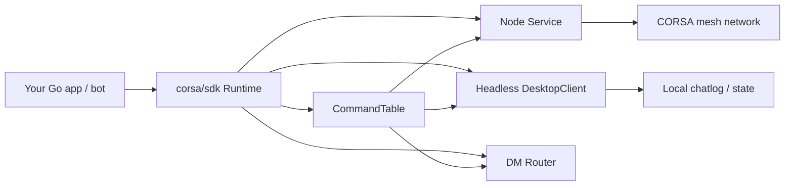
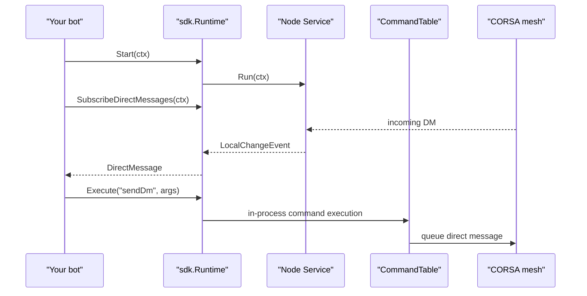
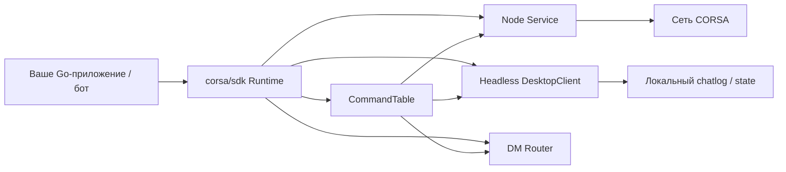
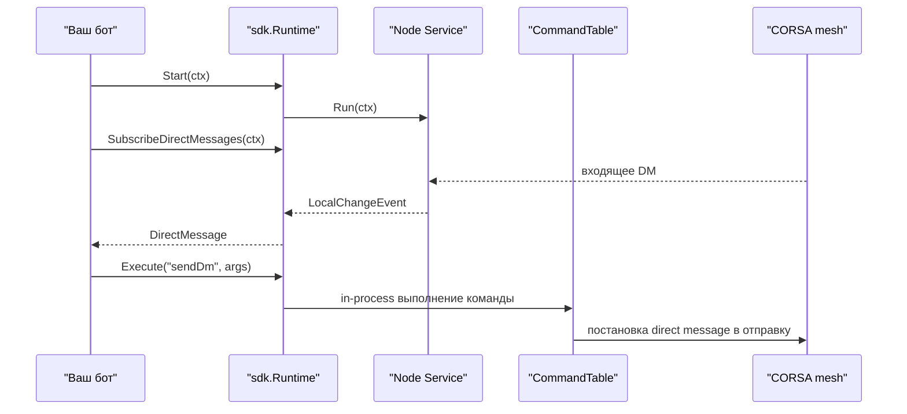

# CORSA SDK

## English

`corsa/sdk` turns this repository into an embeddable Go SDK.

What the SDK gives you:

- start a CORSA node from Go code
- configure the node via Go structs instead of environment variables
- execute the same command layer used by the desktop console, but in-process
- subscribe to decrypted incoming direct messages
- build bots and services on top of the existing mesh

### Installation

The SDK is available as a public Go module.

Install it in another project with:

```bash
go get github.com/piratecash/corsa@latest
```

The repository module path is:

```go
module github.com/piratecash/corsa
```

Import the SDK package:

```go
import "github.com/piratecash/corsa/sdk"
```

Important:

- use `go get` to add a module dependency to your project
- use `go install` only when you want to install a binary command such as `cmd/corsa-node`
- for SDK usage, import `github.com/piratecash/corsa/sdk`

### Using From Another Project

Example external project:

```go
module mybot

go 1.26.1

require github.com/piratecash/corsa v0.0.0
```

```go
package main

import (
	"context"
	"log"
	"os/signal"
	"syscall"

	"github.com/piratecash/corsa/sdk"
)

func main() {
	cfg := sdk.DefaultConfig()
	cfg.Node.ListenAddress = ":64648"
	// AdvertisePort must be set explicitly when binding to a non-default port —
	// the SDK never auto-derives the advertised port from ListenAddress.
	advertisePort := uint16(64648)
	cfg.Node.AdvertisePort = &advertisePort

	// The context that ends the node: Ctrl-C or SIGTERM.
	ctx, stop := signal.NotifyContext(context.Background(), syscall.SIGINT, syscall.SIGTERM)
	defer stop()

	runtime, err := sdk.NewWithContext(ctx, cfg)
	if err != nil {
		log.Fatal(err)
	}

	// Run starts the node and BLOCKS until it stops. Returning from main right
	// after Start would kill the process while the node was still coming up:
	// Close never runs, the drains never happen, and SQLite is left to recover
	// its WAL on the next start. Run returns only once the runtime is fully
	// down, and its error carries any failure of that shutdown.
	if err := runtime.Run(ctx); err != nil {
		log.Fatal(err)
	}
}
```

### Architecture


```mermaid
flowchart LR
    App["Your Go app / bot"] --> SDK["corsa/sdk Runtime"]
    SDK --> CT["CommandTable"]
    SDK --> Node["Node Service"]
    SDK --> Desktop["Headless DesktopClient"]
    SDK --> Router["DM Router"]
    CT --> Node
    CT --> Desktop
    CT --> Router
    Node --> Mesh["CORSA mesh network"]
    Desktop --> Chatlog["Local chatlog / state"]
```

### Runtime Flow


```mermaid
sequenceDiagram
    participant Bot as "Your bot"
    participant SDK as "sdk.Runtime"
    participant Node as "Node Service"
    participant Cmd as "CommandTable"
    participant Mesh as "CORSA mesh"

    Bot->>SDK: Start(ctx)
    SDK->>Node: Run(ctx)
    Bot->>SDK: SubscribeDirectMessages(ctx)
    Mesh-->>Node: incoming DM
    Node-->>SDK: LocalChangeEvent
    SDK-->>Bot: DirectMessage
    Bot->>SDK: Execute("sendDm", args)
    SDK->>Cmd: in-process command execution
    Cmd->>Mesh: queue direct message
```

### Identity

The SDK never auto-generates a new identity. Each consumer must supply
identity explicitly using one of two methods:

**Option 1 — PrivateKey string (preferred for production bots):**

```go
cfg.Node.PrivateKey = "base64-encoded-ed25519-private-key"
```

The X25519 box key pair is derived deterministically from the Ed25519 seed —
the same PrivateKey always produces the same identity address and box key.

**Option 2 — existing identity file:**

```go
cfg.Node.IdentityPath = "/path/to/identity.json"
```

The file must already exist. For development convenience, `sdk.EnsureIdentityFile(path)` 
creates a new identity file if one does not exist yet.

If neither `PrivateKey` nor a valid `IdentityPath` is provided, `sdk.New()` returns an error.

`NodeConfig.PrivateKey` is tagged `json:"-"` and redacted by `NodeConfig.String` /
`GoString`, so marshalling or printing a `Config` — into a support bundle, a crash
report, a settings file — cannot publish the signing key. `RPCConfig.Password` is
handled the same way. Reading the field back gives the real value; only the generic
serialisation and formatting paths are closed. See [encryption.md](encryption.md).

**The runtime keeps no secrets.** `Runtime.Config()` returns the normalized config
with `Node.PrivateKey` and `RPC.Password` **empty**: both are consumed during
construction — the private key becomes the node's identity, the password goes into
the RPC server's own config — and the runtime deliberately does not retain them.
That is not belt-and-braces on top of the redaction above; it is the only thing
that works here. `fmt` calls `String` / `GoString` / `Format` on a value it can
reach, and it can reach none of them through an **unexported** field: printing a
struct that holds a `Config` privately walks it by reflection and prints the key
verbatim, and numeric verbs (`%d`, `%x`) skip `Stringer` even on exported paths.
`Runtime` additionally implements `fmt.Formatter`, so every verb renders one
redacted line. Any type of your own that stores a `Config` in an unexported field
must do the same, or hold a `Config` that carries no secrets.

### State database

`sdk.New` opens the node's shared SQLite state database before it builds any
service, and `Runtime.Close` releases it after the node's background jobs have
joined.

Opening is not instantaneous — an integrity check over the whole file, possibly
a wait for another process's write lock, possibly migrations — so
`sdk.NewWithContext(ctx, cfg)` takes a caller's context for that work.
`sdk.New(cfg)` is the same call with a background context. The context governs
CONSTRUCTION only: the node runs under the context given to `Start`, and the
runtime is released by `Close`.

`Runtime.Wait` returns only once that shutdown has finished, and its error
carries both the run's own failure and any failure of the shutdown. It also
returns for a runtime that was closed without ever being started — that path
has no node goroutine to report an outcome, and a waiter would otherwise block
on a runtime whose database is already closed.

Every waiter gets the SAME outcome. `Wait` is a broadcast: the result is stored
and the channel only signals that the runtime is down, so a shutdown failure
reaches all of them rather than whichever one happened to read first. `Start`
returns that same outcome when it fails after the router is already up, and so
does `Run` — a caller that never waits would otherwise not learn that the
shutdown could not finish and left the database open. Concurrent `Start` calls
get it too: a failing attempt releases the lifecycle lock to run its own Close,
and callers arriving in that window wait for the attempt to settle instead of
reading a half-written result. A caller
returning from `Wait` is entitled to exit the process immediately — the SDK
example does — so delivering the result any earlier would race the background
writes, the bus and router drains and the database close against process exit.

The teardown order is a contract, not a preference: RPC server and SDK
operations, router sends and loops, the node itself, then the node's
fire-and-forget jobs — which are its last WRITERS and publish as they finish,
so they join while the bus and router are still there to receive it — then
those consumers, and only then the database. A database that cannot be opened, verified or migrated fails `New` —
there is no mode where a runtime comes up unable to persist. See
[storage.md](storage.md).

By default the file is `chatlog-<identity_short>-<port>.db` inside
`Node.ChatLogDir`. `Node.StateDBPath` overrides the location outright:

```go
cfg.Node.StateDBPath = "/var/lib/corsa-bot/state.db"
```

Nothing is copied from the default location into an explicit one — an empty
file there is a deliberately new database.

### Идентификация

SDK никогда не создаёт identity автоматически. Каждый потребитель должен
предоставить identity явно одним из двух способов:

**Способ 1 — строка PrivateKey (рекомендуется для продакшен-ботов):**

```go
cfg.Node.PrivateKey = "base64-encoded-ed25519-private-key"
```

X25519 box key пара деривируется детерминистически из Ed25519 seed —
один и тот же PrivateKey всегда даёт один и тот же identity address и box key.

**Способ 2 — существующий файл identity:**

```go
cfg.Node.IdentityPath = "/path/to/identity.json"
```

Файл должен уже существовать. Для удобства разработки `sdk.EnsureIdentityFile(path)`
создаёт новый файл identity, если его ещё нет.

Если ни `PrivateKey`, ни валидный `IdentityPath` не указаны, `sdk.New()` возвращает ошибку.

`NodeConfig.PrivateKey` помечен `json:"-"` и редактируется в `NodeConfig.String` /
`GoString`, поэтому маршалинг или печать `Config` — в support-архив, в отчёт о
падении, в файл настроек — не публикует ключ подписи. С `RPCConfig.Password` то же
самое. Чтение поля даёт настоящее значение; закрыты только общие пути сериализации
и форматирования. См. [encryption.md](encryption.md).

**Runtime не хранит секретов.** `Runtime.Config()` возвращает нормализованную
конфигурацию с ПУСТЫМИ `Node.PrivateKey` и `RPC.Password`: оба потребляются при
конструировании — приватный ключ становится identity узла, пароль уходит в
собственную конфигурацию RPC-сервера, — и runtime намеренно их не удерживает.
Это не «на всякий случай» поверх редактирования выше, а единственное, что здесь
работает. `fmt` вызывает `String` / `GoString` / `Format` только у значения, до
которого может дотянуться, а через **неэкспортируемое** поле не дотягивается ни до
одного: печать структуры, приватно хранящей `Config`, обходит её рефлексией и
печатает ключ дословно, а числовые глаголы (`%d`, `%x`) пропускают `Stringer` даже
на экспортированных путях. `Runtime` дополнительно реализует `fmt.Formatter`,
поэтому любой глагол выдаёт одну редактированную строку. Ваш собственный тип,
хранящий `Config` в неэкспортируемом поле, обязан сделать так же — или хранить
`Config` без секретов.

### Quick Start

```go
package main

import (
	"context"
	"log"
	"os/signal"
	"syscall"

	"github.com/piratecash/corsa/sdk"
)

func main() {
	cfg := sdk.DefaultConfig()
	cfg.Node.ListenAddress = ":64648"
	// AdvertisePort must be set explicitly when binding to a non-default port —
	// the SDK never auto-derives the advertised port from ListenAddress.
	advertisePort := uint16(64648)
	cfg.Node.AdvertisePort = &advertisePort
	cfg.Node.ChatLogDir = ".corsa-bot"
	cfg.Node.IdentityPath = ".corsa-bot/identity-64648.json"
	cfg.Node.TrustStorePath = ".corsa-bot/trust-64648.json"
	cfg.Node.PeersStatePath = ".corsa-bot/peers-64648.json"

	// SDK does not auto-generate identity — create file for first run.
	if err := sdk.EnsureIdentityFile(cfg.Node.IdentityPath); err != nil {
		log.Fatal(err)
	}

	// The context that ends the node: Ctrl-C or SIGTERM.
	ctx, stop := signal.NotifyContext(context.Background(), syscall.SIGINT, syscall.SIGTERM)
	defer stop()

	runtime, err := sdk.NewWithContext(ctx, cfg)
	if err != nil {
		log.Fatal(err)
	}

	// Run starts the node and BLOCKS until it stops. Returning from main right
	// after Start would kill the process while the node was still coming up:
	// Close never runs, the drains never happen, and SQLite is left to recover
	// its WAL on the next start. Run returns only once the runtime is fully
	// down, and its error carries any failure of that shutdown.
	if err := runtime.Run(ctx); err != nil {
		log.Fatal(err)
	}
}
```

### Command Execution

The SDK uses the same command handlers as the desktop console and RPC layer, but without an HTTP hop.

`Execute` and `ExecuteCommand` run under the runtime's OWN context, which is
cancelled when the shutdown reaches its operation drain. A command may
legitimately block for longer than that budget — a resolve waits up to 8
seconds while the drain gives 5 — so without a context a `Close` arriving
mid-command declared the shutdown incomplete, `Wait` reported an error and the
database was deliberately left open. `ExecuteContext` and
`ExecuteCommandContext` take a caller's context as well — as well, not instead:
the command ends when either that context or the runtime's shutdown does, so
passing `context.Background` cannot opt out of the drain. `SendDirectMessage`
is merged the same way, and the send path underneath it now carries that
context all the way to the node: it used to take a context and then reach the
node through a context-free call, so an already-cancelled caller still imported
the contact and still sent the message.

Cancellation is checked BEFORE the node acts and not after. Local dispatch is
synchronous and cannot be interrupted, so a context that ends mid-call prevents
nothing — and discarding the reply at that point threw away the message ID the
node had just generated for a message it had already stored and queued, so the
retry sent a duplicate under a new ID.

Structured execution:

```go
result, err := runtime.Execute("sendDm", map[string]interface{}{
	"to":   peerAddress,
	"body": "Sic Parvis Magna",
})
```

Console-style execution:

```go
result, err := runtime.ExecuteCommand(`sendDm to=` + peerAddress + ` body="Sic Parvis Magna"`)
```

Both paths hit the same in-process `CommandTable`.

### Incoming Messages

```go
messages := runtime.SubscribeDirectMessages(ctx)
for msg := range messages {
	_, err := runtime.Execute("sendDm", map[string]interface{}{
		"to":   msg.Sender,
		"body": "Sic Parvis Magna",
	})
	if err != nil {
		log.Printf("reply failed: %v", err)
	}
}
```

### Example Bot

See: `examples/sic-parvis-magna-bot/main.go`

This example:

- starts a local node
- listens for decrypted incoming DMs
- replies to every incoming message with `Sic Parvis Magna`

---

## Русский

`corsa/sdk` делает этот репозиторий встраиваемым Go SDK.

Что даёт SDK:

- запуск CORSA-ноды из Go-кода
- настройку через Go-структуры, а не через `env`
- выполнение того же слоя команд, который использует desktop-консоль, но in-process
- подписку на расшифрованные входящие direct messages
- возможность писать своих ботов и сервисы поверх mesh-сети

### Установка

SDK доступен как публичный Go-модуль.

Подключение из другого проекта:

```bash
go get github.com/piratecash/corsa@latest
```

Путь модуля в репозитории:

```go
module github.com/piratecash/corsa
```

Импорт SDK-пакета:

```go
import "github.com/piratecash/corsa/sdk"
```

Важно:

- `go get` используется для добавления зависимости в проект
- `go install` нужен только для установки бинарников, например `cmd/corsa-node`
- для SDK используется пакет `github.com/piratecash/corsa/sdk`

### Использование из другого проекта

Пример внешнего проекта:

```go
module mybot

go 1.26.1

require github.com/piratecash/corsa v0.0.0
```

```go
package main

import (
	"context"
	"log"
	"os/signal"
	"syscall"

	"github.com/piratecash/corsa/sdk"
)

func main() {
	cfg := sdk.DefaultConfig()
	cfg.Node.ListenAddress = ":64648"
	// AdvertisePort обязательно указывать явно при не-дефолтном bind-порту —
	// SDK не выводит advertise-порт из ListenAddress автоматически.
	advertisePort := uint16(64648)
	cfg.Node.AdvertisePort = &advertisePort

	// The context that ends the node: Ctrl-C or SIGTERM.
	ctx, stop := signal.NotifyContext(context.Background(), syscall.SIGINT, syscall.SIGTERM)
	defer stop()

	runtime, err := sdk.NewWithContext(ctx, cfg)
	if err != nil {
		log.Fatal(err)
	}

	// Run starts the node and BLOCKS until it stops. Returning from main right
	// after Start would kill the process while the node was still coming up:
	// Close never runs, the drains never happen, and SQLite is left to recover
	// its WAL on the next start. Run returns only once the runtime is fully
	// down, and its error carries any failure of that shutdown.
	if err := runtime.Run(ctx); err != nil {
		log.Fatal(err)
	}
}
```

### Архитектура


```mermaid
flowchart LR
    App["Ваше Go-приложение / бот"] --> SDK["corsa/sdk Runtime"]
    SDK --> CT["CommandTable"]
    SDK --> Node["Node Service"]
    SDK --> Desktop["Headless DesktopClient"]
    SDK --> Router["DM Router"]
    CT --> Node
    CT --> Desktop
    CT --> Router
    Node --> Mesh["Сеть CORSA"]
    Desktop --> Chatlog["Локальный chatlog / state"]
```

### Как это работает


```mermaid
sequenceDiagram
    participant Bot as "Ваш бот"
    participant SDK as "sdk.Runtime"
    participant Node as "Node Service"
    participant Cmd as "CommandTable"
    participant Mesh as "CORSA mesh"

    Bot->>SDK: Start(ctx)
    SDK->>Node: Run(ctx)
    Bot->>SDK: SubscribeDirectMessages(ctx)
    Mesh-->>Node: входящее DM
    Node-->>SDK: LocalChangeEvent
    SDK-->>Bot: DirectMessage
    Bot->>SDK: Execute("sendDm", args)
    SDK->>Cmd: in-process выполнение команды
    Cmd->>Mesh: постановка direct message в отправку
```

### База состояния

`sdk.New` открывает общую SQLite-базу состояния ноды до создания сервисов, а
`Runtime.Close` освобождает её после завершения фоновых задач ноды.

Открытие не мгновенно — проверка целостности всего файла, возможное ожидание
чужой блокировки записи, возможные миграции, — поэтому
`sdk.NewWithContext(ctx, cfg)` принимает контекст вызывающего на эту работу.
`sdk.New(cfg)` — тот же вызов с фоновым контекстом. Контекст управляет только
КОНСТРУИРОВАНИЕМ: нода работает под контекстом, переданным в `Start`, а runtime
освобождается через `Close`.

`Runtime.Wait` возвращает управление только после того, как это завершение
произошло, а его ошибка несёт и отказ самого прогона, и отказ остановки. Он
возвращается и для runtime, закрытого без запуска: на этом пути нет горутины
ноды, которая сообщила бы исход, и ожидающий иначе висел бы на runtime, чья база
уже закрыта.

Все ожидающие получают ОДИН И ТОТ ЖЕ исход. `Wait` — это broadcast: результат
хранится отдельно, а канал лишь сигнализирует о завершении, поэтому ошибка
остановки доходит до всех, а не до того, кто прочитал первым. `Start` при
неудаче после поднятия роутера возвращает тот же самый исход, и `Run` вместе с
ним, — иначе вызывающий, который не ждёт, не узнал бы, что остановка не
завершилась и база осталась открытой. Конкурентные `Start` получают его тоже:
неуспешная попытка отпускает lifecycle-lock, чтобы выполнить собственный Close,
и вызовы, попавшие в это окно, дожидаются её итога вместо чтения
недописанного.
Вернувшийся из `Wait` вызывающий вправе тут же завершить процесс — так и делает
пример SDK, — поэтому отдача результата раньше устроила бы гонку фоновых
записей, drain шины и роутера и закрытия базы с выходом процесса.

Порядок остановки — контракт, а не предпочтение: RPC-сервер и операции SDK,
отправки и циклы роутера, сама нода, затем её fire-and-forget задачи — они
последние ПИСАТЕЛИ и публикуют результат по завершении, поэтому присоединяются,
пока шина и роутер ещё на месте, — затем эти потребители, и только потом база. База,
которую не удалось открыть, проверить или мигрировать, приводит к ошибке `New` —
режима, в котором runtime поднимается без возможности персистенции, нет. См.
[storage.md](storage.md).

По умолчанию файл — `chatlog-<identity_short>-<port>.db` внутри
`Node.ChatLogDir`. `Node.StateDBPath` переопределяет расположение полностью:

```go
cfg.Node.StateDBPath = "/var/lib/corsa-bot/state.db"
```

Из расположения по умолчанию в явное ничего не копируется — пустой файл там
означает осознанно новую базу.

### Быстрый старт

```go
package main

import (
	"context"
	"log"
	"os/signal"
	"syscall"

	"github.com/piratecash/corsa/sdk"
)

func main() {
	cfg := sdk.DefaultConfig()
	cfg.Node.ListenAddress = ":64648"
	// AdvertisePort must be set explicitly when binding to a non-default port —
	// the SDK never auto-derives the advertised port from ListenAddress.
	advertisePort := uint16(64648)
	cfg.Node.AdvertisePort = &advertisePort
	cfg.Node.ChatLogDir = ".corsa-bot"
	cfg.Node.IdentityPath = ".corsa-bot/identity-64648.json"
	cfg.Node.TrustStorePath = ".corsa-bot/trust-64648.json"
	cfg.Node.PeersStatePath = ".corsa-bot/peers-64648.json"

	// SDK does not auto-generate identity — create file for first run.
	if err := sdk.EnsureIdentityFile(cfg.Node.IdentityPath); err != nil {
		log.Fatal(err)
	}

	// The context that ends the node: Ctrl-C or SIGTERM.
	ctx, stop := signal.NotifyContext(context.Background(), syscall.SIGINT, syscall.SIGTERM)
	defer stop()

	runtime, err := sdk.NewWithContext(ctx, cfg)
	if err != nil {
		log.Fatal(err)
	}

	// Run starts the node and BLOCKS until it stops. Returning from main right
	// after Start would kill the process while the node was still coming up:
	// Close never runs, the drains never happen, and SQLite is left to recover
	// its WAL on the next start. Run returns only once the runtime is fully
	// down, and its error carries any failure of that shutdown.
	if err := runtime.Run(ctx); err != nil {
		log.Fatal(err)
	}
}
```

### Выполнение команд

SDK использует тот же `CommandTable`, что и desktop-консоль и HTTP RPC, но без сетевого RPC-канала.

`Execute` и `ExecuteCommand` выполняются под СОБСТВЕННЫМ контекстом runtime, который отменяется, когда остановка доходит до drain операций. Команда может законно блокироваться дольше этого бюджета — resolve ждёт до 8 секунд, а drain даёт 5, — поэтому без контекста `Close`, пришедший во время команды, объявлял остановку незавершённой, `Wait` возвращал ошибку, а база намеренно оставалась открытой. `ExecuteContext` и `ExecuteCommandContext` принимают контекст вызывающего в
ДОПОЛНЕНИЕ, а не взамен: команда завершается по любому из двух — контексту
вызывающего или остановке runtime, — поэтому `context.Background` не позволяет
уклониться от drain. `SendDirectMessage` объединяется так же, а путь отправки под
ним теперь доносит этот контекст до самой ноды: раньше он принимал контекст, но
доходил до ноды через вызов без контекста, поэтому уже отменённый вызывающий
всё равно импортировал контакт и всё равно отправлял сообщение.

Отмена проверяется ДО того, как нода что-то сделает, и не проверяется после.
Локальная диспетчеризация синхронна и не прерывается, поэтому контекст,
закончившийся посреди вызова, ничего не предотвращает, — а отбрасывание ответа в
этот момент выбрасывало ID сообщения, только что сгенерированный нодой для уже
сохранённого и поставленного в очередь сообщения, и повтор отправлял дубликат
под новым ID.

Структурированный вызов:

```go
result, err := runtime.Execute("sendDm", map[string]interface{}{
	"to":   peerAddress,
	"body": "Sic Parvis Magna",
})
```

В стиле консоли:

```go
result, err := runtime.ExecuteCommand(`sendDm to=` + peerAddress + ` body="Sic Parvis Magna"`)
```

### Входящие сообщения

```go
messages := runtime.SubscribeDirectMessages(ctx)
for msg := range messages {
	_, err := runtime.Execute("sendDm", map[string]interface{}{
		"to":   msg.Sender,
		"body": "Sic Parvis Magna",
	})
	if err != nil {
		log.Printf("reply failed: %v", err)
	}
}
```

### Пример минибота

Смотрите: `examples/sic-parvis-magna-bot/main.go`

Этот пример:

- поднимает локальную ноду
- слушает расшифрованные входящие DM
- на любое входящее сообщение отвечает `Sic Parvis Magna`
