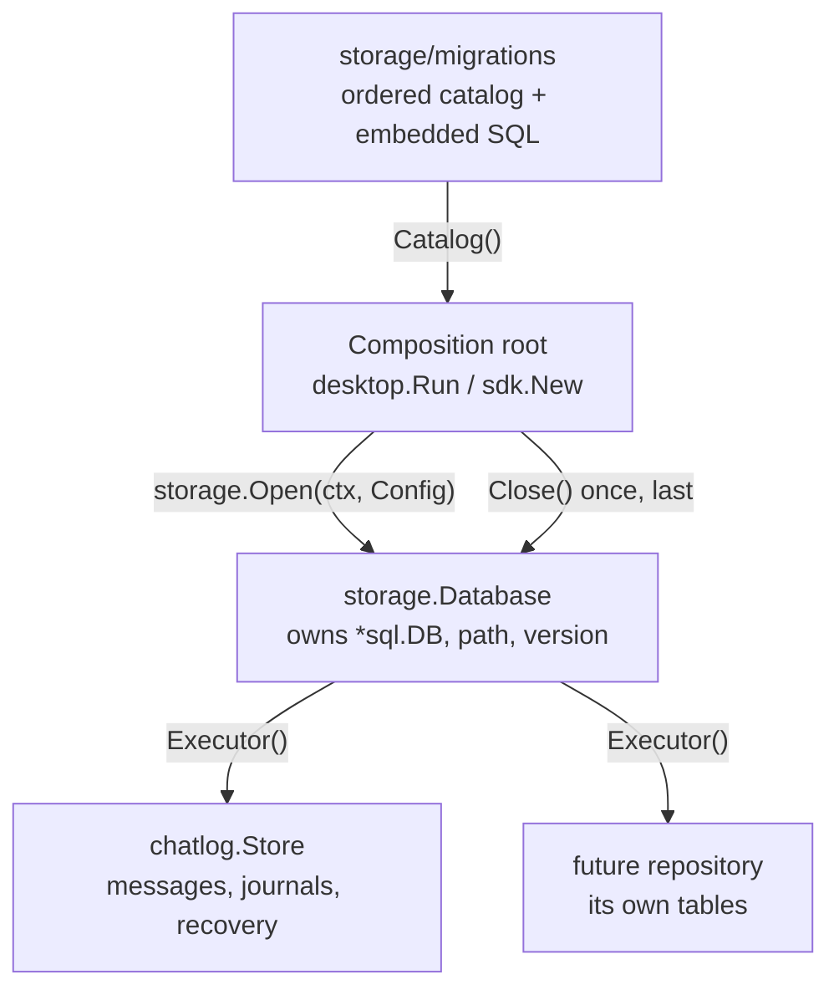
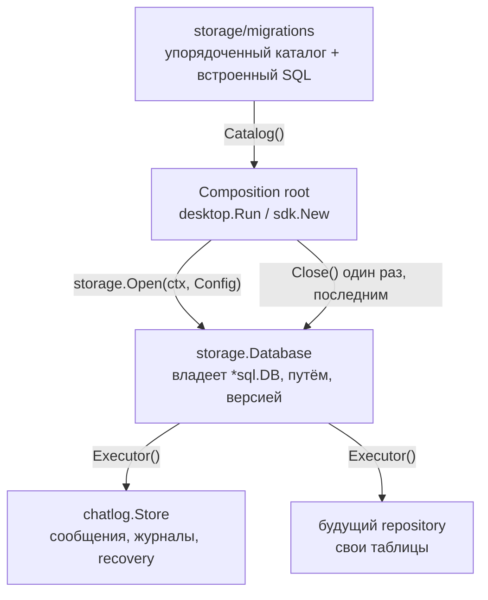

# Shared State Database and Schema Migrations

## English

### Overview

`internal/core/storage` owns the single SQLite file a Corsa node keeps its
durable state in. It is the only place that selects a driver, opens a
connection pool, checks the file, versions the schema and closes the database.
Repositories — today `internal/core/chatlog`, tomorrow any other subsystem —
receive a non-owning `storage.Executor` and issue SQL against it.

`Executor` exposes only the context-taking methods (`ExecContext`,
`QueryContext`, `QueryRowContext`, `BeginTx`). There is no context-free
`Exec`/`Query`/`Begin` on it, so every statement a repository issues carries
the caller's context and a cancelled request or a shutdown actually stops the
query rather than leaving it holding a connection while the database closes
underneath it.

The split exists because a shared file needs a single owner. When each package
opened its own database and created its own tables with `CREATE TABLE IF NOT
EXISTS`, nothing could tell "the schema is current" apart from "a table with
that name exists in some other shape", and a failure to open was reported by a
store object that silently swallowed every write.

### What lives where



*Diagram 1 — Ownership of the shared state database*

### File location

By default the database is the historical chatlog file inside the data
directory (`CORSA_CHATLOG_DIR`, defaults to `.corsa/`):

```
chatlog-<identity_short>-<port>.db
```

The name is kept deliberately. Rolling back to an older binary must find the
full history where that binary looks for it, and moving a live WAL database to
a new name is a risk with no matching benefit. The historical name does not
restrict which tables the file may hold.

`CORSA_STATE_DB_PATH` (`config.Node.StateDBPath`) overrides the location. An
explicit path always wins and **nothing is copied into it**: pointing at an
empty file means a deliberately new database, and an older binary will not see
it. Renaming the default is a separate configuration migration, possible only
after the rollback window for pre-versioned binaries closes.

### Startup sequence

`storage.Open(ctx, Config)` performs these steps in order, and every one of
them can abort startup:

1. validate the migration catalog — before the file is touched at all;
2. resolve the path and create its directory with mode `0700`;
3. open the driver and `PingContext`;
4. `PRAGMA integrity_check`, before anything is written;
5. read `PRAGMA application_id` and reject any non-zero value that is not ours
   as somebody else's database — a read, nothing is stamped yet;
6. put the file into WAL journal mode, retrying while another process is doing
   the same;
7. refuse a database that carries this application's marks yet records no
   migration history, then prove the ledger's own shape before anything reads
   it;
8. read the recorded schema version, then stamp `application_id` on a file that
   records none;
9. apply migration version 1, which creates `storage_metadata` AND records the
   owner identity in the same transaction;
10. verify the recorded owner — a read, never a write;
11. apply the remaining migrations in order;
12. re-verify the whole reference schema and the ledger;
13. re-read the runner-owned markers — verify only, no repair;
14. `PRAGMA foreign_key_check`.

The path travels as a `file:` URI rather than pasted in front of the DSN
options. Both drivers cut a plain path at its first `?` to find their
parameters, so a database at `/data/state?backup.db` silently opened
`/data/state` while `Location()` and every log line named the file the operator
had asked for.

Building that URI is filesystem-dependent, so `fileURI` takes the separator as
an argument — a Windows path can then be tested on a POSIX builder, which is
the only place the tests run. On Windows the separators become `/` (a
backslash left in place is percent-encoded as `%5C`, i.e. a character in a file
name rather than a directory boundary) and a leading `/` is prepended:
`C:\dir\state.db` becomes `file:///C:/dir/state.db`. Without that slash the URI
authority — everything from `//` to the next `/` — swallowed the drive letter,
and SQLite refused the DSN with `invalid uri authority`, which is every Windows
start of the node failing at `Open`. A UNC path already begins with its own two
separators and keeps them, so `\\host\share\state.db` becomes
`file:////host/share/state.db`: an empty authority again, and SQLite maps the
path back to the `\\host\share` form. A POSIX path is left alone, backslashes
included — there they are legal characters in a file name.

`ErrCorrupt` means the FILE is broken — the driver refused it as
not-a-database, or a check reported violations. A check that could not RUN is
not corruption: a cancelled caller is the everyday case, and `errorClass` tests
`ErrCorrupt` before cancellation, so classing it that way told the operator
their healthy database was damaged. The opposite mistake is just as bad —
dropping the class for every run failure reported a genuinely malformed file as
a plain SQL error — so the two are separated explicitly.

Every refusal writes one structured event before `Open` returns — `error_class`,
the RESOLVED path and its `path_source`, the same terms the startup line uses.
Logging the configured value instead could name a different file from the one
actually opened, a relative `StateDBPath` being the everyday case; when
resolution is itself what failed, the configured value is reported with
`path_resolved: false`. The source stays inside its own set — `explicit` or
`legacy-default` — because the operator's CHOICE is known even when the
location is not, and a third value there would be one every consumer of these
logs has to learn. The event is written — not only a migration step that started
and failed. Corruption, a foreign application, an owner mismatch and a catalog
rejected before the file is even located all abort startup with nothing
applied, and the first of those happen before the opening line is written; the
operator would otherwise have seen the process exit with no trace of why.

Both checks report their PASSING result into the ready log line —
`integrity_check` and `foreign_key_violations` — so an operator can tell a
database that was checked from one where the checks never ran.

The file this package creates is created owner-only, before the driver is
handed the path: SQLite would create it 0644 minus umask, and the `-wal` and
`-shm` sidecars inherit that mode. The directory mode only helps when this
package creates the directory too, which an explicit `StateDBPath` in an
existing world-readable directory does not. Message bodies are encrypted, but
the rows still say who talked to whom and when.

An EXISTING file is left alone until the open SUCCEEDS. Up to that point it may
belong to another application or another identity and may be about to be
refused, so nothing about it is this package's to rewrite; a database that is
refused keeps exactly the permissions it had. The sidecars are narrowed early ONLY for a file this run created — such a file
cannot belong to anyone else. Setting WAL mode does not create them, so an
empty transaction asks for them first and they are secured before the ledger
and before the bootstrap migration. That step exists for Windows, where SQLite
creates them without a security descriptor and they would inherit the
directory's ACL; on Unix they inherit the main file's mode, which is already
owner-only.

For a file that was already there, nothing is touched until the owner check —
not before it, because the database may belong to another identity, and not
from inside the claiming transaction either. The claim is not durable until
that transaction commits, and a permission change cannot be rolled back with
it: a failed read-back, a failed condition or a cancelled context would undo
the claim and leave the change behind, with no way to put it back.

The database ITSELF waits for the owner check and is narrowed straight after
it, and so are its sidecars — unless the file is one this run may treat as its
own, which is the only case where they are secured earlier.

"Its own" means created by this open, and nothing else. Zero length says "not
a database"; it does not say "mine" — pre-creating an empty `StateDBPath` is
documented, and another process could have made that file a moment ago. So
every pre-existing file, empty or not, is left exactly as it is until the owner
check has spoken: a refused open must change nothing, and a permission change
cannot be rolled back with the transaction that failed.

The cost is stated rather than hidden: an open that fails AFTER writing —
a failed bootstrap, say — leaves a non-empty file, and the retry then adopts it
like any other existing file. On Windows its sidecars carry the directory's ACL
until the owner check, which is the same window every adoption has. Closing it
would mean re-permissioning a file whose owner is still unknown, and that is
the larger risk of the two.

On Windows the POSIX mode bits are not the guarantee: Go maps them to the
read-only attribute while the actual permissions come from the directory's
inherited ACL. There the same call applies a protected owner-only DACL, the way
`internal/core/node` already does for identity secrets. The Unix tests check
mode bits and say nothing about that path.

The read-only checks come first on purpose. Switching the journal mode is a
WRITE, so doing it earlier would convert somebody else's database to WAL and
only then reject it with `ErrForeignApplication` — a refusal that already
modified what it refused.

An absent ledger means "pre-versioned" only for a file with no owner metadata.
The OWNER TABLE is the proof on its own: `storage_metadata` is created by the
bootstrap migration and that migration's ledger row commits in the same
transaction, so a file that has the table has recorded at least one version —
an EMPTY ledger beside it is damage as surely as a missing one.

The marker plays no part in that decision, deliberately. Requiring
`application_id` as well was a hole: clearing it on a versioned database and
dropping the ledger made the file look pre-versioned, and every version was
then recorded afresh over the existing schema, hiding the loss of the checksum
history. The rows are what is checked, not the table name: a `DELETE FROM
schema_migrations`, or a swap for an empty table of the right shape, leaves the
name in place and the history gone. Creating or accepting one turned
a deleted or swapped migration history into an empty one, and every version was
then recorded afresh over a schema nobody had checked — the one state this
mechanism exists to detect. Adoption is unaffected, because a pre-versioned
file carries neither mark.

Stamping waits for the recorded version (step 8), and the owner row is written
inside the transaction of the version that creates its table (step 9), never
afterwards.

Writing it afterwards left a window that no version number can close. The
tempting rule — "a file at version 1 holds no data, so a missing owner row
there is just an interrupted bootstrap; adopt it" — is false for the case that
matters. ADOPTION is the normal path here: a pre-versioned chatlog file already
holds its entire message history, and version 1 only adds the table that says
who owns it. A process killed between the two commits left that history
unowned, and the next identity to open the file could write itself in as its
owner. Committed together, history and owner cannot come apart.

So there is no version at which a missing owner row means "new". It is DAMAGE,
like an unstamped file that already carries a ledger, and both are reported —
`ErrOwnerMismatch` and `ErrForeignApplication` — never repaired.

Step 6 is not a formality. Journal mode belongs to the FILE, not to a
connection, and switching it needs an exclusive lock that SQLite refuses with
`SQLITE_BUSY` immediately — it does not route this one through `busy_timeout`.
Setting it from the DSN therefore made two nodes starting at the same moment
against the same fresh database race, and the loser failed to start. It is now
set once, with a bounded retry that confirms success by the mode the pragma
reports rather than by the absence of an error.

Ownership is settled between step 8 and step 10 on purpose: reading the owner
needs the metadata table to exist, and no further schema of ours belongs in a
file that turns out to belong to another identity.

Every step takes the caller's context. `storage` never creates a background
context of its own.

### Failure is fatal, and the file is never repaired

`Open` returns `(*Database, error)`. There is no degraded mode: a node does not
start on a database whose schema it cannot prove.

A corrupt file is **not** renamed aside and replaced by an empty one. That was
tolerable when the file held only chat history; with several kinds of state in
one file, a silent rebuild is silent multi-subsystem data loss. Recovery from a
backup is a separate, explicit operation.

The typed failures, all matchable with `errors.Is`:

| Error | Meaning |
|---|---|
| `ErrCatalogInvalid` | the embedded catalog is malformed (duplicate, gapped, unordered, missing verifier) |
| `ErrSchemaTooNew` | the file was migrated by a newer binary |
| `ErrMigrationDrift` | a recorded version has a different name or checksum than the catalog |
| `ErrSchemaIncompatible` | an existing object has an unexpected shape |
| `ErrOwnerMismatch` | the file belongs to another identity |
| `ErrForeignApplication` | `application_id` is set to a non-Corsa value |
| `ErrCorrupt` | the file is not a readable database, or a check reported violations |

### The migration ledger

```sql
CREATE TABLE schema_migrations (
    version    INTEGER PRIMARY KEY,
    name       TEXT NOT NULL UNIQUE,
    checksum   TEXT NOT NULL,
    applied_at TEXT NOT NULL
);
```

`checksum` is the SHA-256 of the embedded SQL. `PRAGMA user_version` is
deliberately not used as a second source of truth. The ledger must be a
contiguous prefix `1..N`; a hole means a version was deleted or applied out of
order, and running the missing step now would execute it against a schema its
author never saw.

The ledger table is verified like any other. `CREATE TABLE IF NOT EXISTS` is a
no-op against a `schema_migrations` that already exists in some other shape, so
one without the primary key, without the `UNIQUE` name or with unexpected
columns would be adopted and then trusted as the version history everything
else here reads from. Duplicate versions are rejected explicitly rather than
collapsed into the first row that wins, and a ledger carrying triggers is
refused outright — a trigger sits between the runner's INSERT and the read-back
that confirms it.

The recorded row is then proven, not assumed: after writing it the runner reads
it back inside the same transaction and checks it says what was written.
`RowsAffected` alone is not evidence — it counts what the INSERT touched, and
an `AFTER INSERT` trigger is free to delete or rewrite that row while SQLite
still reports one affected row.

Each migration runs on a dedicated connection inside an explicit
`BEGIN IMMEDIATE`. The write lock is taken *before* the version is re-read, so
two processes starting at the same moment cannot both decide the step is
missing. The DDL, its structural verification and the ledger row commit
together, which gives four guarantees:

- a process killed mid-step leaves either the whole version or none of it;
- two concurrent openers apply each version exactly once;
- any failure — SQL, verification or ledger write — rolls the whole step back;
- version `N+1` never runs after `N` failed.

Migration SQL must not contain `BEGIN`/`COMMIT`: the runner owns the
transaction, and catalog validation rejects a statement that starts with one.

### Forward-only

There is no `Down` at runtime. Rolling a binary back is served by
expand/contract releases: ship a backward-compatible extension first, let both
binaries live with the same schema, backfill and switch readers in later
releases, and only remove old columns once the rollback window is closed.

A published migration is never edited or renumbered. Its checksum is recorded,
so an edit aborts startup as drift. Two branches that both claim the next
number must resolve the conflict at merge time — that is a useful, explicit
conflict about shared schema.

### Adopting the pre-versioned database

An existing installation has no ledger, so its file is treated as version 0 and
migrated forward in place. No export, `ATTACH`, copy or dual write is involved:
the owner of the same SQLite file changes, the rows do not.

Every chatlog migration uses `CREATE ... IF NOT EXISTS`, which on such a file is
a no-op — and an unverified no-op would stamp a version onto tables nobody
checked. That is why every migration carries a mandatory verifier.

The verifier compares the live schema against a **reference database**: the
catalog is executed into a private in-memory SQLite, and the schema that comes
out is the expectation. SQLite, not this package, is what interprets the DDL.

Every object the reference contains must exist in the file with the same type,
the same owning table and the same definition. Only layout, comments and an
optional `IF NOT EXISTS` are normalised away; case and string literals are
compared byte for byte, because `('dm','global')` and `('DM','GLOBAL')` are
different constraints.

Executing rather than parsing is the point. Earlier versions derived the
expectation from the migration text — first property by property, then by
picking out the `CREATE` statements — and both were wrong the same way: they
only understood what they had been taught to look for. A `CHECK` hidden in a
comment, a literal differing only in case, a generated column
`PRAGMA table_info` does not report, an unexpected foreign key, and later an
`ALTER` or a `DROP` whose effect no parser modelled — each was a way for the
real schema and its stated shape to differ. A reference produced by running the
statements has no such gap, and `ALTER`, `DROP` and `CREATE TRIGGER` need no
support of their own: whatever the SQL does, the reference ends up in the state
the migration actually produces.

The scratch database is opened with the SAME connection semantics as
production, foreign keys included: a bare one has them off, so a catalog whose
data violates one would validate and then fail after the real file had already
changed. Each migration is executed there the way the runner executes it — on a
pinned connection, inside `BEGIN IMMEDIATE`. The transaction boundary is part
of what the statements mean: a deferred foreign key is checked at COMMIT, so a
migration inserting a child before its parent is correct in a transaction and
fails in autocommit, and validating it outside one would reject a step that
applies cleanly. Temporary objects are refused there too — a TEMP trigger never reaches
the file, lingers on the pooled connection the migration ran on, and vanishes
on restart.

Beyond the reference, three things are rejected on the tables the catalog owns:

- an **undeclared trigger** — it runs between the statement a repository issues
  and the row it expects afterwards, so an `AFTER INSERT` can delete the message
  just stored and hand the caller a successful INSERT with nothing saved;
- an **undeclared unique index** — it changes which rows the table accepts, and
  no idempotent DDL would repair that;
- an **incoming foreign key** from a table the catalog knows nothing about —
  `foreign_key_check` passes as long as its rows resolve, and then the first
  delete of a referenced message fails because an undeclared table holds it.
  Parent names are matched case-insensitively over ASCII, which is how SQLite
  compares identifiers — Go's Unicode folding would make the distinct tables
  `Å` and `å` one, and an undeclared table would pass as the managed one whose
  name it resembles. A table matching a LATER version's declaration in full is
  not an undeclared table: its foreign key is the one that migration will
  declare itself.

Objects are matched by type AND name, never by name alone: SQLite lets a table
and a trigger share one, and a same-named trigger could otherwise mask the
table it collides with. An object allowed only because a LATER version declares
it must match that declaration in full, not merely in name.

An extra non-unique index is deliberately tolerated: it is a performance
decision that changes no row a repository may write, so an operator's
hand-added index must not stop the node from starting.

Mid-upgrade the two references differ on purpose. What must exist is the
reference at the version being applied; what may exist is the reference for the
whole catalog — a pre-versioned database can already hold an index a later
version declares, and calling that unexpected would stop the upgrade before
reaching the version that declares it.

The whole reference is re-checked on EVERY open, not only for the versions
applied on that run, and the ledger is re-checked with it. A recorded version
was otherwise never looked at again, so a table dropped or a trigger added after
a successful start survived every later start too, and the repository met it at
runtime instead.

Line endings are pinned. The SQL is embedded verbatim and its SHA-256 goes
into every database's ledger, so a checkout that rewrote those files to CRLF —
Windows with `core.autocrlf` — would embed different bytes and record a
different checksum, and a database migrated by that build would then be refused
by an official one as drift, in both directions. `.gitattributes` holds the
files at LF so the SQL that RUNS is byte-for-byte the reviewed SQL, and the
checksum folds CRLF to LF so an already-recorded one stays valid whatever the
file went through. The fold changes nothing for an LF checkout, so no existing
ledger is affected.

`ValidateCatalog` builds the reference before the database file is opened, so
SQL that does not execute, two versions colliding over one object, and a
migration reaching into the ledger are all refused while nothing has been
touched. A migration that changes DATA must supply `Migration.Invariant` —
`CREATE TABLE ... AS SELECT` counts, because it copies rows, while
`CREATE VIEW ... AS SELECT` does not, because it copies none — since executing
without error proves nothing about what was written. The keyword is only read
at parenthesis depth zero: a column declared `GENERATED ALWAYS AS (...)` sits
inside the column list and copies nothing.

A migration may only change the state database, and only inside the runner's
transaction. Statements starting with `BEGIN`, `COMMIT`, `ROLLBACK`,
`SAVEPOINT`, `RELEASE` or `END` are refused because the runner owns the
transaction; `ATTACH`, `DETACH`, `VACUUM` and `PRAGMA` are refused because
their effect leaves it. This matters at validation time, not only at run time:
the reference is built by EXECUTING the catalog, so an `ATTACH` would write to
another file while the state database is still unopened, and outside the WAL
transaction this package promises. `PRAGMA` is in that list because the
runner's own markers are pragmas — a migration restamping `application_id`
finished its own open cleanly and made the next one fail.

`Migration.Invariant` runs INSIDE the migration's transaction, on its pinned
connection, after the ledger row has been written and read back — and its
failure rolls the whole step back, so version N+1 never runs after a failure at
N. That is the guarantee this runner exists for, and it is why the condition
cannot be moved outside the transaction where a failure would arrive too late
to undo anything.

The condition runs on a handle that hides `ExecContext`, with the connection
sealed by `PRAGMA query_only` for the duration, so SQLite refuses a write. Two
cheap checks follow the call: the seal is re-read, because a pragma reports
only its FINAL state, and `BEGIN IMMEDIATE` must fail, because a `BEGIN` that
SUCCEEDS proves the condition closed the transaction. Either one fails the
step.

None of that is a sandbox, and it is not meant to be one — see **What this
protects against** below. What actually proves the file intact is the
observation in the next paragraph.

### The runner's own rows are compared, not parsed

Before a migration runs, the runner reads its own rows — every ledger entry and
the owner row IN FULL, `bootstrap_version` and `created_at` included — and
compares them again after the statements, and once more after the condition.
The only difference allowed is the row this step records for itself.

`bootstrap_version` is also read on every open rather than merely carried: it
names the `storage_metadata` contract that wrote the file, and a value this
binary does not write means the layout is not the one it expects — higher is
`ErrSchemaTooNew`, anything else `ErrSchemaIncompatible`.

This is where "a migration cannot damage the ledger or the owner row" lives. It
is an OBSERVED fact: it holds whatever route the statements took — a trigger, a
view, a spelling no scanner recognised — because it looks at the rows rather
than at the text that changed them.

Because the condition holds the migration's own transaction, its reads are one
consistent snapshot by construction: everything it sees is the state that
transaction created, and no other process can commit into the middle of it.

On top of that observation the catalog is also SCANNED for statements that act
on the runner's tables, so the mistake is reported at validation with the
version and the name in the message instead of surfacing as a failed step.

The scan reads one thing: the statement's SUBJECT — the table after `INTO`,
`FROM`, `UPDATE`, `TABLE`, or after `ON` when the statement creates an index or
a trigger (and only then: the `ON` of a view's join condition names a column,
not a target) — in every spelling that names the same table: bare,
double-quoted, bracketed, single-quoted (SQLite reads a literal in that
position as an identifier), schema-qualified, and separated by any whitespace
SQLite accepts, form feed and vertical tab included. A leading `WITH` is
stepped over: a CTE only prepares rows for the statement that follows it.

A `CREATE TRIGGER` fragment has TWO subjects. Statements are split at
semicolons and the first one inside a trigger body falls before the first
semicolon, so the fragment carries both the table the trigger is attached to
and the table its first line writes to. Reading only the former let a trigger
on an ordinary table rewrite the owner row — and the row comparison cannot see
that one, because the trigger does not fire during the migration that installs
it but on some ordinary write long afterwards.

That is a deliberate retreat from walking table lists, aliases and subqueries.
Every version of that walk was wrong in both directions at once — a table
behind a parenthesis went unseen while a column that merely shared a name was
refused — and each fix produced the next pair. The subject is enough for what
this rule is for: in SQLite a statement that MODIFIES a table always names it
as its subject, so no write can hide from it. What the scan no longer reports
is a READ of those tables, which changes nothing in the file; the tests list
those cases explicitly, so the retreat is written down rather than assumed.

The scan is a convenience, not the boundary. It reads TEXT and a hand-written
reader of SQL can be wrong in either direction; when the two disagree, the
comparison of rows is what decides.

### What this protects against

Migrations are reviewed Go and SQL compiled into the binary. They are not
untrusted input, and this package does not try to sandbox them: a full SQL
sandbox would quickly be larger, and easier to get wrong, than the migrations
it guards.

What it does defend against is a developer MISTAKE reaching a user's file — a
migration that quietly does nothing on a pre-versioned database, one that
rewrites a table it only meant to extend, one that touches the ledger. The
guarantees are deliberately few and each is checkable: one transaction per
step, the whole schema verified against a reference derived from the catalog,
the runner's own rows compared before and after, and tests that hold those
lines.

A missing index or a missing table is created by the idempotent DDL. A table
whose definition differs cannot be, so it stops startup with
`ErrSchemaIncompatible` and the version is not recorded.

#### Both drivers run the contract

The cgo driver (`github.com/mattn/go-sqlite3`) ships on Android only, and no CI
runner runs Android — so the driver contract suite used to exercise the pure-Go
driver alone, and any divergence in DSN handling, WAL or transaction semantics
would have been discovered in an Android build.

The file is therefore no longer called `driver_android.go`: a `_android.go`
suffix is itself a GOOS constraint that no build tag can override. It is
`driver_cgo.go`, selected by `GOOS=android` OR the `sqlite_cgo` tag, and
`make test-cgo` runs the storage and chatlog suites against it on an ordinary
machine. CI runs that target alongside the normal one.

It earned its place immediately: the two drivers report a refused write at
different moments — modernc.org/sqlite from the call, mattn/go-sqlite3 from the
iteration — and two tests had been asserting on the moment rather than on the
outcome.

#### Which shapes exist in the field

The pre-versioned schema went through three generations, all of which are
still out there, and each has a frozen fixture in
`internal/core/storage/migrations/testdata`:

| Generation | Landed in | Tables |
|---|---|---|
| 1 | commit `a99fb10` | `messages` + its four indexes |
| 2 | commit `2987836`, **shipped in release v1.0.64** | + `seen_ack`, `delivery_failed` |
| 3 | commit `9267953` | + `decrypt_recovery_jobs`, `peer_established`, `decrypt_recovery_cycles`, `decrypt_resend_intents` |

Generation 3 landed *after* the v1.0.64 release bump, so it exists only in
development builds — a released installation is at generation 2, and that is
the shape most upgrades will actually start from. The `messages` table itself
never changed across any of them, which is why the exact-column verifier is
safe for all three.

The adoption, end-to-end upgrade and rollback tests run against every
generation, and each asserts up front that its fixture really lacks the later
tables — otherwise a fixture that quietly grew them would make "the migration
created this table" untestable.

### Adding a subsystem

Three explicit steps, none of which involves `chatlog`:

1. add `NNNN_<domain>.sql` and a catalog entry with the next version and a
   verifier;
2. write a repository with its own domain types and SQL;
3. build it from the composition root with `database.Executor()`.

There is no generic key/value or blob API. Tables are domain-explicit; the
existing `messages` name is kept for compatibility and belongs to the chatlog
repository.

### Drivers

Two drivers are kept, selected by build tag:

- non-Android: `modernc.org/sqlite` — pure Go, so node/SDK/headless builds
  cross-compile with `CGO_ENABLED=0`;
- Android: `github.com/mattn/go-sqlite3` — cgo, already compiled through the
  NDK by the gogio build.

modernc compiles for `GOOS=android` only because Android also carries the
`linux` build tag; the platform is absent from its support matrix, so a
successful compile proves nothing about ABI, WAL locking or crash recovery.
Standardising on mattn instead would cost every other target its CGO-free
cross-compilation. So the unification is of the *contract*, not the
implementation: one catalog, one set of repository statements, two thin
platform configurations.

Both DSNs set the same per-connection semantics — `busy_timeout=5000`,
`foreign_keys=ON`, `secure_delete=ON` and `synchronous=FULL` — and the driver
contract suite asserts them together with the journal mode.

`secure_delete` is here because this file holds chat history. Without it a
`DELETE` only unlinks the page, and the message body stays legible in the
free space of the database file — which would make deleting a message a
promise kept against SQL queries and broken against anyone who reads the
file. The cost is one extra write per freed page, invisible next to the work
around it.

WAL adds a second half to that promise: the zeroing of a freed page is itself
a log frame, so the ORIGINAL page content survives in the `-wal` file until a
checkpoint retires it. Automatic checkpoints happen at ~4 MB of log and at
close, which is fine for ordinary writes and not fine for a deletion whose
whole point is that the content stops existing. The delete paths therefore
follow their commit with an explicit `wal_checkpoint(TRUNCATE)`
(`chatlog.CheckpointWAL`), best-effort: a busy checkpoint is not a failed
deletion, and the automatic one still comes.

`synchronous=FULL` is stated rather than inherited, and that is the third
half of the same promise. In WAL mode a `COMMIT` under `synchronous=NORMAL`
returns once the log is in the operating system's cache: fast, and for most
applications correct, but here it means a user can be told their messages are
deleted and have them come back after a power cut. FULL is SQLite's own
default — but a COMPILE-TIME one, so a driver built with
`SQLITE_DEFAULT_WAL_SYNCHRONOUS=1` would hand out NORMAL and nothing in this
repository would notice. The DSN says it, and `TestOpenCommitsSynchronously`
keeps it said. The cost is one fsync per commit, paid by a client that writes
at human speed.

The write-ahead log is truncated before Open calls the database ready
(`checkpointWAL`, with the retry described above). What it holds is two
things that must not outlive their reason: the pre-migration image of every
page a step rewrote, so a data-touching migration would leave the old
content in a sidecar file until the log filled; and, from a PREVIOUS run
that died between a deletion and its checkpoint, the bytes of erased
messages — the automatic checkpoint fires at ~1000 pages, which a quiet
client can take days to reach.

After a migration it is MANDATORY: those pages exist because this very Open
rewrote them, and declaring the database ready with them still in the log
would be this process leaving the trace, so a failure is returned from Open
and the node does not start. On an ordinary open it is best-effort — the log
may hold nothing sensitive at all, and refusing to start over a busy
checkpoint would be an outage we inflicted on ourselves.

`journal_mode` is deliberately **not** in either DSN. It is a property of the
file rather than of a connection, so setting it there made every pooled
connection attempt the switch; `ensureWALMode` does it once during Open
instead, after the file has been verified and with the retry described above.

### Shutdown

`Database.Close` is idempotent and must be the last thing to run. Both
composition roots follow the same order — `desktop.Run` through its window
shutdown hook, the SDK inside `Runtime.Close`:

1. stop the RPC server, so no new external command enters the command table;
2. drain the router's in-flight sends, then stop its long-lived loops;
3. cancel the node and wait for `Service.Run` to return;
4. wait for `Service.WaitBackground`: the node's fire-and-forget jobs are its
   last WRITERS, and they publish as they finish — so they are joined while the
   bus and the router are still there to receive it;
5. drain the event bus, then the router's remaining in-flight work;
6. `Database.Close()` once.

The router keeps two contexts for this. `loopCtx` belongs to the long-lived
retry loops and is cancelled at step 2; the context repository calls run under
is a separate one, cancelled only at the end of step 5. Sharing them would
cancel the handlers that are still draining at step 5 — and those handlers are
exactly the ones writing terminal delete and recovery outcomes.

Every stage above the database can still be issuing SQL, and SQLite cannot tell
"shutting down" from "lost the database" for an in-flight message write, so
closing early is data loss rather than a tidy exit.

`Runtime.Close` drives the whole sequence itself, including cancelling the node:
a caller that closes the runtime without cancelling the context it passed to
`Start` must still get an ordered shutdown. Each stage is separately bounded —
the RPC stage included, through `ShutdownWithTimeout` — so a library `Close`
always returns.

A stage that times out means its goroutines may still be running, so every
stage below it is skipped — draining the event bus out from under live
handlers, or cancelling their context in `ShutdownDrain`, loses exactly the
terminal writes this ordering exists to protect, and leaving the database open
afterwards does not undo that. The database is deliberately **not** closed
either: the process exits with the file open and SQLite recovers the WAL
crash-consistently on the next start. `Close` reports this as an error and does
**not** latch — every stage is idempotent, so a later `Close` retries the joins
that timed out and can still release the database instead of leaking it for the
life of the process. This is the same rule desktop follows.

The SDK's public API takes part in the same gate. `Execute`, `ExecuteCommand`,
`SendDirectMessage` and `SubscribeDirectMessages` register with an operation
counter that `Close` drains before it touches anything, and they are refused
once a shutdown has begun. Long-lived streams are cancelled by `Close` itself
first: a subscription holds its slot until its own context ends, so waiting for
one started with `context.Background()` would be waiting forever.

The RPC stage needs a signal that survives a retry. `Server.ShutdownWithTimeout`
starts the graceful shutdown once, in the background, and every call waits on
the same completion channel; a nil result means the server actually went quiet
— listeners closed and every connection idle. Calling fasthttp's Shutdown per
attempt could not answer that: after the first attempt closes the listeners,
later calls return immediately whether or not a slow request is still being
read or a handler is still inside the command table. The router gates its own loops; without this an
embedder could still call into the stack while the node was stopping and the
database closing.

`Start` and `Close` share one lifecycle lock. `Start` on a closed runtime is an
error rather than a second boot on a released database and a drained event bus,
and the lock is held across the whole of `Start` — guarding only the flags let a
concurrent `Close` drain the bus while `router.Start` was still subscribing.

### Observability

Startup emits structured events: the resolved path and its source
(`explicit` / `legacy-default`), the version before and after, and one line per
executed migration with `version`, `name`, `duration` and `result`.

A failed step is logged too, at error level and with an `error_class`
(`schema-incompatible`, `migration-drift`, `owner-mismatch`, `corrupt`, `sql`,
…). It is the line an operator needs most: a crash-on-upgrade otherwise leaves
only a returned error, with no record of which version was running, how long it
ran, or how far the upgrade got before it stopped. The class is logged instead
of the driver message, which can carry the statement and its bound values.
Message bodies, metadata, identity keys and SQL carrying dynamic values are
never logged.

---

## Русский

### Обзор

`internal/core/storage` владеет единственным SQLite-файлом, в котором нода
Corsa хранит долговременное состояние. Это единственное место, где выбирается
драйвер, открывается пул соединений, проверяется файл, версионируется схема и
закрывается база. Repositories — сегодня `internal/core/chatlog`, завтра любая
другая подсистема — получают невладеющий `storage.Executor` и выполняют через
него SQL.

В `Executor` есть только контекстные методы (`ExecContext`, `QueryContext`,
`QueryRowContext`, `BeginTx`). Безконтекстных `Exec`/`Query`/`Begin` там нет,
поэтому каждый оператор repository несёт контекст вызывающего: отменённый
запрос или shutdown действительно останавливают запрос, а не оставляют его
держать соединение, пока база закрывается.

Разделение нужно потому, что у общего файла должен быть один владелец. Когда
каждый пакет открывал свою базу и создавал таблицы через `CREATE TABLE IF NOT
EXISTS`, нельзя было отличить «схема актуальна» от «таблица с таким именем
существует, но другой формы», а ошибка открытия возвращалась объектом, который
молча проглатывал все записи.

### Что где живёт



*Диаграмма 1 — Владение общей базой состояния*

### Расположение файла

По умолчанию база — исторический файл chatlog внутри директории данных
(`CORSA_CHATLOG_DIR`, по умолчанию `.corsa/`):

```
chatlog-<identity_short>-<port>.db
```

Имя сохранено намеренно. Откат на предыдущий бинарь должен найти всю историю
там, где он её ищет, а перенос живой WAL-базы под новое имя — это риск без
соответствующей выгоды. Историческое имя не ограничивает набор таблиц в файле.

`CORSA_STATE_DB_PATH` (`config.Node.StateDBPath`) переопределяет расположение.
Явный путь всегда приоритетнее, и **в него ничего не копируется**: пустой файл
по явному пути означает осознанно новую базу, и старый бинарь её не увидит.
Переименование default-имени — отдельная конфигурационная миграция, возможная
только после закрытия окна отката на pre-versioned бинари.

### Последовательность старта

`storage.Open(ctx, Config)` выполняет шаги строго по порядку, и любой из них
может остановить запуск:

1. валидация каталога миграций — до того, как файл вообще будет затронут;
2. разрешение пути и создание директории с правами `0700`;
3. открытие драйвера и `PingContext`;
4. `PRAGMA integrity_check` — до любых изменений;
5. чтение `PRAGMA application_id`: любое ненулевое чужое значение отвергается
   как чужая база — это чтение, ничего ещё не проставляется;
6. перевод файла в WAL journal mode с повтором, пока это же делает другой
   процесс;
7. отказ базе, которая несёт метки этого приложения, но не записала ни одной
   версии, и затем проверка формы самого журнала до того, как его кто-то
   прочитает;
8. чтение записанной версии схемы и простановка `application_id` на файле, не
   записавшем ни одной;
9. применение миграции версии 1, создающей `storage_metadata` И записывающей
   identity владельца в той же транзакции;
10. проверка записанного владельца — чтение, никогда не запись;
11. применение остальных миграций по порядку;
12. повторная проверка всего эталона схемы и журнала;
13. повторное чтение служебных маркеров — только проверка, без починки;
14. `PRAGMA foreign_key_check`.

Путь передаётся как `file:`-URI, а не приклеивается перед опциями DSN. Оба
драйвера обрезают обычный путь по первому `?`, разыскивая свои параметры,
поэтому база `/data/state?backup.db` молча открывала `/data/state`, тогда как
`Location()` и все строки лога называли файл, который запросил оператор.

Построение этого URI зависит от файловой системы, поэтому `fileURI` принимает
разделитель аргументом — так windows-путь проверяется на POSIX-машине, а только
там тесты и запускаются. На Windows разделители заменяются на `/` (оставленный
обратный слэш кодируется как `%5C`, то есть становится символом в имени файла, а
не границей каталога) и добавляется ведущий `/`: `C:\dir\state.db` превращается в
`file:///C:/dir/state.db`. Без этого слэша authority URI — всё от `//` до
следующего `/` — поглощал букву диска, и SQLite отвергал DSN с `invalid uri
authority`, то есть каждый запуск ноды на Windows падал на `Open`. UNC-путь уже
начинается с собственных двух разделителей и сохраняет их, поэтому
`\\host\share\state.db` становится `file:////host/share/state.db`: authority
снова пустой, а SQLite восстанавливает форму `\\host\share`. POSIX-путь не
трогается, включая обратные слэши, — там это законные символы имени файла.

`ErrCorrupt` означает, что сломан ФАЙЛ: драйвер отверг его как не-базу либо
проверка нашла нарушения. Проверка, которая не смогла ВЫПОЛНИТЬСЯ, повреждением
не является: отменённый вызывающий — обычное дело, а `errorClass` проверяет
`ErrCorrupt` раньше отмены, поэтому такая классификация сообщала оператору, что
его здоровая база повреждена. Обратная ошибка не лучше — снятие класса со всех
ошибок выполнения выдавало действительно испорченный файл за обычную ошибку
SQL, — поэтому эти два случая разделены явно.

Каждый отказ пишет одно структурированное событие до возврата из `Open` —
`error_class`, РАЗРЕШЁННЫЙ путь и его `path_source`, в тех же терминах, что и
стартовая строка. Логирование настроенного значения могло назвать не тот файл,
который открывался на самом деле (обычный случай — относительный
`StateDBPath`); если же не удалось само разрешение, настроенное значение
сообщается вместе с `path_resolved: false`. Источник при этом остаётся в своём
множестве — `explicit` или `legacy-default`, — потому что ВЫБОР оператора
известен, даже когда неизвестно расположение, а третье значение пришлось бы
выучить каждому потребителю этих логов. Событие пишется — а не только шаг миграции, который начался и
упал. Повреждение, чужое приложение, несовпадение владельца и каталог,
отвергнутый ещё до определения файла, останавливают запуск, ничего не применив,
причём первые из них происходят раньше стартовой строки; иначе оператор видел бы
завершившийся процесс без следа причины.

Обе проверки кладут в итоговую строку лога и УСПЕШНЫЙ результат —
`integrity_check` и `foreign_key_violations`, — чтобы оператор мог отличить
проверенную базу от той, где проверки не выполнялись.

Файл, который создаёт этот пакет, создаётся с правами только для владельца, ещё
до того, как путь попадёт к драйверу: SQLite создал бы его как 0644 за вычетом
umask, а сайдкары `-wal` и `-shm` наследуют этот режим. Права каталога помогают
лишь тогда, когда каталог создаёт тот же пакет, — а явный `StateDBPath` внутри
уже существующего общедоступного каталога это не про то. Тела сообщений
зашифрованы, но строки по-прежнему говорят, кто с кем и когда переписывался.

СУЩЕСТВУЮЩИЙ файл не трогается, пока открытие не УДАЛОСЬ. До этого момента он
может принадлежать другому приложению или другой identity и может быть вот-вот
отвергнут, поэтому менять в нём что-либо пакет не вправе: отвергнутая база
сохраняет ровно те права, что были. Сайдкары сужаются рано ТОЛЬКО у файла, созданного этим же запуском: такой файл
не может принадлежать никому другому. Включение WAL их не создаёт, поэтому
пустая транзакция сначала запрашивает их, и они защищаются до журнала и до
bootstrap-миграции. Этот шаг существует ради Windows, где SQLite создаёт их без
security descriptor и они унаследовали бы ACL каталога; на Unix они наследуют
режим основного файла, который уже owner-only.

У файла, который уже существовал, до проверки владельца не трогается ничего — ни
до неё, потому что база может принадлежать другой identity, ни изнутри
транзакции claim. Claim не является durable, пока эта транзакция не
закоммичена, а изменение прав откатить вместе с ней нельзя: неуспешное
перечитывание, упавшее условие или отменённый контекст откатили бы claim и
оставили изменение прав, вернуть которое уже нечем.

САМА база ждёт проверки владельца и сужается сразу после неё — вместе со своими
сайдкарами, — кроме единственного случая, когда файл этот запуск вправе считать
своим: тогда они защищаются раньше.

«Свой» — это созданный этим открытием, и только он. Нулевая длина говорит «не
база», но не говорит «моя»: заранее созданный пустой `StateDBPath`
документирован, а такой файл мог секунду назад создать и другой процесс. Поэтому
любой уже существующий файл — пустой или нет — остаётся ровно таким, каков он
есть, пока не выскажется проверка владельца: отвергнутое открытие не должно
менять ничего, а изменение прав не откатывается вместе с упавшей транзакцией.

Цена названа, а не спрятана: открытие, упавшее ПОСЛЕ записи (например, на
bootstrap), оставляет непустой файл, и повтор принимает его как любой другой
существующий. На Windows его сайдкары до проверки владельца несут ACL каталога —
то же окно, что и у любого adoption. Закрыть его означало бы менять права
файла, чей владелец ещё неизвестен, а это больший риск из двух.

На Windows POSIX-биты режима гарантией не являются: Go отображает их в атрибут
read-only, а фактические права наследуются из ACL каталога. Там тот же вызов
применяет защищённый owner-only DACL — так же, как `internal/core/node` уже
делает для секретов identity. Unix-тесты проверяют биты режима и об этом пути
ничего не говорят.

Проверки только на чтение идут первыми намеренно. Смена journal mode — это
ЗАПИСЬ, поэтому раньше чужая база переводилась бы в WAL и только потом
отвергалась с `ErrForeignApplication` — отказ, уже изменивший то, что
отвергает.

Отсутствующий журнал означает «pre-versioned» только для файла без метаданных
владельца. ТАБЛИЦА ВЛАДЕЛЬЦА доказывает это сама по себе: `storage_metadata`
создаётся bootstrap-миграцией, а её строка журнала коммитится в той же
транзакции, поэтому файл с этой таблицей записал хотя бы одну версию — и ПУСТОЙ
журнал рядом с ней такое же повреждение, как и отсутствующий.

Маркер в этом решении не участвует, и намеренно. Требовать ещё и
`application_id` было дырой: сброс маркера на versioned-базе вместе с удалением
журнала делал файл похожим на pre-versioned, после чего все версии
записывались заново поверх существующей схемы, скрывая потерю истории
checksum. Проверяются строки, а не имя таблицы:
`DELETE FROM schema_migrations` или подмена пустой таблицей правильной формы
оставляют имя на месте, а историю — нет. Создание нового или приём пустого
превращали удалённую или подменённую историю
миграций в пустую, после чего все версии записывались заново поверх схемы,
которую никто не проверял, — ровно то состояние, ради обнаружения которого весь
механизм и существует. Adoption это не задевает: у pre-versioned файла нет ни
одной из меток.

Простановка ждёт записанной версии (шаг 8), а строка владельца пишется внутри
транзакции той версии, которая создаёт её таблицу (шаг 9), и никогда позже.

Запись после оставляла окно, которое не закрывается никаким номером версии.
Соблазнительное правило — «на версии 1 данных нет, значит отсутствующая строка
владельца это прерванный bootstrap, присваиваем» — ложно ровно для того случая,
ради которого всё и делается. ADOPTION здесь нормальный путь: pre-versioned
файл chatlog уже содержит всю историю сообщений, а версия 1 лишь добавляет
таблицу, которая говорит, чей он. Процесс, убитый между двумя коммитами,
оставлял эту историю без владельца, и следующая identity, открывшая файл,
записывала владельцем себя. Закоммиченные вместе, история и её владелец
разъехаться не могут.

Поэтому нет такой версии, на которой отсутствие строки владельца означает
«новый файл». Это ПОВРЕЖДЕНИЕ — как и файл без маркера, но уже с журналом, — и
оба случая сообщаются (`ErrOwnerMismatch` и `ErrForeignApplication`), а не
чинятся.

Шаг 6 — не формальность. Journal mode принадлежит ФАЙЛУ, а не соединению, и его
переключение требует эксклюзивной блокировки, в которой SQLite отказывает сразу
с `SQLITE_BUSY`: именно этот случай он не пропускает через `busy_timeout`.
Из-за установки прагмы в DSN две ноды, стартующие одновременно на одной свежей
базе, гонялись, и проигравшая не запускалась. Теперь режим ставится один раз, с
ограниченным повтором, а успех подтверждается значением, которое вернула прагма,
а не отсутствием ошибки.

Владелец определяется между шагами 8 и 10 намеренно: чтобы прочитать владельца,
нужна таблица метаданных, и никакая наша дальнейшая схема не должна попадать в
файл, который окажется чужим.

Каждый шаг принимает контекст caller-а. `storage` никогда не создаёт
собственный background-контекст.

### Ошибка фатальна, файл не «чинится»

`Open` возвращает `(*Database, error)`. Деградированного режима нет: нода не
стартует на базе, форму схемы которой она не может доказать.

Повреждённый файл **не** переименовывается и не заменяется пустым. Это было
терпимо, пока в файле лежала только история чата; когда в одном файле несколько
видов состояния, тихая пересборка — это тихая потеря данных сразу нескольких
подсистем. Восстановление из бэкапа — отдельная явная операция.

Типизированные ошибки, все проверяются через `errors.Is`:

| Ошибка | Значение |
|---|---|
| `ErrCatalogInvalid` | встроенный каталог некорректен (дубль, пропуск, порядок, нет верификатора) |
| `ErrSchemaTooNew` | файл мигрирован более новым бинарём |
| `ErrMigrationDrift` | записанная версия имеет другое имя или checksum, чем каталог |
| `ErrSchemaIncompatible` | существующий объект имеет неожиданную форму |
| `ErrOwnerMismatch` | файл принадлежит другой identity |
| `ErrForeignApplication` | `application_id` содержит не-Corsa значение |
| `ErrCorrupt` | файл не является читаемой базой либо проверка нашла нарушения |

### Журнал миграций

```sql
CREATE TABLE schema_migrations (
    version    INTEGER PRIMARY KEY,
    name       TEXT NOT NULL UNIQUE,
    checksum   TEXT NOT NULL,
    applied_at TEXT NOT NULL
);
```

`checksum` — SHA-256 встроенного SQL. `PRAGMA user_version` намеренно не
используется как второй источник истины. Журнал обязан быть непрерывным
префиксом `1..N`; дыра означает, что версию удалили или применили не по
порядку, и запуск пропущенного шага сейчас выполнил бы его на схеме, которую
его автор никогда не видел.

Сама служебная таблица проверяется как любая другая. `CREATE TABLE IF NOT
EXISTS` — no-op против уже существующего `schema_migrations` другой формы,
поэтому таблица без primary key, без `UNIQUE` на имени или с лишними колонками
была бы принята и затем считалась историей версий, из которой читает всё
остальное. Дубликаты версий отвергаются явно, а не схлопываются в первую
выигравшую строку, а журнал с триггерами отвергается сразу — триггер стоит
между INSERT-ом runner-а и подтверждающим чтением.

Записанная строка затем доказывается, а не предполагается: после вставки runner
перечитывает её в той же транзакции и сверяет содержимое. Одного `RowsAffected`
недостаточно — он считает то, что затронул INSERT, а триггер `AFTER INSERT`
волен удалить или переписать строку, и SQLite всё равно сообщит одну затронутую.

Каждая миграция выполняется на выделенном соединении внутри явного
`BEGIN IMMEDIATE`. Write lock берётся *до* повторного чтения версии, поэтому два
одновременно стартовавших процесса не могут оба решить, что шаг отсутствует.
DDL, его структурная проверка и строка журнала коммитятся вместе, что даёт
четыре гарантии:

- процесс, убитый посередине шага, оставляет либо всю версию, либо ничего;
- два конкурентных opener-а применяют каждую версию ровно один раз;
- любая ошибка — SQL, проверки или записи версии — откатывает весь шаг;
- версия `N+1` не запускается после провала `N`.

SQL миграции не должен содержать `BEGIN`/`COMMIT`: транзакцией владеет runner, и
валидация каталога отвергает оператор, начинающийся с них.

### Только вперёд

В runtime нет `Down`. Откат бинаря обслуживается релизами expand/contract:
сначала выпускается обратно совместимое расширение, обе версии живут с одной
схемой, заполнение и переключение читателей идут отдельными релизами, а старые
колонки удаляются только после закрытия окна отката.

Опубликованная миграция никогда не редактируется и не перенумеровывается. Её
checksum записан, поэтому правка останавливает запуск как drift. Две ветки,
претендующие на один номер, обязаны разрешить конфликт при merge — это полезный
явный конфликт общей схемы.

### Принятие pre-versioned базы

У существующей установки журнала нет, поэтому её файл считается версией 0 и
мигрируется вперёд на месте. Ни экспорта, ни `ATTACH`, ни копирования, ни dual
write: меняется владелец того же SQLite-файла, а не строки.

Все миграции chatlog используют `CREATE ... IF NOT EXISTS`, что на таком файле
является no-op — а непроверенный no-op проставил бы версию таблицам, которые
никто не смотрел. Поэтому у каждой миграции есть обязательный верификатор.

Верификатор сравнивает живую схему с **эталонной базой**: каталог выполняется в
приватную in-memory SQLite, и получившаяся схема и есть ожидание. DDL
интерпретирует SQLite, а не этот пакет.

Каждый объект эталона обязан присутствовать в файле с тем же типом, той же
владеющей таблицей и тем же определением. Нормализуются только раскладка,
комментарии и необязательный `IF NOT EXISTS`; регистр и строковые литералы
сравниваются побайтно, потому что `('dm','global')` и `('DM','GLOBAL')` — разные
ограничения.

Смысл именно в исполнении, а не в разборе. Прежние версии выводили ожидание из
текста миграции — сперва по свойствам, затем выбирая операторы `CREATE`, — и обе
ошибались одинаково: они понимали лишь то, что их научили искать. `CHECK`,
спрятанный в комментарии; литерал, отличающийся регистром; generated-колонка,
которую `PRAGMA table_info` не показывает; внешний ключ; а затем `ALTER` и
`DROP`, эффект которых не моделировал ни один парсер, — каждый был способом
разойтись реальной схеме с заявленной. У эталона, полученного исполнением, такой
щели нет, и `ALTER`, `DROP` и `CREATE TRIGGER` не требуют отдельной поддержки:
что бы SQL ни делал, эталон приходит в то состояние, которое миграция реально
производит.

Scratch-база открывается с ТЕМИ ЖЕ настройками соединения, что и production,
включая внешние ключи: у голой они выключены, поэтому каталог, чьи данные
нарушают FK, прошёл бы валидацию и упал уже после изменения реального файла.
Каждая миграция исполняется там так же, как её исполняет runner: на закреплённом
соединении, внутри `BEGIN IMMEDIATE`. Граница транзакции — часть смысла
операторов: отложенный внешний ключ проверяется на COMMIT, поэтому миграция,
вставляющая потомка раньше родителя, корректна в транзакции и падает в
autocommit, и валидация вне транзакции отвергла бы шаг, который применяется
чисто.
Временные объекты там же отвергаются — TEMP-триггер не попадает в файл, остаётся
на пуловом соединении, где выполнялась миграция, и исчезает после рестарта.

Сверх эталона на таблицах каталога отвергаются три вещи:

- **необъявленный триггер** — он выполняется между оператором repository и
  строкой, которую тот ожидает, поэтому `AFTER INSERT` может удалить только что
  сохранённое сообщение и вернуть успешный INSERT без строки;
- **необъявленный уникальный индекс** — он меняет множество допустимых строк, и
  никакой идемпотентный DDL этого не исправит;
- **входящий внешний ключ** от таблицы, о которой каталог ничего не знает, —
  `foreign_key_check` проходит, пока её строки разрешаются, а затем первое
  удаление сообщения падает, потому что его держит необъявленная таблица. Имена
  родительских таблиц сопоставляются без учёта регистра по ASCII — именно так
  сравнивает идентификаторы SQLite: Unicode-складывание Go сделало бы различные
  таблицы `Å` и `å` одной, и необъявленная таблица сошла бы за управляемую, на
  которую похожа именем. Таблица, полностью совпадающая с объявлением БОЛЕЕ
  ПОЗДНЕЙ версии, необъявленной не является: её внешний ключ объявит та самая
  миграция.

Объекты сопоставляются по типу И имени, никогда только по имени: SQLite
позволяет таблице и триггеру носить одно имя, и одноимённый триггер иначе
маскировал бы таблицу. Объект, допустимый лишь потому, что его объявляет более
поздняя версия, обязан совпасть с этим объявлением целиком, а не по имени.

Лишний не-уникальный индекс допускается намеренно: это решение о
производительности, не меняющее ни одной строки, которую repository вправе
записать, поэтому рукописный индекс оператора не должен мешать ноде стартовать.

В процессе апгрейда два эталона намеренно различаются. Что обязано быть — эталон
на применяемой версии; что допустимо — эталон всего каталога: pre-versioned база
может уже содержать индекс, объявленный поздней версией, и объявление его
неожиданным остановило бы апгрейд, не дойдя до версии, которая его объявляет.

Весь эталон перепроверяется при КАЖДОМ открытии, а не только для версий,
применённых в этом запуске, и вместе с ним перепроверяется журнал. Иначе на
записанную версию больше никто не смотрел: удалённая таблица или добавленный
триггер переживали все последующие старты, и repository встречался с этим уже в
рантайме.

Окончания строк закреплены. SQL встраивается дословно, а его SHA-256 попадает в
журнал каждой базы, поэтому checkout, переписавший эти файлы в CRLF (Windows с
`core.autocrlf`), встроил бы другие байты и записал бы другой checksum, после
чего база, мигрированная таким сборкой, отвергалась бы официальной как drift — и
наоборот. `.gitattributes` держит файлы в LF, чтобы ВЫПОЛНЯЕМЫЙ SQL побайтово
совпадал с отревьюенным, а checksum складывает CRLF в LF, чтобы уже записанное
значение оставалось верным, что бы с файлом ни произошло. Для LF-checkout
складывание ничего не меняет, поэтому ни один существующий журнал не затронут.

`ValidateCatalog` строит эталон до открытия файла, поэтому не выполняющийся SQL,
две версии, столкнувшиеся на одном объекте, и миграция, залезающая в журнал,
отвергаются, пока ничего не тронуто. Миграция, меняющая ДАННЫЕ, обязана задать
`Migration.Invariant` — `CREATE TABLE ... AS SELECT` считается, потому что
копирует строки, а `CREATE VIEW ... AS SELECT` не считается, потому что не
копирует ничего, — так как отсутствие ошибки ничего не говорит о записанном.
Ключевое слово читается только на нулевой глубине скобок: колонка, объявленная
`GENERATED ALWAYS AS (...)`, находится внутри списка колонок и не копирует
ничего.

Миграция может менять только state-базу и только внутри транзакции runner-а.
Операторы, начинающиеся с `BEGIN`, `COMMIT`, `ROLLBACK`, `SAVEPOINT`, `RELEASE`
или `END`, отвергаются, потому что транзакцией владеет runner; `ATTACH`,
`DETACH`, `VACUUM` и `PRAGMA` — потому что их эффект выходит за её пределы. Это
важно уже на валидации, а не только на прогоне: эталон строится ИСПОЛНЕНИЕМ
каталога, поэтому `ATTACH` записал бы в другой файл, пока state-база ещё не
открыта, и вне WAL-транзакции, которую этот пакет обещает. `PRAGMA` в этом
списке потому, что служебные маркеры runner-а — это pragma: миграция,
переставившая `application_id`, спокойно завершала своё открытие и ломала
следующее.

`Migration.Invariant` выполняется ВНУТРИ транзакции миграции, на её
закреплённом соединении, после того как строка журнала записана и прочитана
обратно, — и его ошибка откатывает весь шаг, поэтому версия N+1 никогда не
запускается после ошибки на N. Это и есть гарантия, ради которой существует
runner, и поэтому условие нельзя вынести из транзакции: там ошибка приходит
слишком поздно, чтобы что-то откатывать.

Условие выполняется на handle, который прячет `ExecContext`, а соединение на
время вызова запечатано `PRAGMA query_only`, поэтому запись SQLite отвергает.
После вызова идут две дешёвые проверки: печать перечитывается (pragma сообщает
только КОНЕЧНОЕ состояние) и `BEGIN IMMEDIATE` обязан упасть, поскольку
УСПЕШНЫЙ `BEGIN` доказывает, что условие закрыло транзакцию. Любая из двух
роняет шаг.

Песочницей это не является и не пытается быть — см. **От чего это защищает**
ниже. Целостность файла доказывает наблюдение из следующего раздела.

### Собственные строки runner-а сравниваются, а не разбираются

Перед прогоном миграции runner читает свои строки — все записи журнала и строку
владельца, — ЦЕЛИКОМ, включая `bootstrap_version` и `created_at`, — сравнивает их после
операторов и ещё раз после условия. Единственное допустимое отличие — строка,
которую этот шаг записывает сам себе.

`bootstrap_version` при каждом открытии не просто переносится, а читается: он
называет контракт `storage_metadata`, которым записан файл, и значение, которого
этот бинарь не пишет, означает не тот формат — большее даёт `ErrSchemaTooNew`,
любое другое `ErrSchemaIncompatible`.

Именно здесь живёт «миграция не может повредить журнал или строку владельца».
Это НАБЛЮДАЕМЫЙ факт: он держится, каким бы путём операторы ни пошли — триггер,
представление, написание, которого не узнал ни один сканер, — потому что
смотрит на строки, а не на текст, который их менял.

Так как условие держит собственную транзакцию миграции, его чтения по
построению дают один согласованный снимок: всё, что оно видит, — состояние,
созданное этой транзакцией, и никакой другой процесс не закоммитит в середину.

Поверх этого наблюдения каталог ещё и СКАНИРУЕТСЯ на операторы, действующие на
таблицы runner-а, — чтобы ошибка называлась на валидации, с версией и именем в
сообщении, а не всплывала упавшим шагом.

Сканер читает ровно одно: ПОДЛЕЖАЩЕЕ оператора — таблицу после `INTO`, `FROM`,
`UPDATE`, `TABLE` или после `ON`, когда оператор создаёт индекс либо триггер (и
только тогда: `ON` в условии соединения у представления называет колонку, а не
цель), — во всех написаниях, называющих ту же таблицу: голым словом, в двойных
кавычках, в скобках, в одинарных кавычках (в этой позиции SQLite читает литерал
как идентификатор), со схемой и через любой пробельный символ, который
принимает SQLite, включая form feed и вертикальную табуляцию. Ведущий `WITH`
перешагивается: CTE лишь готовит строки для следующего за ним оператора.

У фрагмента `CREATE TRIGGER` ПОДЛЕЖАЩИХ два. Операторы режутся по точкам с
запятой, а первый оператор тела триггера оказывается до первой из них — поэтому
фрагмент несёт и таблицу, к которой привязан триггер, и таблицу, в которую
пишет его первая строка. Чтение только первой позволяло триггеру на обычной
таблице переписать строку владельца — и сравнение строк этого не видит, потому
что триггер срабатывает не во время устанавливающей его миграции, а на какой-то
обычной записи много позже.

Это осознанное отступление от обхода списков таблиц, псевдонимов и подзапросов.
Каждая версия такого обхода ошибалась сразу в обе стороны — таблица за скобкой
оставалась незамеченной, а колонка, лишь совпавшая именем, отвергалась, — и
каждая правка порождала следующую пару. Подлежащего достаточно для того, ради
чего правило существует: в SQLite оператор, ИЗМЕНЯЮЩИЙ таблицу, всегда называет
её подлежащим, поэтому ни одна запись от него не спрячется. Чего сканер больше
не сообщает — ЧТЕНИЯ этих таблиц, которое ничего в файле не меняет; такие случаи
перечислены в тестах явно, чтобы отступление было записано, а не подразумевалось.

Сканер — удобство, а не граница. Он читает ТЕКСТ, а рукописный читатель SQL
может ошибиться в обе стороны; при расхождении решает сравнение строк.

### От чего это защищает

Миграции — это отревьюенные Go и SQL, вкомпилированные в бинарь. Они не
недоверенный ввод, и этот пакет не пытается посадить их в песочницу: полноценная
SQL-песочница быстро оказывается больше и опаснее самих миграций.

Защищает он от ОШИБКИ разработчика, доехавшей до файла пользователя: миграции,
которая на pre-versioned базе тихо ничего не делает; которая переписывает
таблицу, а хотела дополнить; которая трогает журнал. Гарантий намеренно
немного, и каждая проверяема: одна транзакция на шаг, вся схема сверяется с
эталоном, выведенным из каталога, собственные строки runner-а сравниваются до и
после, и тесты, которые держат эти линии.

Отсутствующий индекс или отсутствующая таблица создаются идемпотентным DDL.
Таблица с отличающимся определением — нет, поэтому такой файл останавливает
запуск с `ErrSchemaIncompatible`, и версия не записывается.

#### Контракт гоняется на обоих драйверах

Cgo-драйвер (`github.com/mattn/go-sqlite3`) поставляется только на Android, а
Android не запускает ни один CI-раннер — поэтому набор driver contract проверял
исключительно чистый Go-драйвер, и любое расхождение в обработке DSN, WAL или
семантике транзакций всплыло бы уже в Android-сборке.

Поэтому файл больше не называется `driver_android.go`: суффикс `_android.go`
сам по себе является GOOS-ограничением, которое не перебивается никаким build
tag. Он называется `driver_cgo.go` и выбирается при `GOOS=android` ИЛИ по тегу
`sqlite_cgo`, а `make test-cgo` гоняет по нему наборы storage и chatlog на
обычной машине. CI выполняет эту цель рядом с обычной.

Польза нашлась сразу: драйверы сообщают об отвергнутой записи в разные моменты
— modernc.org/sqlite из вызова, mattn/go-sqlite3 из итерации, — и два теста
проверяли момент вместо результата.

#### Какие формы существуют в поле

Pre-versioned схема прошла три поколения, и все три до сих пор встречаются; у
каждого есть замороженная фикстура в
`internal/core/storage/migrations/testdata`:

| Поколение | Появилось в | Таблицы |
|---|---|---|
| 1 | коммит `a99fb10` | `messages` + четыре индекса |
| 2 | коммит `2987836`, **вошло в релиз v1.0.64** | + `seen_ack`, `delivery_failed` |
| 3 | коммит `9267953` | + `decrypt_recovery_jobs`, `peer_established`, `decrypt_recovery_cycles`, `decrypt_resend_intents` |

Поколение 3 появилось *после* релизного бампа v1.0.64, поэтому существует
только в dev-сборках — у релизной установки поколение 2, и именно с этой формы
будет стартовать большинство апгрейдов. Сама таблица `messages` не менялась ни
разу, поэтому верификатор с точным набором колонок безопасен для всех трёх.

Тесты принятия, сквозного апгрейда и отката гоняются по каждому поколению, и
каждый сначала проверяет, что его фикстура действительно не содержит более
поздних таблиц — иначе фикстура, тихо обросшая ими, сделала бы проверку «эту
таблицу создала миграция» невозможной.

### Добавление подсистемы

Три явных шага, ни один из которых не касается `chatlog`:

1. добавить `NNNN_<domain>.sql` и запись каталога со следующей версией и
   верификатором;
2. написать repository со своими доменными типами и SQL;
3. собрать его в composition root через `database.Executor()`.

Универсального key/value или blob API нет. Таблицы доменно-явные; имя
`messages` сохранено ради совместимости и принадлежит repository chatlog.

### Драйверы

Драйверов два, выбор по build tag:

- не-Android: `modernc.org/sqlite` — чистый Go, поэтому сборки node/SDK/headless
  кросс-компилируются с `CGO_ENABLED=0`;
- Android: `github.com/mattn/go-sqlite3` — cgo, и так компилируется через NDK
  сборкой gogio.

modernc компилируется под `GOOS=android` только потому, что Android несёт также
build tag `linux`; платформы нет в матрице поддержки, поэтому успешная
компиляция ничего не доказывает про ABI, WAL locking и crash recovery. Переход
на один mattn лишил бы все остальные цели CGO-free кросс-компиляции. Поэтому
унифицирован *контракт*, а не реализация: один каталог, один набор
repository-запросов и две тонкие платформенные конфигурации.

Оба DSN задают одинаковую посоединительную семантику — `busy_timeout=5000`,
`foreign_keys=ON`, `secure_delete=ON` и `synchronous=FULL`, — и это
проверяется contract-тестами вместе с journal mode.

`secure_delete` здесь потому, что в этом файле лежит история переписки. Без
него `DELETE` только отвязывает страницу, и тело сообщения остаётся читаемым
в свободном пространстве файла — то есть удаление было бы обещанием,
выполненным для SQL-запросов и нарушенным для любого, кто откроет файл. Цена
— одна дополнительная запись на освобождённую страницу, незаметная на фоне
всего остального.

У WAL есть вторая половина этой истории: обнуление освобождённой страницы —
это тоже фрейм лога, поэтому ИСХОДНОЕ содержимое страницы живёт в файле
`-wal` до чекпойнта. Автоматические чекпойнты происходят примерно на 4 МБ
лога и при закрытии — для обычных записей нормально, для удаления, весь
смысл которого в том, что содержимое перестаёт существовать, — нет. Поэтому
пути удаления после коммита выполняют явный `wal_checkpoint(TRUNCATE)`
(`chatlog.CheckpointWAL`), best-effort: busy — это не провал удаления, а
автоматический чекпойнт всё равно придёт.

`synchronous=FULL` задан явно, а не унаследован, — и это третья половина того
же обещания. В режиме WAL `COMMIT` при `synchronous=NORMAL` возвращается,
как только лог попал в кэш операционной системы: быстро и для большинства
приложений корректно, но здесь это значит, что пользователю сказали «удалено»,
а после отключения питания сообщения вернулись. FULL — собственный дефолт
SQLite, но дефолт ВРЕМЕНИ СБОРКИ: драйвер, собранный с
`SQLITE_DEFAULT_WAL_SYNCHRONOUS=1`, отдаст NORMAL, и в репозитории этого никто
не заметит. Поэтому DSN говорит это вслух, а `TestOpenCommitsSynchronously`
следит, чтобы продолжал говорить. Цена — один fsync на коммит у клиента,
который пишет со скоростью человека.

Журнал упреждающей записи усекается прежде, чем Open объявит базу готовой
(`checkpointWAL`, с описанным выше retry). В нём лежат две вещи, которые не
должны пережить свою причину: до-миграционный образ каждой переписанной
страницы — иначе миграция, трогающая данные, оставила бы старое содержимое в
сайдкар-файле до заполнения лога; и — от ПРЕДЫДУЩЕГО запуска, умершего между
удалением и его чекпойнтом, — байты стёртых сообщений: автоматический чекпойнт
срабатывает примерно на 1000 страницах, до которых тихий клиент добирается
сутками.

После миграции это ОБЯЗАТЕЛЬНО: эти страницы существуют потому, что их
переписал именно этот Open, и объявить базу готовой, оставив их в логе,
значило бы, что след оставил сам процесс, — поэтому ошибка возвращается из
Open и узел не стартует. На обычном открытии — best-effort: в логе может не
быть ничего чувствительного, а отказ стартовать из-за занятого чекпойнта был
бы простоем, который мы устроили себе сами.

`journal_mode` намеренно **не** в DSN. Это свойство файла, а не соединения,
поэтому установка там заставляла каждое соединение пула пытаться переключить
режим; вместо этого его один раз ставит `ensureWALMode` при Open — после
проверки файла и с описанным выше повтором.

### Завершение работы

`Database.Close` идемпотентен и обязан выполняться последним. Оба composition
root-а идут одним порядком — `desktop.Run` через свой shutdown-хук окна, SDK
внутри `Runtime.Close`:

1. остановить RPC-сервер, чтобы в command table не заходили новые внешние
   команды;
2. дренировать незавершённые отправки роутера, затем остановить его
   долгоживущие циклы;
3. отменить ноду и дождаться возврата `Service.Run`;
4. дождаться `Service.WaitBackground`: fire-and-forget задачи ноды — её
   последние ПИСАТЕЛИ, и по завершении они публикуют результат, поэтому
   присоединяются, пока шина и роутер ещё на месте и способны его принять;
5. дренировать event bus, затем оставшуюся работу роутера;
6. один раз вызвать `Database.Close()`.

У роутера для этого два контекста. `loopCtx` принадлежит долгоживущим циклам и
отменяется на шаге 2; контекст, под которым идут вызовы repository, — отдельный
и отменяется только в конце шага 5. Общий контекст отменил бы обработчики,
которые как раз дренируются на шаге 5, — а это ровно те обработчики, что пишут
терминальные исходы delete и recovery.

Любая ступень выше базы может ещё выполнять SQL, а SQLite не отличает «мы
выключаемся» от «база пропала» для незавершённой записи сообщения, поэтому
раннее закрытие — это потеря данных, а не аккуратный выход.

`Runtime.Close` ведёт всю последовательность сам, включая отмену ноды: вызвавший
Close без отмены контекста, переданного в `Start`, всё равно обязан получить
упорядоченное завершение. Каждая ступень ограничена по времени отдельно —
включая RPC, через `ShutdownWithTimeout`, — чтобы библиотечный `Close` всегда
возвращался.

Ступень, упавшая по таймауту, означает, что её горутины могут ещё работать,
поэтому все следующие ступени пропускаются: дренаж шины из-под живых
обработчиков или отмена их контекста в `ShutdownDrain` теряют ровно те
терминальные записи, ради которых этот порядок и существует, а оставленная
открытой база этого не отменяет. Сама база тоже **не** закрывается: процесс
выходит с открытым файлом, и SQLite восстановит WAL crash-consistently при
следующем старте. `Close` сообщает об этом ошибкой и **не** защёлкивается —
все ступени идемпотентны, поэтому повторный `Close` дожимает не уложившиеся
join-ы и всё-таки освобождает базу, а не течёт до конца жизни процесса. Это то
же правило, что и в desktop.

Публичный API SDK участвует в том же gate. `Execute`, `ExecuteCommand`,
`SendDirectMessage` и `SubscribeDirectMessages` регистрируются в счётчике
операций, который `Close` дренирует до того, как что-либо трогать, и
отклоняются после начала shutdown. Долгоживущие стримы `Close` отменяет сам и
первым делом: подписка держит слот до конца собственного контекста, поэтому
ожидание стрима, запущенного с `context.Background()`, было бы вечным.

RPC-ступени нужен сигнал, переживающий повтор. `Server.ShutdownWithTimeout`
запускает graceful shutdown один раз, в фоне, и все вызовы ждут один и тот же
канал завершения; nil означает, что сервер действительно затих — слушатели
закрыты и все соединения idle. Вызов fasthttp Shutdown на каждую попытку этого
сказать не мог: после того как первая попытка закрыла слушатели, последующие
возвращаются сразу — независимо от того, дочитывается ли ещё медленный запрос
и не сидит ли обработчик внутри command table. Роутер закрывает свои циклы; без этого
встраивающий код мог вызвать в стек, пока нода останавливается, а база
закрывается.

`Start` и `Close` делят один lifecycle-lock. `Start` на закрытом runtime — это
ошибка, а не повторный подъём на освобождённой базе и дренированном event bus;
lock удерживается на всё время `Start`, потому что защиты одних только флагов не
хватило: конкурентный `Close` дренировал шину, пока `router.Start` ещё на неё
подписывался.

### Наблюдаемость

На старте пишутся структурированные события: разрешённый путь и его источник
(`explicit` / `legacy-default`), версия до и после, и по одной строке на каждую
реально выполненную миграцию с `version`, `name`, `duration` и `result`.

Упавший шаг логируется тоже — на уровне error и с `error_class`
(`schema-incompatible`, `migration-drift`, `owner-mismatch`, `corrupt`, `sql`,
…). Это самая нужная оператору строка: иначе от падения на апгрейде остаётся
только возвращённая ошибка, без записи о том, какая версия выполнялась, сколько
она шла и как далеко апгрейд успел дойти. Логируется класс, а не сообщение
драйвера, которое может содержать сам оператор и его значения. Тела сообщений,
metadata, ключи identity и SQL с динамическими значениями не логируются
никогда.
