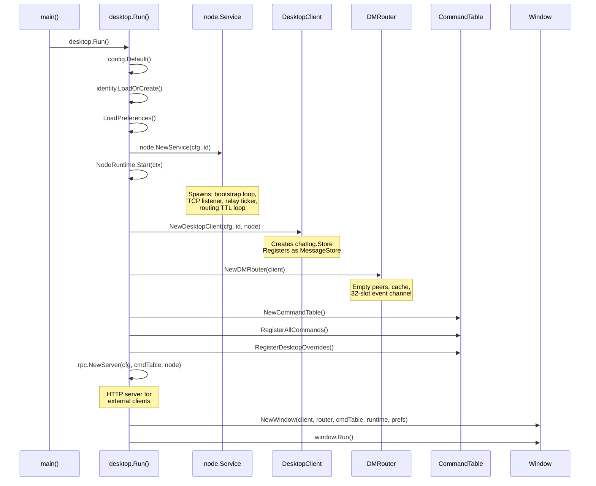
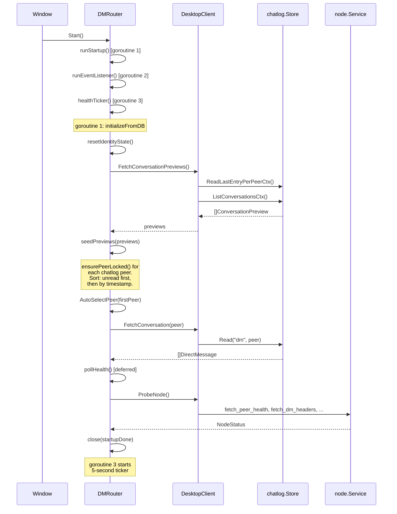
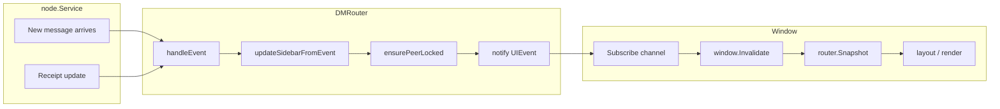
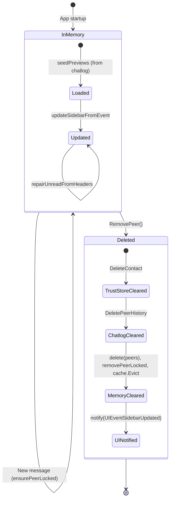
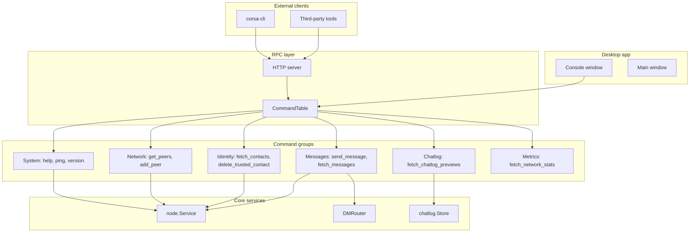
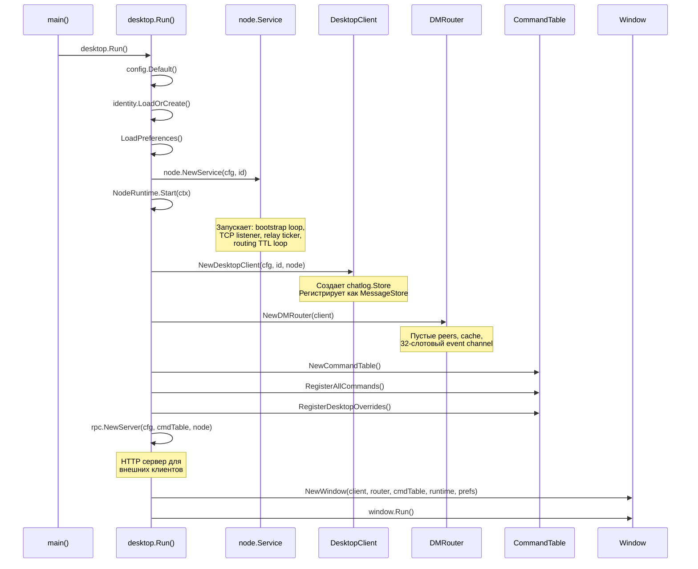
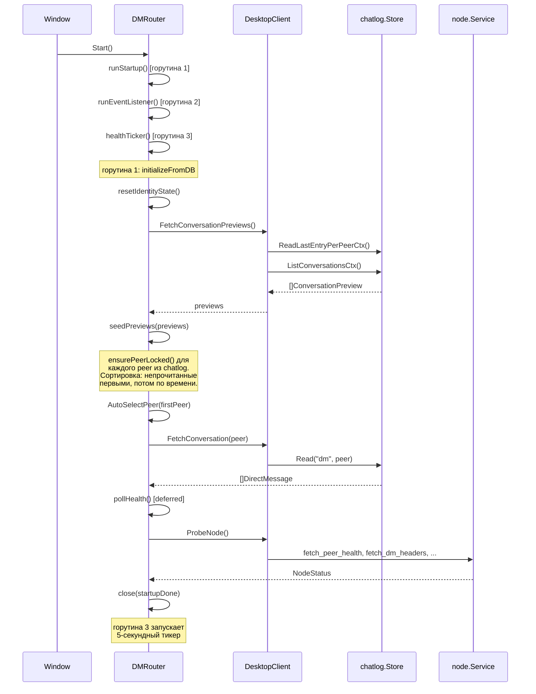
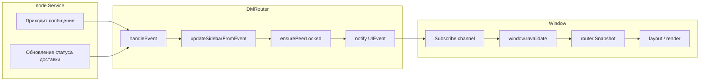
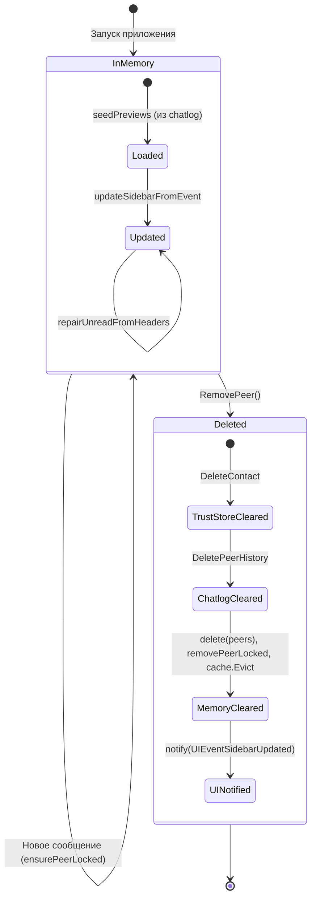
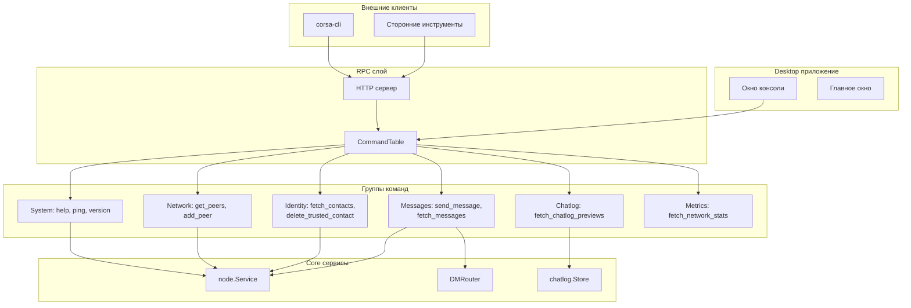

# CORSA Desktop UI

## English

### Overview

The desktop UI is built with [Gio](https://gioui.org) — a portable immediate-mode GUI library for Go. The UI layer is thin: it reads state from the `DMRouter` via atomic snapshots and delegates all business logic to the service layer.

### Component hierarchy

```
Window (Gio event loop)
  ├── Header (console button, language selector, update badge)
  ├── Sidebar (contacts card)
  │   ├── Identity search
  │   ├── Recipient list (from router peers)
  │   └── Context menu (copy, alias, delete)
  ├── Chat area
  │   ├── Message list (scrollable)
  │   └── Message bubbles (with delivery status)
  └── Composer card
      ├── Recipient display
      ├── Message input
      ├── Send button
      └── Status line (send/delete/sync feedback)
```

### Initialization sequence



*Initialization sequence*

### DMRouter startup



*DMRouter startup sequence*

### Event-driven UI updates



*Event-driven UI update flow*

### Identity lifecycle



*Identity lifecycle*

Identity enters the system through two paths:

1. **Startup** — `seedPreviews` reads conversation previews from the chatlog database and calls `ensurePeerLocked` for each peer address.
2. **Runtime** — when a new message arrives from an unknown identity, `updateSidebarFromEvent` and `repairUnreadFromHeaders` call `ensurePeerLocked` to add the peer.

Identity exits through `RemovePeer`:

1. `DeleteContact` — removes from the node trust store (persisted JSON file)
2. `DeletePeerHistory` — removes all chat messages from SQLite
3. In-memory cleanup — `peers`, `peerOrder`, `cache` cleared
4. UI notification — sidebar rebuilds from `peers` immediately

### Sidebar data source

The sidebar recipient list is built exclusively from the router's in-memory `peers` map. There is no dependency on polling or external contact sources:

```
snapRecipients()
  └── snap.Peers (router in-memory state)
      ├── Seeded from chatlog at startup
      ├── Updated by incoming messages in real-time
      └── Cleaned on RemovePeer
```

### UIEvent types

| Event | Trigger | UI effect |
|-------|---------|-----------|
| `UIEventMessagesUpdated` | New message, receipt update, conversation switch | Chat area redraws |
| `UIEventSidebarUpdated` | Peer added/removed, unread count changed, preview updated | Sidebar redraws |
| `UIEventStatusUpdated` | Health poll completed | Network status indicator updates |
| `UIEventBeep` | New incoming message (not during startup replay) | System notification sound |

### RPC architecture



*RPC architecture*

The `CommandTable` is a single registry of all available commands. Desktop UI calls `Execute()` directly (no HTTP round-trip). External clients go through the HTTP server which wraps the same `CommandTable`.

---

## Русский

### Обзор

Desktop UI построен на [Gio](https://gioui.org) — кроссплатформенной immediate-mode GUI библиотеке для Go. UI-слой тонкий: читает состояние из `DMRouter` через атомарные снимки и делегирует всю бизнес-логику в сервисный слой.

### Иерархия компонентов

```
Window (Gio event loop)
  ├── Header (кнопка консоли, выбор языка, бейдж обновления)
  ├── Sidebar (карточка контактов)
  │   ├── Поиск identity
  │   ├── Список получателей (из peers роутера)
  │   └── Контекстное меню (копировать, псевдоним, удалить)
  ├── Область чата
  │   ├── Список сообщений (скроллируемый)
  │   └── Пузыри сообщений (со статусом доставки)
  └── Карточка ввода
      ├── Отображение получателя
      ├── Поле ввода сообщения
      ├── Кнопка отправки
      └── Строка статуса (обратная связь по отправке/удалению/синхронизации)
```

### Последовательность инициализации



*Последовательность инициализации*

### Запуск DMRouter



*Последовательность запуска DMRouter*

### Event-driven обновление UI



*Поток event-driven обновлений UI*

### Жизненный цикл Identity



*Жизненный цикл identity*

Identity попадает в систему двумя путями:

1. **При запуске** — `seedPreviews` читает превью разговоров из chatlog БД и вызывает `ensurePeerLocked` для каждого адреса.
2. **В рантайме** — когда приходит сообщение от неизвестного identity, `updateSidebarFromEvent` и `repairUnreadFromHeaders` вызывают `ensurePeerLocked`.

Identity удаляется через `RemovePeer`:

1. `DeleteContact` — удаляет из trust store ноды (JSON файл)
2. `DeletePeerHistory` — удаляет все сообщения из SQLite
3. Очистка памяти — `peers`, `peerOrder`, `cache`
4. Уведомление UI — sidebar перестраивается из `peers` мгновенно

### Источник данных для sidebar

Список получателей в sidebar строится исключительно из in-memory map `peers` роутера. Нет зависимости от polling или внешних источников контактов:

```
snapRecipients()
  └── snap.Peers (in-memory состояние роутера)
      ├── Загружается из chatlog при старте
      ├── Обновляется входящими сообщениями в реальном времени
      └── Очищается при RemovePeer
```

### Типы UIEvent

| Event | Триггер | Эффект в UI |
|-------|---------|-------------|
| `UIEventMessagesUpdated` | Новое сообщение, обновление статуса доставки, переключение разговора | Перерисовка области чата |
| `UIEventSidebarUpdated` | Peer добавлен/удален, счетчик непрочитанных изменен, превью обновлено | Перерисовка sidebar |
| `UIEventStatusUpdated` | Завершен health poll | Обновление индикатора сети |
| `UIEventBeep` | Новое входящее сообщение (не во время стартового replay) | Системный звук уведомления |

### Архитектура RPC



*Архитектура RPC*

`CommandTable` — единый реестр всех доступных команд. Desktop UI вызывает `Execute()` напрямую (без HTTP round-trip). Внешние клиенты работают через HTTP сервер, который оборачивает тот же `CommandTable`.

