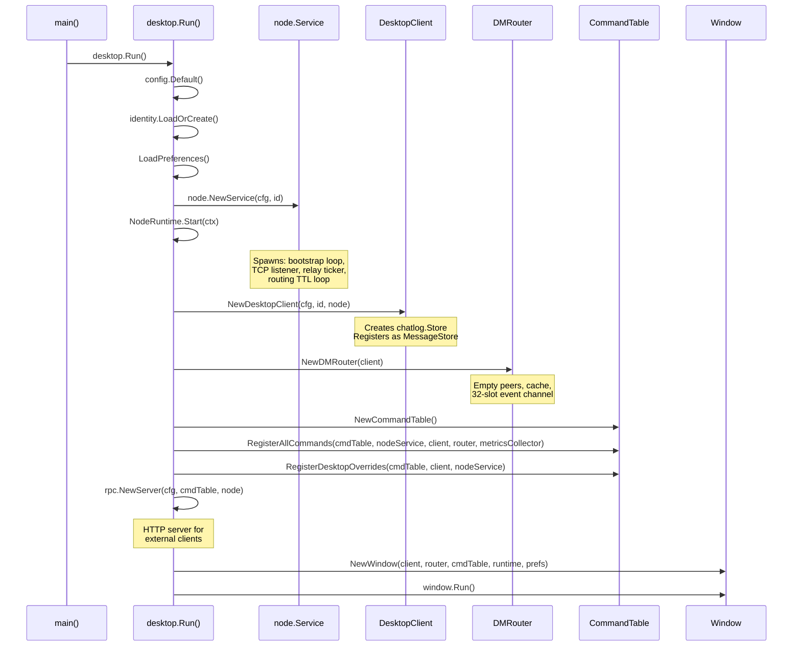
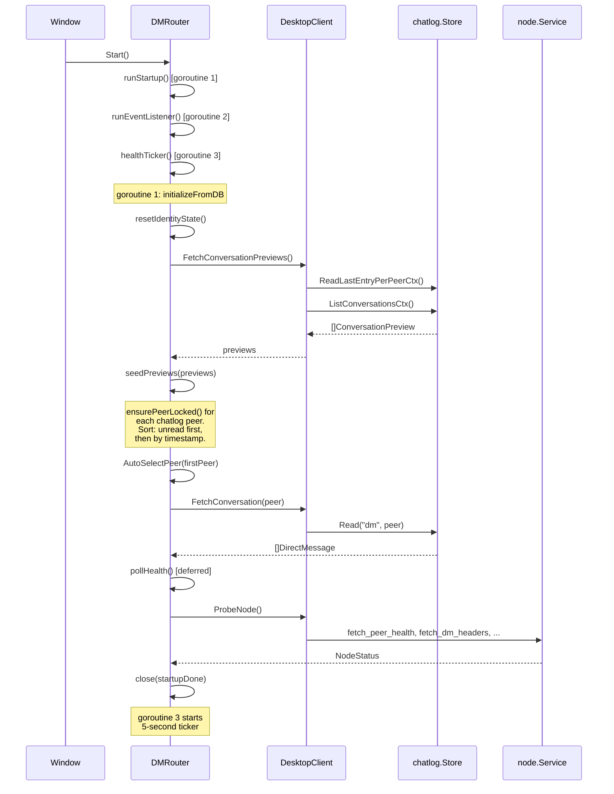
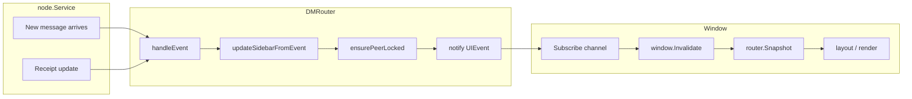
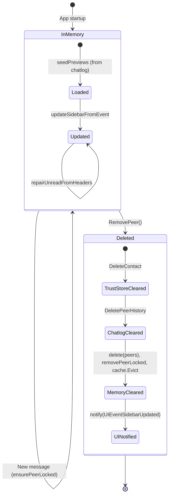
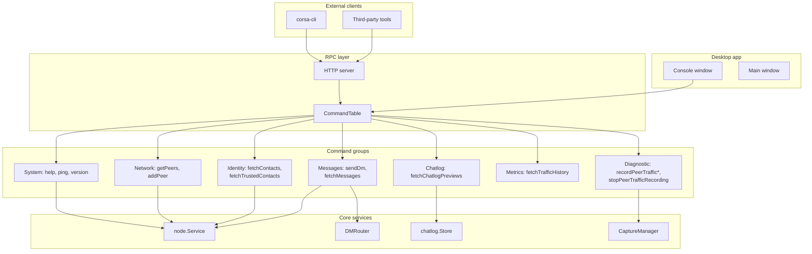
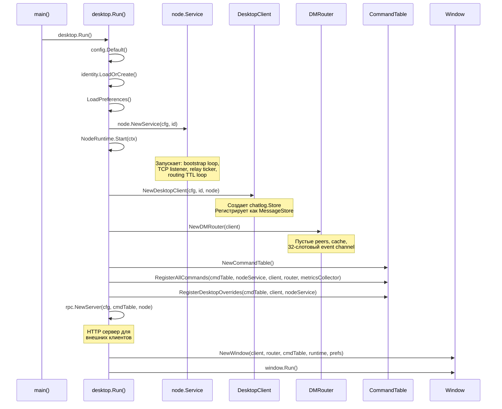
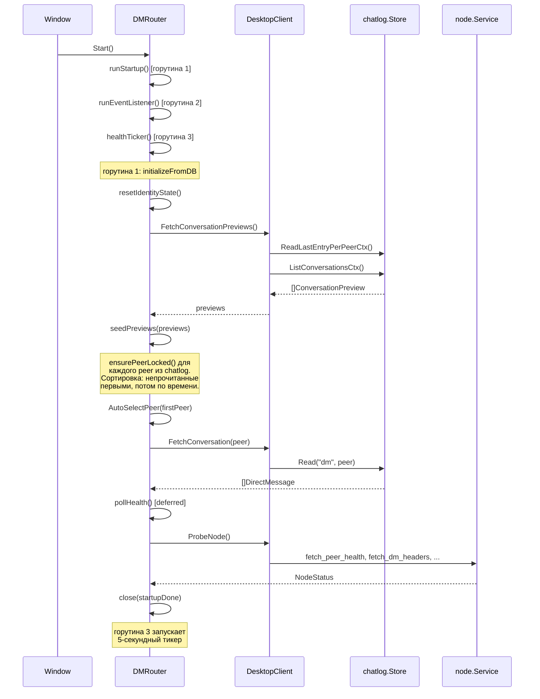
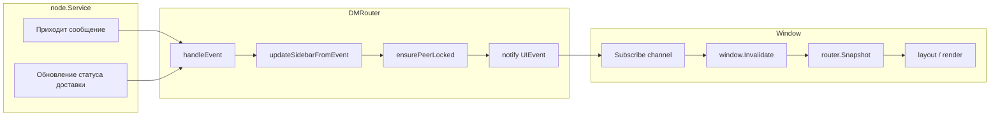
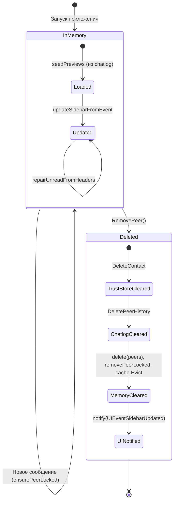

# CORSA Desktop UI

## English

### Overview

The desktop UI is built with [Gio](https://gioui.org) — a portable immediate-mode GUI library for Go. The UI layer is thin: it reads state from the `DMRouter` via atomic snapshots and delegates all business logic to the service layer.

### Component hierarchy

```
Window (Gio event loop)
  ├── Header (console button, language selector, update badge)
  ├── Sidebar (contacts card)
  │   ├── Identity search
  │   ├── Recipient list (from router peers)
  │   │   └── Reachable indicator (green/gray dot)
  │   └── Context menu (copy, alias, delete)
  ├── Chat area
  │   ├── Message list (scrollable)
  │   └── Message bubbles (with delivery status)
  │       ├── Author + timestamp (DD.MM.YYYY HH:MM)
  │       ├── Reply quote (if reply): sender · date + quoted text
  │       │   └── Click scrolls to original message
  │       ├── Message body (selectable text)
  │       ├── Delivery status (sent/delivered/seen)
  │       └── Context menu (right-click: Reply, Copy)
  └── Composer card
      ├── Recipient display
      ├── Reply preview banner (when replying)
      ├── Message input
      ├── Send button
      └── Status line (send/delete/sync feedback)
```

### Initialization sequence



*Initialization sequence*

### DMRouter startup



*DMRouter startup sequence*

### Event-driven UI updates



*Event-driven UI update flow*

### Identity lifecycle



*Identity lifecycle*

Identity enters the system through two paths:

1. **Startup** — `seedPreviews` reads conversation previews from the chatlog database and calls `ensurePeerLocked` for each peer address.
2. **Runtime** — when a new message arrives from an unknown identity, `updateSidebarFromEvent` and `repairUnreadFromHeaders` call `ensurePeerLocked` to add the peer.

Identity exits through `RemovePeer`:

1. `DeleteContact` — removes from the node trust store (persisted JSON file)
2. `DeletePeerHistory` — removes all chat messages from SQLite
3. In-memory cleanup — `peers`, `peerOrder`, `cache` cleared
4. UI notification — sidebar rebuilds from `peers` immediately

### Sidebar data source

The sidebar recipient list is built exclusively from the router's in-memory `peers` map. There is no dependency on polling or external contact sources:

```
snapRecipients()
  └── snap.Peers (router in-memory state)
      ├── Seeded from chatlog at startup
      ├── Updated by incoming messages in real-time
      └── Cleaned on RemovePeer
```

### UIEvent types

| Event | Trigger | UI effect |
|-------|---------|-----------|
| `UIEventMessagesUpdated` | New message, receipt update, conversation switch | Chat area redraws |
| `UIEventSidebarUpdated` | Peer added/removed, unread count changed, preview updated | Sidebar redraws |
| `UIEventStatusUpdated` | Health poll completed | Network status indicator updates |
| `UIEventBeep` | New incoming message (not during startup replay) | System notification sound |

### Reachable indicator

Each contact in the sidebar displays a small colored dot next to the peer name. The indicator has three states:

- **Green** — at least one route exists (identity is reachable through the mesh)
- **Gray** — no route available (identity is unreachable)
- **Gray outline** — reachability data is unavailable (probe failed or node not connected)

The reachability data is populated during each `ProbeNode` cycle. In embedded mode, `buildReachableIDs()` calls `node.Service.RoutingSnapshot()` directly (no RPC round-trip) and extracts all identities with a live `BestRoute`. In remote TCP mode (`localNode == nil`), it falls back to the `fetch_reachable_ids` frame, which performs the same logic on the node side. The reachable set covers all identities in the routing table — not just those from `fetch_identities` — so sidebar peers that entered via chatlog or DM headers also get correct status. Results are stored in `NodeStatus.ReachableIDs` and flow through the standard `RouterSnapshot` pipeline to the UI.

### Contact list sorting

The sidebar contact list uses 4-tier priority sorting. This is a UI/product concern — the router provides data (peers, unread counts, reachability), and the presentation layer (`sidebar_sort.go`) decides display order. Sorting runs on every frame render using the current `RouterSnapshot`, so any state change (unread cleared, preview refreshed, reachability updated) is immediately reflected without explicit re-sort triggers.

| Tier | Condition | Sort key |
|------|-----------|----------|
| 1 | Online + unread messages | Unread count descending |
| 2 | Online, no unread | Last message timestamp descending |
| 3 | Offline + unread messages | Unread count descending |
| 4 | Offline, no unread | Last message timestamp descending |

"Online" means `ReachableIDs[identity] == true` — at least one live route exists in the routing table.

The sort pipeline in `snapRecipients()`:

1. `mergeRecipientOrder()` — merges peers from `Peers` map with `PeerOrder` (router's internal ordering, used as stable tiebreaker)
2. `sortSidebarPeers()` — applies 4-tier sort using `RouterSnapshot.Peers` and `RouterSnapshot.NodeStatus.ReachableIDs`

When `ReachableIDs` is nil (probe not completed or failed), all peers are treated as offline, and the sort degrades gracefully to 2-tier (unread first, then by timestamp).

### Сортировка списка контактов

Sidebar список контактов использует 4-уровневую приоритетную сортировку. Это UI/продуктовая логика — роутер предоставляет данные (peers, счётчики непрочитанных, доступность), а слой представления (`sidebar_sort.go`) определяет порядок отображения. Сортировка выполняется на каждом кадре рендеринга из текущего `RouterSnapshot`, поэтому любое изменение состояния (очистка непрочитанных, обновление preview, изменение доступности) немедленно отражается без явных триггеров пересортировки.

| Уровень | Условие | Ключ сортировки |
|---------|---------|-----------------|
| 1 | Online + есть непрочитанные | Число непрочитанных по убыванию |
| 2 | Online, нет непрочитанных | Время последнего сообщения по убыванию |
| 3 | Offline + есть непрочитанные | Число непрочитанных по убыванию |
| 4 | Offline, нет непрочитанных | Время последнего сообщения по убыванию |

"Online" означает `ReachableIDs[identity] == true` — хотя бы один живой маршрут существует в таблице маршрутизации.

Конвейер сортировки в `snapRecipients()`:

1. `mergeRecipientOrder()` — объединяет peers из `Peers` map с `PeerOrder` (внутренний порядок роутера, используется как стабильный tiebreaker)
2. `sortSidebarPeers()` — применяет 4-уровневую сортировку используя `RouterSnapshot.Peers` и `RouterSnapshot.NodeStatus.ReachableIDs`

Когда `ReachableIDs` равен nil (проба не завершена или не удалась), все peers считаются offline, и сортировка корректно деградирует до 2-уровневой (непрочитанные первыми, затем по timestamp).

### RPC architecture



*RPC architecture*

The `CommandTable` is a single registry of all available commands. Desktop UI calls `Execute()` directly (no HTTP round-trip). External clients go through the HTTP server which wraps the same `CommandTable`.

### Console Window — Traffic Recording Indicators

The Console Window (opened via the header console button) displays per-peer diagnostic information. When a capture session is active, the following UI elements appear:

- **Recording dot** — a small red ellipse on the peer card header next to the peer address. Visible when `PeerHealth.Recording == true` for any `conn_id` of the peer.
- **Recording info row** — displayed below the peer card health data. Shows scope (`conn_id` / `ip` / `all`), file path (selectable text), capture start time, and dropped event count if non-zero. An error string is shown if the capture writer encountered a disk error.
- **Stop all recording banner** — a red banner at the top of the peers tab. Visible when at least one peer has `Recording == true`. Contains a "Stop all" button that dispatches `stopPeerTrafficRecording scope=all` via `CommandTable.Execute()`.

Recording state is sourced exclusively from `fetchPeerHealth` (`PeerHealth` rows). The UI does not maintain independent recording state — it derives visibility from the periodic health snapshot.

---

## Русский

### Обзор

Desktop UI построен на [Gio](https://gioui.org) — кроссплатформенной immediate-mode GUI библиотеке для Go. UI-слой тонкий: читает состояние из `DMRouter` через атомарные снимки и делегирует всю бизнес-логику в сервисный слой.

### Иерархия компонентов

```
Window (Gio event loop)
  ├── Header (кнопка консоли, выбор языка, бейдж обновления)
  ├── Sidebar (карточка контактов)
  │   ├── Поиск identity
  │   ├── Список получателей (из peers роутера)
  │   │   └── Индикатор достижимости (зеленая/серая точка)
  │   └── Контекстное меню (копировать, псевдоним, удалить)
  ├── Область чата
  │   ├── Список сообщений (скроллируемый)
  │   └── Пузыри сообщений (со статусом доставки)
  │       ├── Автор + дата (ДД.ММ.ГГГГ ЧЧ:ММ)
  │       ├── Цитата ответа (если ответ): отправитель · дата + текст
  │       │   └── Клик прокручивает к оригинальному сообщению
  │       ├── Тело сообщения (выделяемый текст)
  │       ├── Статус доставки (отправлено/доставлено/прочитано)
  │       └── Контекстное меню (правый клик: Ответить, Копировать)
  └── Карточка ввода
      ├── Отображение получателя
      ├── Баннер предпросмотра ответа (при ответе)
      ├── Поле ввода сообщения
      ├── Кнопка отправки
      └── Строка статуса (обратная связь по отправке/удалению/синхронизации)
```

### Последовательность инициализации



*Последовательность инициализации*

### Запуск DMRouter



*Последовательность запуска DMRouter*

### Event-driven обновление UI



*Поток event-driven обновлений UI*

### Жизненный цикл Identity



*Жизненный цикл identity*

Identity попадает в систему двумя путями:

1. **При запуске** — `seedPreviews` читает превью разговоров из chatlog БД и вызывает `ensurePeerLocked` для каждого адреса.
2. **В рантайме** — когда приходит сообщение от неизвестного identity, `updateSidebarFromEvent` и `repairUnreadFromHeaders` вызывают `ensurePeerLocked`.

Identity удаляется через `RemovePeer`:

1. `DeleteContact` — удаляет из trust store ноды (JSON файл)
2. `DeletePeerHistory` — удаляет все сообщения из SQLite
3. Очистка памяти — `peers`, `peerOrder`, `cache`
4. Уведомление UI — sidebar перестраивается из `peers` мгновенно

### Источник данных для sidebar

Список получателей в sidebar строится исключительно из in-memory map `peers` роутера. Нет зависимости от polling или внешних источников контактов:

```
snapRecipients()
  └── snap.Peers (in-memory состояние роутера)
      ├── Загружается из chatlog при старте
      ├── Обновляется входящими сообщениями в реальном времени
      └── Очищается при RemovePeer
```

### Типы UIEvent

| Event | Триггер | Эффект в UI |
|-------|---------|-------------|
| `UIEventMessagesUpdated` | Новое сообщение, обновление статуса доставки, переключение разговора | Перерисовка области чата |
| `UIEventSidebarUpdated` | Peer добавлен/удален, счетчик непрочитанных изменен, превью обновлено | Перерисовка sidebar |
| `UIEventStatusUpdated` | Завершен health poll | Обновление индикатора сети |
| `UIEventBeep` | Новое входящее сообщение (не во время стартового replay) | Системный звук уведомления |

### Индикатор достижимости

Каждый контакт в sidebar отображает маленькую цветную точку рядом с именем. Индикатор имеет три состояния:

- **Зелёный** — маршрут есть (identity достижим через mesh-сеть)
- **Серый** — маршрутов нет (identity недоступен)
- **Серый контур** — данные о достижимости недоступны (probe не удался или нода не подключена)

Данные о достижимости заполняются при каждом цикле `ProbeNode`. `buildReachableIDs()` вызывает `node.Service.RoutingSnapshot()` напрямую через embedded node (без RPC round-trip) и извлекает все identity с живым `BestRoute`. Набор достижимых identity строится из всей routing table — не только из `fetch_identities` — поэтому sidebar peers, попавшие через chatlog или DM headers, тоже получают корректный статус. Результат хранится в `NodeStatus.ReachableIDs` и проходит через стандартный pipeline `RouterSnapshot` до UI.

### Архитектура RPC


*Архитектура RPC*

`CommandTable` — единый реестр всех доступных команд. Desktop UI вызывает `Execute()` напрямую (без HTTP round-trip). Внешние клиенты работают через HTTP сервер, который оборачивает тот же `CommandTable`.

### Окно консоли — индикаторы записи трафика

Окно консоли (открывается кнопкой консоли в заголовке) отображает диагностическую информацию по каждому peer'у. Когда capture-сессия активна, появляются следующие UI-элементы:

- **Точка записи** — маленький красный эллипс на заголовке peer-карточки рядом с адресом. Виден когда `PeerHealth.Recording == true` для любого `conn_id` этого peer'а.
- **Строка информации о записи** — отображается под данными здоровья peer-карточки. Показывает scope (`conn_id` / `ip` / `all`), путь к файлу (выделяемый текст), время старта записи и количество потерянных событий если ненулевое. Строка ошибки показывается если capture writer столкнулся с ошибкой диска.
- **Баннер остановки записи** — красный баннер вверху вкладки peers. Виден когда хотя бы один peer имеет `Recording == true`. Содержит кнопку "Stop all", которая отправляет `stopPeerTrafficRecording scope=all` через `CommandTable.Execute()`.

