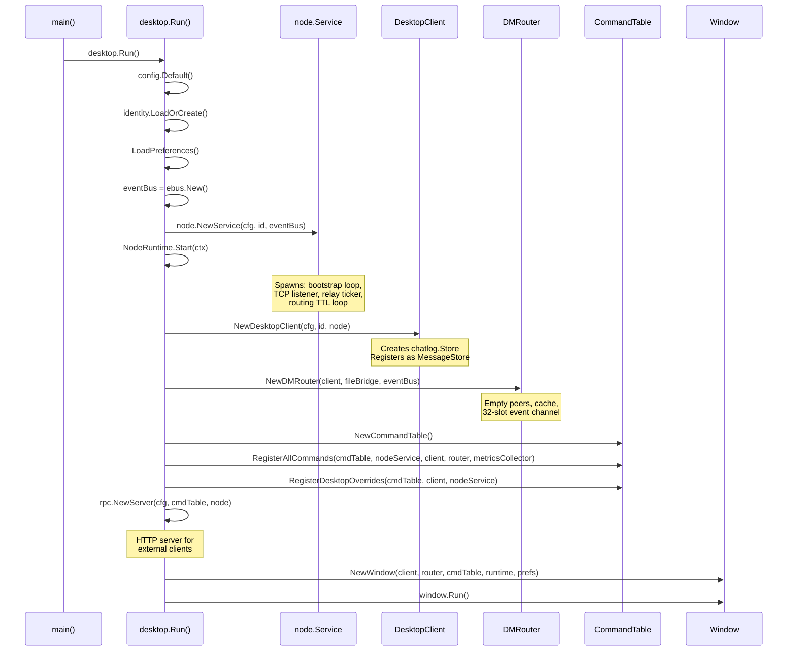
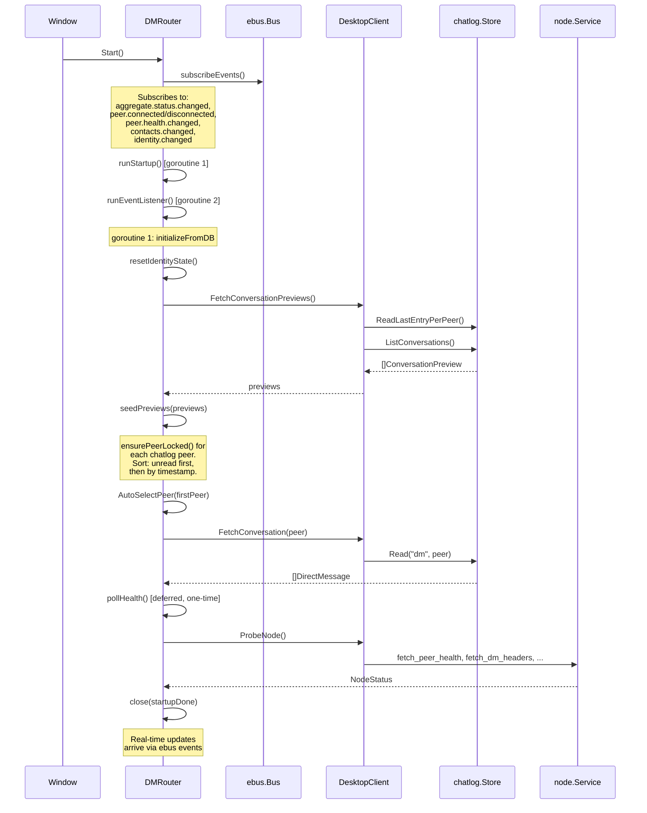
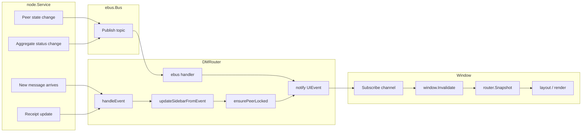
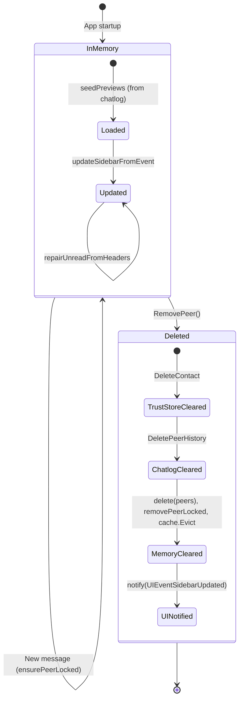
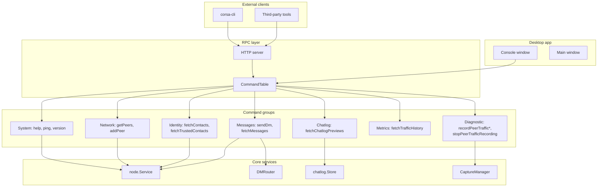
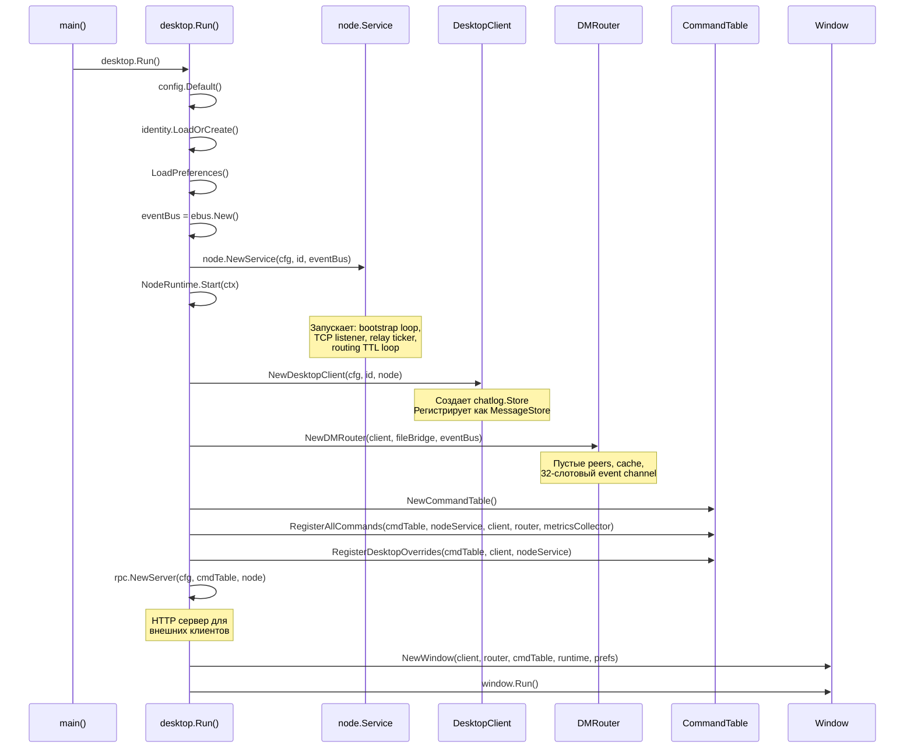
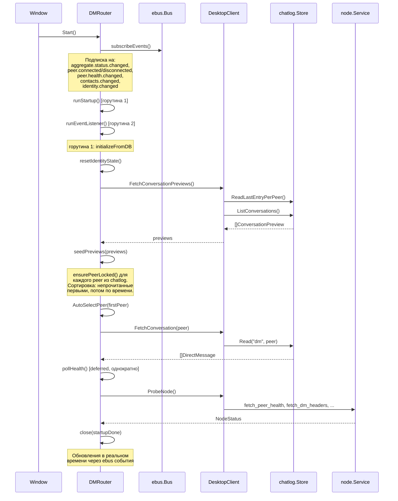
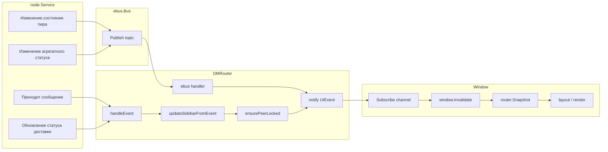
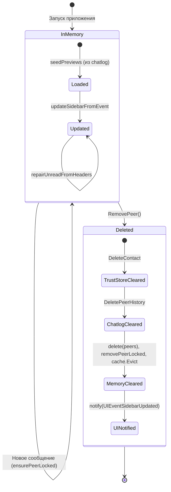

# CORSA Desktop UI

## English

### Overview

The desktop UI is built with [Gio](https://gioui.org) — a portable immediate-mode GUI library for Go. The UI layer is thin: it reads state from the `DMRouter` via atomic snapshots and delegates all business logic to the service layer.

### Component hierarchy

```
Window (Gio event loop)
  ├── Header (language selector, update badge)
  ├── Sidebar (contacts card)
  │   ├── My identity card (fingerprint, fully wrapped address, known count)
  │   │   └── Identity details overlay
  │   │       ├── QR contact link + full address
  │   │       ├── Copy identity / Share contact actions
  │   │       └── Centered modal on desktop; opaque full-screen view in compact mode
  │   ├── Identity search (short visual hint, descriptive accessibility label)
  │   ├── Known identity list (from router peers)
  │   │   └── Presence avatar (green/gray/outline) + last-online timestamp
  │   └── Context menu (right-click, 500 ms long-press, or the card's ⋯ button: copy, alias, delete)
  ├── Chat area
  │   ├── Message list (scrollable)
  │   └── Message bubbles (with delivery status)
  │       ├── Author + timestamp (DD.MM.YYYY HH:MM)
  │       ├── Reply quote (if reply): sender · date + quoted text
  │       │   └── Click scrolls to original message
  │       ├── Message body (selectable text)
  │       ├── Delivery status (sent/delivered/seen)
  │       └── Context menu (right-click, 500 ms long-press, or the bubble's ⋯ button: Reply, Copy, Delete)
  └── Composer card
      ├── Recipient display
      ├── Reply preview banner (when replying)
      ├── Message input (vertically centered single-line text, upright attachment icon, emoji picker, inline send action)
      │   └── Emoji picker (categories, keyword search aligned with its icon, recently used)
      ├── Status line (send/delete/sync feedback)
      └── Footer (flexible shielded network status, chart-icon console button on the same desktop row down to 360dp)
```

The emoji picker is non-modal. Opening it and selecting an emoji keep keyboard
focus in the message editor; `Escape` and system `Back` close the picker before
chat or Activity navigation. On touch input, opening the picker hides the soft
keyboard without blurring the editor. Only the opening layout suppresses the
focus-triggered show command: tapping the message editor while the picker is
open can raise the keyboard normally. Closing restores the keyboard state that
was active before opening, independently of whether the picker button was
pressed by touch or mouse, and clears the search query and the grid's scroll
offset: a query that outlived its picker would reopen it on a single cell with
no category highlighted, explained only by small text in a field nobody is
looking at. Opening the picker scrolls the chip row to the selected category,
which is what keeps a scrolling row from highlighting none of the chips it has
room for.
Search is global across categories and matches prefixes at keyword boundaries;
every catalog entry has individual English and Russian names, so incremental
queries such as `piz` work without arbitrary infix matches. Category selection
is not highlighted while a global query is active. Up to 12 recently used emoji
are stored in desktop preferences, with rapid selections coalesced into one
write and the pending snapshot flushed on shutdown, then restored on the next
start.

The composer measures the rendered footer once and uses that exact height when
sizing the emoji picker. Below the picker's own chrome plus one row of emoji
the surface is not drawn at all: it stays open, asks for the touch keyboard to
be taken away, and appears once that room does — a clipped strip with no
reachable cell would be worse than the wait. `Escape`, system `Back` and the
picker button keep closing it while it waits, since they are handled outside
the layout. A dismissal key wins over a toggle tap delivered in the same
frame — one gesture, one outcome.

The row of category chips spreads across the picker when all nine fit at full
size and scrolls them at full size when they do not, the way the grid below it
already works. Shrinking them to fit was the alternative and it is worse: at
140dp of row the icon would be 15dp, at 40dp it would be 4dp — overlapping
nothing and hittable by nobody — and unlike vertical room, horizontal room
cannot be asked for by dismissing the keyboard. Each emoji in the grid is centred on its INK
rather than on its line box, because an emoji's ink ends on the baseline and
the font descent below it is empty — centring the box lifts every glyph off the
middle of the hover highlight drawn around it. A blocked send action shows its localized reason next
to the arrow instead of exposing it only to accessibility. Editor height and
scrollbar visibility use the same 21sp line-height metric as text rendering,
and the height cap is floored to a whole number of those lines, so a capped
editor never shows the top slice of a line that cannot be read;
the Gio line-height scale is explicitly `1` instead of its 1.2 default.

The identity details overlay owns keyboard focus while it is open. Focus starts
on Close, Tab and Shift+Tab cycle through Close, Copy identity, and Share
contact, and Escape closes the overlay. This prevents the search editor or
composer underneath from receiving text and shortcuts. Closing from the
keyboard returns focus to the My identity card.

### Touch keyboard (Windows tablets)

Gio's Windows backend never invokes the on-screen keyboard itself, so the
desktop app drives it explicitly: tapping any editor with a finger shows
the keyboard (`InputPane.TryShow`, with a legacy TabTip/Toggle fallback on
old Win10 builds); while a **docked** keyboard is visible the window adds
bottom padding equal to the keyboard's `OccludedRect` height so the
composer/console input stays above it. A **floating** keyboard reports no
occlusion (zero height, per the `OccludedRect` contract) and — like other
Windows apps — the layout is not reflowed around it; the user moves the
floating keyboard themselves, and the app keeps tracking the session so
that re-docking reflows correctly. When every editor of the window loses
focus — including a tap outside
the editors — a keyboard that the app itself opened is hidden again
(`TryHide`), while a keyboard the user opened manually is left alone.
Ownership of the "app-opened" session follows the active window, so a
keyboard opened from the main window can be dismissed after switching to
the console and vice versa.

### Initialization sequence


```mermaid
sequenceDiagram
    participant Main as main()
    participant App as desktop.Run()
    participant Node as node.Service
    participant Client as DesktopClient
    participant Router as DMRouter
    participant Cmd as CommandTable
    participant Win as Window

    Main->>App: desktop.Run()
    App->>App: config.Default()
    App->>App: identity.LoadOrCreate()
    App->>App: LoadPreferences()

    App->>App: eventBus = ebus.New()
    App->>Node: node.NewService(cfg, id, eventBus)
    App->>App: NodeRuntime.Start(ctx)
    Note over Node: Spawns: bootstrap loop,<br/>TCP listener, relay ticker,<br/>routing TTL loop

    App->>Client: NewDesktopClient(cfg, id, node)
    Note over Client: Creates chatlog.Store<br/>Registers as MessageStore

    App->>Router: NewDMRouter(client, fileBridge, eventBus)
    Note over Router: Empty peers, cache,<br/>32-slot event channel

    App->>Cmd: NewCommandTable()
    App->>Cmd: RegisterAllCommands(cmdTable, nodeService, client, router, metricsCollector)
    App->>Cmd: RegisterDesktopOverrides(cmdTable, client, nodeService)

    App->>App: rpc.NewServer(cfg, cmdTable, node)
    Note over App: HTTP server for<br/>external clients

    App->>Win: NewWindow(client, router, cmdTable, runtime, prefs)
    App->>Win: window.Run()
```

*Initialization sequence*

### DMRouter startup


```mermaid
sequenceDiagram
    participant Win as Window
    participant Router as DMRouter
    participant eBus as ebus.Bus
    participant Client as DesktopClient
    participant DB as chatlog.Store
    participant Node as node.Service

    Win->>Router: Start()
    Router->>eBus: subscribeEvents()
    Note over Router: Subscribes to:<br/>aggregate.status.changed,<br/>peer.connected/disconnected,<br/>peer.health.changed,<br/>contacts.changed,<br/>identity.changed
    Router->>Router: runStartup() [goroutine 1]
    Router->>Router: runEventListener() [goroutine 2]

    Note over Router: goroutine 1: initializeFromDB

    Router->>Router: resetIdentityState()
    Router->>Client: FetchConversationPreviews()
    Client->>DB: ReadLastEntryPerPeer()
    Client->>DB: ListConversations()
    DB-->>Client: []ConversationPreview
    Client-->>Router: previews

    Router->>Router: seedPreviews(previews)
    Note over Router: ensurePeerLocked() for<br/>each chatlog peer.<br/>Sort: unread first,<br/>then by timestamp.

    Router->>Router: AutoSelectPeer(firstPeer)
    Router->>Client: FetchConversation(peer)
    Client->>DB: Read("dm", peer)
    DB-->>Router: []DirectMessage

    Router->>Router: pollHealth() [deferred, one-time]
    Router->>Client: ProbeNode()
    Client->>Node: fetch_peer_health, fetch_dm_headers, ...
    Node-->>Router: NodeStatus

    Router->>Router: close(startupDone)
    Note over Router: Real-time updates<br/>arrive via ebus events
```

*DMRouter startup sequence*

### Event-driven UI updates

The node layer pushes state changes via an internal event bus (`ebus.Bus`). The DMRouter subscribes to relevant topics and updates its snapshot on each event. Messages and receipts are still delivered via the legacy `SubscribeLocalChanges` channel during migration.


```mermaid
flowchart LR
    subgraph Node["node.Service"]
        MSG[New message arrives]
        RCV[Receipt update]
        PEER[Peer state change]
        AGG[Aggregate status change]
    end

    subgraph eBus["ebus.Bus"]
        PUB[Publish topic]
    end

    subgraph Router["DMRouter"]
        EVT[handleEvent]
        EBUS_H[ebus handler]
        SIDE[updateSidebarFromEvent]
        ENSURE[ensurePeerLocked]
        NOTIFY[notify UIEvent]
    end

    subgraph Window["Window"]
        SUB[Subscribe channel]
        INV[window.Invalidate]
        SNAP[router.Snapshot]
        LAYOUT[layout / render]
    end

    MSG --> EVT
    RCV --> EVT
    PEER --> PUB
    AGG --> PUB
    PUB --> EBUS_H
    EBUS_H --> NOTIFY
    EVT --> SIDE
    SIDE --> ENSURE
    ENSURE --> NOTIFY
    NOTIFY --> SUB
    SUB --> INV
    INV --> SNAP
    SNAP --> LAYOUT
```

*Event-driven UI update flow*

### Identity lifecycle


```mermaid
stateDiagram-v2
    [*] --> InMemory: App startup
    InMemory --> InMemory: New message (ensurePeerLocked)

    state InMemory {
        [*] --> Loaded: seedPreviews (from chatlog)
        Loaded --> Updated: updateSidebarFromEvent
        Updated --> Updated: repairUnreadFromHeaders
    }

    InMemory --> Deleted: RemovePeer()

    state Deleted {
        [*] --> TrustStoreCleared: DeleteContact
        TrustStoreCleared --> ChatlogCleared: DeletePeerHistory
        ChatlogCleared --> MemoryCleared: delete(peers), removePeerLocked, cache.Evict
        MemoryCleared --> UINotified: notify(UIEventSidebarUpdated)
    }

    Deleted --> [*]
```

*Identity lifecycle*

Identity enters the system through two paths:

1. **Startup** — `seedPreviews` reads conversation previews from the chatlog database and calls `ensurePeerLocked` for each peer address.
2. **Runtime** — when a new message arrives from an unknown identity, `updateSidebarFromEvent` and `repairUnreadFromHeaders` call `ensurePeerLocked` to add the peer.

Identity exits through `RemovePeer`:

1. `DeleteContact` — removes from the node trust store (persisted JSON file)
2. `DeletePeerHistory` — removes all chat messages from SQLite
3. In-memory cleanup — `peers`, `peerOrder`, `cache` cleared
4. UI notification — sidebar rebuilds from `peers` immediately

A failure of step 2 is not the same as a failure of the final history sweep
that closes the removal, and the window separates them with
`errors.Is(err, service.ErrHistorySweepFailed)`. The first leaves the contact
intact — the composer draft, the attachment, the alias and the selection stay
with it. The second leaves the contact gone and only its history in doubt:
the window finishes its own cleanup (`forgetPeerComposerState`, the alias,
the neighbour selection) and shows the error, because a draft belonging to a
conversation the user can no longer open, and a deleted chat left selected,
are worse than a reported failure.

### Sidebar data source

The sidebar recipient list is built exclusively from the router's in-memory `peers` map. There is no dependency on polling or external contact sources:

```
snapRecipients()
  └── snap.Peers (router in-memory state)
      ├── Seeded from chatlog at startup
      ├── Updated by incoming messages in real-time
      └── Cleaned on RemovePeer
```

### UIEvent types

| Event | Trigger | UI effect |
|-------|---------|-----------|
| `UIEventMessagesUpdated` | New message, receipt update, conversation switch | Chat area redraws |
| `UIEventSidebarUpdated` | Peer added/removed, unread count changed, preview updated | Sidebar redraws |
| `UIEventStatusUpdated` | Health poll completed | Network status indicator updates |
| `UIEventBeep` | New incoming message (not during startup replay) | System notification sound |

### Contact presence

Each contact in the sidebar displays a person avatar with three states:

- **Green filled** — at least one route exists (identity is reachable through the mesh)
- **Gray filled** — no route is available (identity is unreachable)
- **Gray outline** — reachability data is unavailable (probe failed or node not connected)

The sidebar starts directly with “My identity”; there is intentionally no extra “Clients” heading above it. This keeps the hierarchy aligned with the compact design and avoids repeating what the panel already communicates.

Reachability is computed once alongside every immutable routing snapshot and stored as a cached identity set. In embedded mode, `NodeProber.BuildReachableIDs()` clones that set directly (no RPC round-trip); remote TCP mode (`localNode == nil`) receives the same cached set through `fetch_reachable_ids`. It covers all identities in the routing table — not just those from `fetch_identities` — so sidebar peers that entered through chatlog or DM headers also get the correct status. Snapshot-published events keep `NodeStatus.ReachableIDs` current between full `ProbeNode` cycles.

Offline rows also show the latest available online observation; online rows rely on the green avatar instead of displaying a moving current time. `identity.presence.changed` is an offline-only observation containing the observing node in `Source`, the affected identity batch, and the transition time. A clean remote EOF on the final direct session is attributed at the lifecycle path that performs `RemoveDirectPeer`, so the normal two-node Alice↔Bob topology records Bob even when the routing table becomes empty. The timestamp is captured when the session closes and carried through withdrawal grace; the grace delay never shifts `last_online_at`. A deliberate local eviction/shutdown, reset, and timeout are not attributed: they may mean that the observing node lost its own interface, NAT mapping, firewall path, or route. `RemoveDirectPeer` returns the peer's post-mutation reachability under the routing-table lock and with the same selectable-route predicate as `Snapshot.ReachableIdentitiesWithTransit`, avoiding a second clock read and a racy `Lookup`. For transit identities the routing-snapshot comparison remains necessary; it records a final-route loss only while another remote route witnesses that the local node still has network reachability, and never turns a total collapse into a mass offline event. A serialized presence projection remembers whether each previously reachable identity had selectable direct and/or transit sources. Direct removal consumes the direct source in the same serialized interval as snapshot capture: a clean EOF consumes the whole final transition only when lifecycle actually publishes it, while an ambiguous close leaves any transit source snapshot-owned. Therefore a direct loss and a later transit loss produce the same durable result whether they land in one snapshot generation or two, without a cross-goroutine dedup marker. Both paths timestamp their observations through the same `presenceClock` provider.

The observing node queues `last_online_at` persistence exactly once in its tracked background runner before publishing the best-effort event; the event bus is a notification channel, not a command path back into the node. The desktop subscriber accepts only events whose `Source` equals its own node identity and updates contacts only. `ReachableIDs` has one writer: the snapshot-reason route event. If the desktop event is dropped, the next probe repairs the UI from durable state.

The field survives a restart and is separate from `last_seen_at`, which describes key-material observation. `peers.json` v3 also persists each known address-to-identity binding, so identity-matched `PeerHealth` activity/disconnect evidence remains usable immediately after restart instead of waiting for a new handshake. Durable contact time and peer health are compared by timestamp and the newest wins; **incoming** conversation activity is not in that comparison and is spent only as a fallback, described below. An outgoing message is never evidence that its recipient was online. Conversation activity is never read from the sidebar preview: the preview is the last row of the thread, which is our own message in every conversation we answered last, so a preview-derived reading loses the contact's message behind the reply.

The node-owned sources are the durable `last_online_at` on the contact and the `PeerHealth` activity timestamps. Both are this node's own observations, stamped with its own clock, and they are compared by recency — newest wins. The node is the only writer of `last_online_at`: it stamps a contact when the final route to it is lost, and when a DM arrives over that peer's own authenticated session. The arrival path also publishes `identity.presence.observed`, because the desktop probes the node once at startup and lives on events afterwards — without the event the durable write would not reach the running sidebar until the next launch. The monitor applies that topic and `identity.presence.changed` through one handler: they differ in what was observed, not in what the UI does with it, and neither touches `ReachableIDs`. An observation about an identity the monitor has no contact row for yet is held aside rather than dropped — the topics and `contact.added` run on independent subscriber goroutines — and the contact-added handler or the startup probe claims it. The hold is capped, entries expire after five minutes, and when it is full the entry evicted first is one that came from `identity.presence.changed`: those carry routing-table identities, most of which will never be contacts, while `identity.presence.observed` carries the sender of an accepted DM, whose contact row is already on its way.

`RouterPeerState.LastIncomingAt` is not one of those sources and never competes with them. It is the newest message this contact wrote — the SENDER's clock — recomputed by the router from the chatlog and deliberately never persisted: a durable copy would be a second thing to keep in step with the first, and ordering their writers needs a version that a sidebar label does not justify. The router recomputes it at startup, advances it on every incoming message (including startup replay and the open conversation, which the unread badge deliberately skips), and recomputes it again on the delete path, where the evidence legitimately moves backwards because the message that carried it is gone. It is spent only when the node-owned sources know nothing at all; letting it win on recency would let a peer push their own timestamp over an observation this node actually made.

A timestamp in the future is refused on the way in — the sender is the one party who gains from appearing recently online. Refusing a row never refuses the conversation: the chatlog query skips future rows while still returning the honest message behind them, so a forged date costs the forger their own last-online line rather than erasing it.

The node writes `last_online_at` at most once per contact per minute on the DM path. Persisting means marshalling every contact and rewriting the trust file, and an inbound DM — including the retries and re-gossips that arrive before the dedup gate — would otherwise buy one of those each. The durable value only has to survive a restart, so a minute of resolution costs nothing there, while the running sidebar still learns of every arrival through `identity.presence.observed`. Today is shown as local `HH:MM`, then “Yesterday”, a localized plural phrase for 2–6 calendar days, and a locale-specific short date. On compact rows the visual timestamp is hidden before it can steal space from the contact name, while accessibility keeps the full value. The clickable contact row emits one authoritative description (“Online”, “Last online: …”, or an unknown-status combination), so child avatar and timestamp operations cannot overwrite each other. This avatar/timestamp treatment is scoped to contact rows; the compact chat header keeps its small reachability dot.

### Counted phrases (plural forms)

A caption that contains a number has to agree with it, and which words
change is a property of the language: Russian needs three forms
("1 сообщение ждёт", "2 сообщения ждут", "5 сообщений ждут"), Arabic six,
Chinese one. `Window.tCount(key, count, …)` picks the catalogue entry for
the count's plural form — `key.one`, `key.few`, `key.many`, `key.other` —
and formats it with the count as the first argument. The rules live in
`i18n_plural.go` and follow the CLDR categories for the shipped languages.

A missing form falls back to `key.other` in the same language, then to
English, so a half-translated catalogue renders an awkward sentence rather
than a raw key; a key with no plural entries at all falls through to the
plain `translate`, so `tCount` is safe to use on any key.

Adding a language means adding its rule to `pluralFormFor` and its forms to
the catalogue. Only phrases whose wording actually changes need forms —
`"Known peers: %d"` reads correctly at any count and stays a plain entry.

### Contact list sorting

The sidebar contact list uses 4-tier priority sorting. This is a UI/product concern — the router provides data (peers, unread counts, reachability), and the presentation layer (`sidebar_sort.go`) decides display order. Sorting runs on every frame render using the current `RouterSnapshot`, so any state change (unread cleared, preview refreshed, reachability updated) is immediately reflected without explicit re-sort triggers.

| Tier | Condition | Sort key |
|------|-----------|----------|
| 1 | Online + unread messages | Unread count descending |
| 2 | Online, no unread | Last message timestamp descending |
| 3 | Offline + unread messages | Unread count descending |
| 4 | Offline, no unread | Last message timestamp descending |

"Online" means `ReachableIDs[identity] == true` — at least one live route exists in the routing table.

The sort pipeline in `snapRecipients()`:

1. `mergeRecipientOrder()` — merges peers from `Peers` map with `PeerOrder` (router's internal ordering, used as stable tiebreaker)
2. `sortSidebarPeers()` — applies 4-tier sort using `RouterSnapshot.Peers` and `RouterSnapshot.NodeStatus.ReachableIDs`

When `ReachableIDs` is nil (probe not completed or failed), all peers are treated as offline, and the sort degrades gracefully to 2-tier (unread first, then by timestamp).

### Фразы со счётчиком (формы множественного числа)

Подпись, в которой есть число, обязана с ним согласовываться, и какие
именно слова меняются — свойство языка: русскому нужны три формы
(«1 сообщение ждёт», «2 сообщения ждут», «5 сообщений ждут»), арабскому
шесть, китайскому одна. `Window.tCount(key, count, …)` выбирает запись
каталога под нужную форму — `key.one`, `key.few`, `key.many`, `key.other`
— и форматирует её, подставляя счётчик первым аргументом. Правила лежат в
`i18n_plural.go` и следуют категориям CLDR для поддерживаемых языков.

Отсутствующая форма откатывается к `key.other` того же языка, затем к
английскому, поэтому недопереведённый каталог даёт корявую фразу, а не
голый ключ; ключ, у которого форм нет вовсе, уходит в обычный `translate`,
поэтому `tCount` безопасен для любого ключа.

Добавить язык — значит добавить его правило в `pluralFormFor` и его формы
в каталог. Формы нужны только фразам, у которых действительно меняются
слова: `«Известных пиров: %d»` читается при любом числе и остаётся обычной
записью.

### Сортировка списка контактов

Sidebar список контактов использует 4-уровневую приоритетную сортировку. Это UI/продуктовая логика — роутер предоставляет данные (peers, счётчики непрочитанных, доступность), а слой представления (`sidebar_sort.go`) определяет порядок отображения. Сортировка выполняется на каждом кадре рендеринга из текущего `RouterSnapshot`, поэтому любое изменение состояния (очистка непрочитанных, обновление preview, изменение доступности) немедленно отражается без явных триггеров пересортировки.

| Уровень | Условие | Ключ сортировки |
|---------|---------|-----------------|
| 1 | Online + есть непрочитанные | Число непрочитанных по убыванию |
| 2 | Online, нет непрочитанных | Время последнего сообщения по убыванию |
| 3 | Offline + есть непрочитанные | Число непрочитанных по убыванию |
| 4 | Offline, нет непрочитанных | Время последнего сообщения по убыванию |

"Online" означает `ReachableIDs[identity] == true` — хотя бы один живой маршрут существует в таблице маршрутизации.

Конвейер сортировки в `snapRecipients()`:

1. `mergeRecipientOrder()` — объединяет peers из `Peers` map с `PeerOrder` (внутренний порядок роутера, используется как стабильный tiebreaker)
2. `sortSidebarPeers()` — применяет 4-уровневую сортировку используя `RouterSnapshot.Peers` и `RouterSnapshot.NodeStatus.ReachableIDs`

Когда `ReachableIDs` равен nil (проба не завершена или не удалась), все peers считаются offline, и сортировка корректно деградирует до 2-уровневой (непрочитанные первыми, затем по timestamp).

### RPC architecture


```mermaid
flowchart TD
    subgraph External["External clients"]
        CLI[corsa-cli]
        API[Third-party tools]
    end

    subgraph Desktop["Desktop app"]
        CON[Console window]
        WIN[Main window]
    end

    subgraph RPC["RPC layer"]
        HTTP[HTTP server]
        CMD[CommandTable]
    end

    subgraph Commands["Command groups"]
        SYS[System: help, ping, version]
        NET[Network: getPeers, addPeer]
        ID[Identity: fetchContacts,<br/>fetchTrustedContacts]
        MSG[Messages: sendDm,<br/>fetchMessages]
        CHAT[Chatlog: fetchChatlogPreviews]
        METRICS[Metrics: fetchTrafficHistory]
        DIAG[Diagnostic: recordPeerTraffic*,<br/>stopPeerTrafficRecording]
    end

    subgraph Core["Core services"]
        NODE[node.Service]
        ROUTER[DMRouter]
        CHATLOG[chatlog.Store]
        CAP[CaptureManager]
    end

    CLI --> HTTP
    API --> HTTP
    HTTP --> CMD
    CON --> CMD
    CMD --> SYS
    CMD --> NET
    CMD --> ID
    CMD --> MSG
    CMD --> CHAT
    CMD --> METRICS
    CMD --> DIAG
    SYS --> NODE
    NET --> NODE
    ID --> NODE
    MSG --> NODE
    MSG --> ROUTER
    CHAT --> CHATLOG
    DIAG --> CAP
```

*RPC architecture*

The `CommandTable` is a single registry of all available commands. Desktop UI calls `Execute()` directly (no HTTP round-trip). External clients go through the HTTP server which wraps the same `CommandTable`.

### Console Window — Traffic Recording Indicators

The Console Window (opened via the composer footer console button) displays per-peer diagnostic information. When a capture session is active, the following UI elements appear:

- **Recording dot** — a small red ellipse on the peer card header next to the peer address. Visible when `NodeStatus.CaptureSessions` contains an `Active` entry whose `ConnID` matches the peer row.
- **Recording info row** — displayed below the peer card health data. Shows scope (`conn_id` / `ip` / `all`), file path (selectable text), capture start time, and dropped event count if non-zero. An error string is shown if the capture writer encountered a disk error.
- **Stop all recording banner** — a red banner at the top of the peers tab. Visible when `NodeStatus.CaptureSessions` contains any `Active` entry. Contains a "Stop all" button that dispatches `stopPeerTrafficRecording scope=all` via `CommandTable.Execute()`.

Capture sessions live in a dedicated `map[domain.ConnID]service.CaptureSession` field on `NodeStatus` — separate from `PeerHealth`. This separation guarantees that capture bookkeeping cannot corrupt peer-health rows: capture-start never materializes a peer row, and capture-stop never strips fields from one. The UI derives recording visibility by looking up the peer's `ConnID` in that map.

State is seeded from `ProbeNode` at startup — `captureSessionsFromFrame` extracts one `CaptureSession` per `fetch_peer_health` entry whose `Recording` flag is set — and kept live via two ebus topics published from `traffic_capture_bridge.go`:

- `TopicCaptureSessionStarted` inserts a `CaptureSession` keyed by the event's `ConnID` with `Active=true`, `FilePath`, `StartedAt`, `Scope`, and `Format` copied from the event. Unknown/empty `Format` falls back to `domain.CaptureFormatCompact`. A restart on the same `ConnID` overwrites any lingering stopped entry so diagnostic counters reset.
- `TopicCaptureSessionStopped` marks the matching entry `Active=false`, stamps `StoppedAt` from the monitor's injectable clock, and records the terminal `Error` / `DroppedEvents`. Stopped entries linger for `NodeStatusMonitor.captureRetention` (default 60 seconds) so the UI can surface the failure reason after the writer goes away. A stop event for an unknown `ConnID` is logged and ignored — no peer-row side effects.

The lazy TTL sweep runs at the start of every `applyCaptureStarted` and at the end of every `applyCaptureStopped`: entries whose `StoppedAt` is older than `captureRetention` are deleted in-place. There is no background goroutine — retention is bounded by the frequency of capture-handler invocations, which is acceptable because a stopped session only matters to the UI while the user is still looking at it.

The `CaptureSessionStarted` payload carries the overlay identity envelope (`Address`, `PeerID`, `Direction`) so the UI can still label a recording when the corresponding `PeerHealth` row has not yet arrived — the label is read directly off the `CaptureSession` rather than from a cross-referenced peer row. This removes the earlier class of bugs where capture-only placeholder rows survived after stop, accidentally graduated via address-scoped traffic events, or silently overwrote real health state.

The payload contract permits an empty `Address` when the publisher could not resolve the connection (torn down between `StartCapture` and the publish, or never tracked). The session is still stored on `NodeStatus.CaptureSessions` so the writer stays visible to the "Stop all recordings" path, but the desktop fallback treats such sessions as unlabeled: `captureHasIdentity` returns false when both `Address` and `PeerID` are empty, and `mergeCapturesIntoPeers` / `countUniquePeers` / `countConnectedPeers` all skip them. Without this gate, unresolved captures would render as blank peer cards and all collapse into a single phantom entry under the empty-string dedup key (`peerIdentityKey("", "") == ""`), inflating `known_peers` / `connected_peers` by exactly one regardless of how many unresolved captures are active.

`mergeCapturesIntoPeers` reconciles each active capture against `peers` with three ordered rules: (1) an existing row with the same `ConnID` is authoritative and the capture is skipped; (2) otherwise, if a `ConnID=0` address-level placeholder (seeded by `applySlotStateDelta` or `applyPeerPendingDelta`) shares the capture's `Address`, the placeholder is promoted in place — `ConnID`, `Direction`, and `Connected` come from the capture, while `SlotState`, `PendingCount`, and any already-observed `PeerID` are preserved; (3) otherwise a fresh synthetic row is appended via `synthesizePeerHealthFromCapture`. Promotion prevents the split-state duplicate where a slot-only placeholder and an orphan capture for the same peer would render as two separate cards until a later health delta reconciles them. The function still honors the "does not mutate the caller's slice" contract via copy-on-write: the input slice is cloned the first time a promotion is required so diagnostic snapshots keep reading the original placeholder unchanged.

---

## Русский

### Обзор

Desktop UI построен на [Gio](https://gioui.org) — кроссплатформенной immediate-mode GUI библиотеке для Go. UI-слой тонкий: читает состояние из `DMRouter` через атомарные снимки и делегирует всю бизнес-логику в сервисный слой.

### Иерархия компонентов

```
Window (Gio event loop)
  ├── Header (выбор языка, бейдж обновления)
  ├── Sidebar (карточка контактов)
  │   ├── Карточка «Мой identity» (fingerprint, полный адрес с переносом, число известных identity)
  │   │   └── Оверлей сведений об identity
  │   │       ├── QR-ссылка контакта + полный адрес
  │   │       ├── Действия «Скопировать identity» / «Поделиться контактом»
  │   │       └── Центрированная модалка на desktop; непрозрачный полноэкранный вид в compact-режиме
  │   ├── Поиск identity (короткий визуальный hint, расширенный accessibility label)
  │   ├── Список известных identity (из peers роутера)
  │   │   └── Аватар присутствия (зелёный/серый/контурный) + время последнего online
  │   └── Контекстное меню (правый клик, долгое удержание 500 мс или кнопка ⋯ на карточке: копировать, псевдоним, удалить)
  ├── Область чата
  │   ├── Список сообщений (скроллируемый)
  │   └── Пузыри сообщений (со статусом доставки)
  │       ├── Автор + дата (ДД.ММ.ГГГГ ЧЧ:ММ)
  │       ├── Цитата ответа (если ответ): отправитель · дата + текст
  │       │   └── Клик прокручивает к оригинальному сообщению
  │       ├── Тело сообщения (выделяемый текст)
  │       ├── Статус доставки (отправлено/доставлено/прочитано)
  │       └── Контекстное меню (правый клик, долгое удержание 500 мс или кнопка ⋯ на пузыре: Ответить, Копировать, Удалить)
  └── Карточка ввода
      ├── Отображение получателя
      ├── Баннер предпросмотра ответа (при ответе)
      ├── Поле ввода (однострочный текст выровнен по вертикали, вертикальная скрепка, выбор эмодзи, встроенная кнопка отправки)
      │   └── Выбор эмодзи (категории, поиск по ключевым словам с выравниванием по лупе, недавние)
      ├── Строка статуса (обратная связь по отправке/удалению/синхронизации)
      └── Нижняя строка (гибкий статус защищённой сети со щитом, кнопка консоли с иконкой графика в той же desktop-строке до 360dp)
```

Пикер эмодзи немодальный. При открытии и выборе эмодзи фокус
остаётся в редакторе сообщения; `Escape` и системный `Back`
сначала закрывают пикер, а не чат или Activity. При сенсорном вводе пикер
скрывает экранную клавиатуру без потери фокуса. Команда показа гасится только в layout
открытия: тап по тексту сообщения при открытом пикере снова поднимает клавиатуру. При закрытии
восстанавливается состояние до открытия независимо от того, была ли кнопка нажата пальцем или мышью,
а поисковый запрос и позиция прокрутки сетки сбрасываются: переживший закрытие
запрос открывал бы пикер на одной ячейке без подсвеченной категории, и
объяснял бы это только мелкий текст в поле, на которое никто не смотрит. При
открытии ряд чипов подскролливается к выбранной категории — иначе прокручиваемый
ряд не подсвечивает ни один из чипов, которые в нём поместились.
Поиск глобальный по всем категориям и совпадает с началом ключевого слова;
каждая запись каталога имеет свои английские и русские имена. Поэтому `piz`
уже находит pizza, но произвольная подстрока в середине слова не даёт ложного совпадения.
При активном глобальном запросе категория не подсвечивается. До 12 недавних эмодзи
хранятся в desktop-настройках: быстрые выборы объединяются в одну запись,
ожидающий снимок сохраняется при завершении, а при следующем запуске список восстанавливается.

Композер один раз измеряет отрисованный footer и использует его точную
высоту при расчёте пикера. Если остатка не хватает на собственный хром пикера
плюс один ряд эмодзи, поверхность не рисуется вовсе: пикер остаётся открытым,
просит убрать сенсорную клавиатуру и появляется, когда место освободится, —
обрезанная полоса без единой доступной ячейки была бы хуже ожидания. Всё это
время `Escape`, системный `Back` и кнопка пикера продолжают его закрывать:
они обрабатываются вне layout. Клавиша закрытия побеждает тап по тумблеру,
пришедший в том же кадре, — один жест, один результат.

Ряд категорий распределяет чипы по ширине пикера, когда все девять помещаются
в полный размер, и прокручивает их полноразмерными, когда не помещаются, — так
же, как устроена сетка под ним. Альтернатива — ужимать чипы — хуже: при ширине
ряда 140dp иконка становится 15dp, при 40dp — 4dp, наезда нет, но и попасть по
такому чипу нельзя, а горизонтальное место, в отличие от вертикального, не у
кого попросить убиранием клавиатуры. Каждое эмодзи в сетке центрируется по своим
чернилам, а не по строчному боксу: чернила эмодзи заканчиваются на базовой
линии, а нижний выносной элемент шрифта под ней пуст, поэтому центровка бокса
поднимала глиф выше центра ховер-подсветки. Заблокированная отправка показывает
локализованную причину рядом со стрелкой, а не только в accessibility.
Высота редактора и видимость скроллбара считаются из той же высоты
строки 21sp, которую использует отрисовка текста, а предельная высота
округляется вниз до целого числа таких строк, поэтому упёршийся в предел
редактор не показывает верхний срез нечитаемой строки; масштаб высоты строки Gio
явно равен `1`, а не значению 1,2 по умолчанию.

Пока оверлей identity открыт, он владеет клавиатурным фокусом. Сначала фокус
получает кнопка закрытия, Tab и Shift+Tab циклически переключают «Закрыть»,
«Скопировать identity» и «Поделиться контактом», а Escape закрывает оверлей.
Поэтому поиск и поле сообщения под ним не получают текст и сочетания клавиш.
При закрытии с клавиатуры фокус возвращается на карточку «Мой identity».

### Сенсорная клавиатура (Windows-планшеты)

Windows-бэкенд Gio сам экранную клавиатуру не вызывает, поэтому приложение
управляет ею явно: тап пальцем в любое поле ввода показывает клавиатуру
(`InputPane.TryShow`, на старых сборках Win10 — legacy-путь TabTip/Toggle);
пока видна **пристыкованная** (docked) клавиатура, окно добавляет нижний
отступ, равный высоте её `OccludedRect`, чтобы поле ввода не перекрывалось.
**Плавающая** (floating) клавиатура окклюзию не даёт (нулевая высота — так
определено контрактом `OccludedRect`), и, как и другие приложения Windows,
компоновка под неё не подстраивается: пользователь двигает плавающую
клавиатуру сам, а приложение продолжает отслеживать сессию, чтобы
повторная стыковка снова дала отступ. Когда все редакторы окна теряют фокус —
включая тап вне полей ввода — клавиатура, открытая самим приложением,
скрывается (`TryHide`), а открытая пользователем вручную не трогается.
Владение «приложенческой» сессией следует за активным окном: клавиатуру,
открытую из главного окна, можно закрыть и после перехода в консоль, и
наоборот.

### Последовательность инициализации


```mermaid
sequenceDiagram
    participant Main as main()
    participant App as desktop.Run()
    participant Node as node.Service
    participant Client as DesktopClient
    participant Router as DMRouter
    participant Cmd as CommandTable
    participant Win as Window

    Main->>App: desktop.Run()
    App->>App: config.Default()
    App->>App: identity.LoadOrCreate()
    App->>App: LoadPreferences()

    App->>App: eventBus = ebus.New()
    App->>Node: node.NewService(cfg, id, eventBus)
    App->>App: NodeRuntime.Start(ctx)
    Note over Node: Запускает: bootstrap loop,<br/>TCP listener, relay ticker,<br/>routing TTL loop

    App->>Client: NewDesktopClient(cfg, id, node)
    Note over Client: Создает chatlog.Store<br/>Регистрирует как MessageStore

    App->>Router: NewDMRouter(client, fileBridge, eventBus)
    Note over Router: Пустые peers, cache,<br/>32-слотовый event channel

    App->>Cmd: NewCommandTable()
    App->>Cmd: RegisterAllCommands(cmdTable, nodeService, client, router, metricsCollector)
    App->>Cmd: RegisterDesktopOverrides(cmdTable, client, nodeService)

    App->>App: rpc.NewServer(cfg, cmdTable, node)
    Note over App: HTTP сервер для<br/>внешних клиентов

    App->>Win: NewWindow(client, router, cmdTable, runtime, prefs)
    App->>Win: window.Run()
```

*Последовательность инициализации*

### Запуск DMRouter


```mermaid
sequenceDiagram
    participant Win as Window
    participant Router as DMRouter
    participant eBus as ebus.Bus
    participant Client as DesktopClient
    participant DB as chatlog.Store
    participant Node as node.Service

    Win->>Router: Start()
    Router->>eBus: subscribeEvents()
    Note over Router: Подписка на:<br/>aggregate.status.changed,<br/>peer.connected/disconnected,<br/>peer.health.changed,<br/>contacts.changed,<br/>identity.changed
    Router->>Router: runStartup() [горутина 1]
    Router->>Router: runEventListener() [горутина 2]

    Note over Router: горутина 1: initializeFromDB

    Router->>Router: resetIdentityState()
    Router->>Client: FetchConversationPreviews()
    Client->>DB: ReadLastEntryPerPeer()
    Client->>DB: ListConversations()
    DB-->>Client: []ConversationPreview
    Client-->>Router: previews

    Router->>Router: seedPreviews(previews)
    Note over Router: ensurePeerLocked() для<br/>каждого peer из chatlog.<br/>Сортировка: непрочитанные<br/>первыми, потом по времени.

    Router->>Router: AutoSelectPeer(firstPeer)
    Router->>Client: FetchConversation(peer)
    Client->>DB: Read("dm", peer)
    DB-->>Router: []DirectMessage

    Router->>Router: pollHealth() [deferred, однократно]
    Router->>Client: ProbeNode()
    Client->>Node: fetch_peer_health, fetch_dm_headers, ...
    Node-->>Router: NodeStatus

    Router->>Router: close(startupDone)
    Note over Router: Обновления в реальном<br/>времени через ebus события
```

*Последовательность запуска DMRouter*

### Event-driven обновление UI

Слой node.Service отправляет изменения состояния через внутреннюю шину событий (`ebus.Bus`). DMRouter подписывается на нужные топики и обновляет свой снапшот при каждом событии. Сообщения и квитанции доставки пока доставляются через legacy-канал `SubscribeLocalChanges` в процессе миграции.


```mermaid
flowchart LR
    subgraph Node["node.Service"]
        MSG[Приходит сообщение]
        RCV[Обновление статуса доставки]
        PEER[Изменение состояния пира]
        AGG[Изменение агрегатного статуса]
    end

    subgraph eBus["ebus.Bus"]
        PUB[Publish topic]
    end

    subgraph Router["DMRouter"]
        EVT[handleEvent]
        EBUS_H[ebus handler]
        SIDE[updateSidebarFromEvent]
        ENSURE[ensurePeerLocked]
        NOTIFY[notify UIEvent]
    end

    subgraph Window["Window"]
        SUB[Subscribe channel]
        INV[window.Invalidate]
        SNAP[router.Snapshot]
        LAYOUT[layout / render]
    end

    MSG --> EVT
    RCV --> EVT
    PEER --> PUB
    AGG --> PUB
    PUB --> EBUS_H
    EBUS_H --> NOTIFY
    EVT --> SIDE
    SIDE --> ENSURE
    ENSURE --> NOTIFY
    NOTIFY --> SUB
    SUB --> INV
    INV --> SNAP
    SNAP --> LAYOUT
```

*Поток event-driven обновлений UI*

### Жизненный цикл Identity


```mermaid
stateDiagram-v2
    [*] --> InMemory: Запуск приложения
    InMemory --> InMemory: Новое сообщение (ensurePeerLocked)

    state InMemory {
        [*] --> Loaded: seedPreviews (из chatlog)
        Loaded --> Updated: updateSidebarFromEvent
        Updated --> Updated: repairUnreadFromHeaders
    }

    InMemory --> Deleted: RemovePeer()

    state Deleted {
        [*] --> TrustStoreCleared: DeleteContact
        TrustStoreCleared --> ChatlogCleared: DeletePeerHistory
        ChatlogCleared --> MemoryCleared: delete(peers), removePeerLocked, cache.Evict
        MemoryCleared --> UINotified: notify(UIEventSidebarUpdated)
    }

    Deleted --> [*]
```

*Жизненный цикл identity*

Identity попадает в систему двумя путями:

1. **При запуске** — `seedPreviews` читает превью разговоров из chatlog БД и вызывает `ensurePeerLocked` для каждого адреса.
2. **В рантайме** — когда приходит сообщение от неизвестного identity, `updateSidebarFromEvent` и `repairUnreadFromHeaders` вызывают `ensurePeerLocked`.

Identity удаляется через `RemovePeer`:

1. `DeleteContact` — удаляет из trust store ноды (JSON файл)
2. `DeletePeerHistory` — удаляет все сообщения из SQLite
3. Очистка памяти — `peers`, `peerOrder`, `cache`
4. Уведомление UI — sidebar перестраивается из `peers` мгновенно

Падение шага 2 и падение финальной зачистки истории в конце удаления — разные
случаи, и окно различает их через
`errors.Is(err, service.ErrHistorySweepFailed)`. Первое оставляет контакт на
месте: черновик композера, вложение, алиас и выбор остаются с ним. Второе
оставляет контакт удалённым, и под вопросом только его история: окно доводит
свою очистку (`forgetPeerComposerState`, алиас, выбор соседнего диалога) и
показывает ошибку, потому что черновик диалога, который уже нельзя открыть, и
выбранным оставшийся удалённый чат хуже, чем сообщённая ошибка.

### Источник данных для sidebar

Список получателей в sidebar строится исключительно из in-memory map `peers` роутера. Нет зависимости от polling или внешних источников контактов:

```
snapRecipients()
  └── snap.Peers (in-memory состояние роутера)
      ├── Загружается из chatlog при старте
      ├── Обновляется входящими сообщениями в реальном времени
      └── Очищается при RemovePeer
```

### Типы UIEvent

| Event | Триггер | Эффект в UI |
|-------|---------|-------------|
| `UIEventMessagesUpdated` | Новое сообщение, обновление статуса доставки, переключение разговора | Перерисовка области чата |
| `UIEventSidebarUpdated` | Peer добавлен/удален, счетчик непрочитанных изменен, превью обновлено | Перерисовка sidebar |
| `UIEventStatusUpdated` | Завершен health poll | Обновление индикатора сети |
| `UIEventBeep` | Новое входящее сообщение (не во время стартового replay) | Системный звук уведомления |

### Статус присутствия контакта

Каждый контакт в sidebar отображает аватар пользователя с тремя состояниями:

- **Зелёный заполненный** — маршрут есть (identity достижим через mesh-сеть)
- **Серый заполненный** — маршрутов нет (identity недоступен)
- **Серый контурный** — данные о достижимости недоступны (probe не удался или нода не подключена)

Sidebar сразу начинается с карточки «Мой identity»: отдельного заголовка «Клиенты» над ней намеренно нет. Так иерархия соответствует компактному дизайну и не повторяет уже очевидное назначение панели.

Достижимость вычисляется один раз вместе с каждым immutable routing snapshot и хранится как кэшированный набор identity. В embedded-режиме `NodeProber.BuildReachableIDs()` напрямую клонирует этот набор (без RPC round-trip), а remote TCP-режим (`localNode == nil`) получает тот же кэш через `fetch_reachable_ids`. Набор строится по всей routing table — не только из `fetch_identities` — поэтому sidebar peers, попавшие через chatlog или DM headers, тоже получают корректный статус. События публикации снапшота поддерживают `NodeStatus.ReachableIDs` актуальным между полными циклами `ProbeNode`.

В offline-строке также показано последнее доступное наблюдение online; для online-контакта достаточно зелёного аватара, поэтому бегущие текущие часы не выводятся. `identity.presence.changed` — offline-only наблюдение: оно несёт ноду-наблюдателя в `Source`, батч затронутых identity и время перехода. Чистый удалённый EOF последней direct-сессии атрибутируется в lifecycle-пути, который выполняет `RemoveDirectPeer`: поэтому обычная двухузловая схема Алиса↔Боб записывает уход Боба даже при опустевшей routing table. Timestamp захватывается при закрытии сессии и переносится через withdrawal grace, поэтому задержка grace не сдвигает `last_online_at`. Намеренный local eviction/shutdown, reset и timeout не атрибутируются — они могут означать потерю интерфейса, NAT mapping, firewall-path или маршрута самой ноды-наблюдателя. `RemoveDirectPeer` возвращает post-mutation reachability peer-а под локом routing table и с тем же selectable-route предикатом, что `Snapshot.ReachableIdentitiesWithTransit`, поэтому второй clock-read и гоняющийся `Lookup` не нужны. Для transit identity сравнение routing snapshot по-прежнему нужно: исчезновение последнего маршрута записывается, только пока другой удалённый маршрут подтверждает сетевую доступность локальной ноды; тотальный коллапс не превращается в массовый offline. Сериализованная presence-проекция помнит, какие selectable-источники — direct и/или transit — обеспечивали достижимость каждой identity в предыдущем наблюдаемом состоянии. Direct removal потребляет direct-источник в том же сериализованном интервале, что и snapshot capture: clean EOF потребляет весь финальный переход только когда lifecycle действительно его публикует, а при ambiguous close остававшийся transit-источник сохраняется за snapshot-путём. Поэтому последовательность direct-loss, затем transit-loss даёт одинаковую durable-запись независимо от того, попали изменения в одно поколение снапшота или в два, без cross-goroutine dedup marker. Оба пути ставят время наблюдения через общий провайдер `presenceClock`.

Нода-наблюдатель ровно один раз ставит `last_online_at` в свой tracked background runner до публикации best-effort события; event bus служит каналом уведомления, а не командным путём обратно в node. Desktop subscriber принимает только события, чей `Source` совпадает с identity его ноды, и меняет только контакты. У `ReachableIDs` остаётся единственный writer — route event с snapshot reason. Если desktop-событие потеряно, следующий probe восстановит UI из durable-состояния.

Поле переживает перезапуск и не связано с `last_seen_at`, который описывает наблюдение ключевого материала. `peers.json` v3 дополнительно сохраняет связь address→identity, поэтому identity-связанные activity/disconnect timestamps из `PeerHealth` доступны сразу после рестарта, а не только после нового handshake. Durable timestamp контакта и PeerHealth сравниваются по времени — выбирается самое свежее значение; последняя **входящая** активность диалога в этом сравнении не участвует и тратится только как fallback, описанный ниже. Собственное исходящее сообщение никогда не доказывает, что получатель был online. Активность диалога никогда не берётся из превью сайдбара: превью — это последняя строка треда, то есть наше собственное сообщение в любом диалоге, где мы ответили последними, поэтому чтение из превью теряет сообщение контакта за нашим ответом.

Источники, принадлежащие ноде, — это durable `last_online_at` в контакте и activity-таймстемпы `PeerHealth`. Оба являются собственными наблюдениями этой ноды, поставленными её часами, и сравниваются по свежести: побеждает самое новое. Единственный писатель `last_online_at` — нода: она штампует контакт при потере последнего маршрута и при приходе DM по собственной аутентифицированной сессии этого peer-а. Путь прихода дополнительно публикует `identity.presence.observed`: desktop опрашивает ноду один раз при старте и дальше живёт на событиях, поэтому без события durable-запись не дошла бы до работающего сайдбара до следующего запуска. Монитор применяет этот топик и `identity.presence.changed` одним обработчиком: они отличаются тем, что наблюдалось, а не тем, что с этим делает UI, и ни один не трогает `ReachableIDs`. Наблюдение об идентичности, для которой у монитора ещё нет строки контакта, откладывается, а не выбрасывается — топики и `contact.added` работают на независимых горутинах-подписчиках, — и его забирает обработчик contact-added или стартовая проба. Отложенное ограничено по объёму, записи протухают через пять минут, а при переполнении первой вытесняется запись из `identity.presence.changed`: она несёт идентичность из таблицы маршрутизации, которая контактом может не стать никогда, тогда как `identity.presence.observed` несёт отправителя принятого DM, чья строка контакта уже в пути.

`RouterPeerState.LastIncomingAt` в число этих источников не входит и никогда с ними не конкурирует. Это самое свежее написанное контактом сообщение, то есть время с часов ОТПРАВИТЕЛЯ; роутер пересчитывает его из chatlog и намеренно нигде не сохраняет: durable-копия была бы вторым значением, которое надо согласовывать с первым, а упорядочивание их писателей требует версии, которой строчка в сайдбаре не оправдывает. Роутер пересчитывает поле при старте, продвигает на каждом входящем сообщении (включая startup replay и открытый диалог, которые счётчик непрочитанного намеренно пропускает) и пересчитывает заново на пути удаления, где значение законно уходит назад, потому что подтверждавшее его сообщение удалено. Тратится оно, только когда источники ноды не знают ничего вообще; победа по свежести позволила бы peer-у продавить собственный timestamp поверх наблюдения, которое нода действительно сделала.

Время в будущем отвергается на входе — отправитель единственный, кому выгодно выглядеть недавно онлайн. Отказ от строки никогда не означает отказа от диалога: запрос chatlog пропускает будущие строки, но возвращает честное сообщение за ними, поэтому подделка стоит подделывающему его собственной строки last-online, а не стирает её.

Нода пишет `last_online_at` не чаще одного раза на контакт в минуту на DM-пути. Запись означает маршалинг всех контактов и перезапись trust-файла, а входящий DM — включая ретраи и повторный gossip, приходящие до гейта дедупликации — покупал бы по такой записи каждый. Durable-значению достаточно пережить рестарт, поэтому минутное разрешение там ничего не стоит, а работающий сайдбар всё равно узнаёт о каждом приходе через `identity.presence.observed`. Сегодняшнее время отображается локальным `HH:MM`, затем используются «Вчера», локализованная plural-форма для 2–6 календарных дней и соответствующая локали короткая дата. В компактной строке визуальный timestamp скрывается раньше, чем начнёт отнимать место у имени; accessibility по-прежнему получает полное значение. Clickable-строка контакта публикует одно итоговое описание («Онлайн», «Последний раз онлайн: …» либо комбинацию с неизвестным статусом), поэтому дочерние avatar/timestamp операции не затирают друг друга. Такой аватар и timestamp применяются только к строкам контактов; компактный заголовок чата сохраняет маленькую точку достижимости.

### Архитектура RPC


```mermaid
flowchart TD
    subgraph External["Внешние клиенты"]
        CLI[corsa-cli]
        API[Сторонние инструменты]
    end

    subgraph Desktop["Desktop приложение"]
        CON[Окно консоли]
        WIN[Главное окно]
    end

    subgraph RPC["RPC слой"]
        HTTP[HTTP сервер]
        CMD[CommandTable]
    end

    subgraph Commands["Группы команд"]
        SYS[System: help, ping, version]
        NET[Network: getPeers, addPeer]
        ID[Identity: fetchContacts,<br/>fetchTrustedContacts]
        MSG[Messages: sendDm,<br/>fetchMessages]
        CHAT[Chatlog: fetchChatlogPreviews]
        METRICS[Metrics: fetchTrafficHistory]
        DIAG[Diagnostic: recordPeerTraffic*,<br/>stopPeerTrafficRecording]
    end

    subgraph Core["Core сервисы"]
        NODE[node.Service]
        ROUTER[DMRouter]
        CHATLOG[chatlog.Store]
        CAP[CaptureManager]
    end

    CLI --> HTTP
    API --> HTTP
    HTTP --> CMD
    CON --> CMD
    CMD --> SYS
    CMD --> NET
    CMD --> ID
    CMD --> MSG
    CMD --> CHAT
    CMD --> METRICS
    CMD --> DIAG
    SYS --> NODE
    NET --> NODE
    ID --> NODE
    MSG --> NODE
    MSG --> ROUTER
    CHAT --> CHATLOG
    DIAG --> CAP
```

*Архитектура RPC*

`CommandTable` — единый реестр всех доступных команд. Desktop UI вызывает `Execute()` напрямую (без HTTP round-trip). Внешние клиенты работают через HTTP сервер, который оборачивает тот же `CommandTable`.

### Окно консоли — индикаторы записи трафика

Окно консоли (открывается кнопкой консоли в нижней строке карточки ввода) отображает диагностическую информацию по каждому peer'у. Когда capture-сессия активна, появляются следующие UI-элементы:

- **Точка записи** — маленький красный эллипс на заголовке peer-карточки рядом с адресом. Виден когда `NodeStatus.CaptureSessions` содержит запись с `Active=true` и `ConnID`, совпадающим со строкой пира.
- **Строка информации о записи** — отображается под данными здоровья peer-карточки. Показывает scope (`conn_id` / `ip` / `all`), путь к файлу (выделяемый текст), время старта записи и количество потерянных событий если ненулевое. Строка ошибки показывается если capture writer столкнулся с ошибкой диска.
- **Баннер остановки записи** — красный баннер вверху вкладки peers. Виден когда `NodeStatus.CaptureSessions` содержит хотя бы одну запись с `Active=true`. Содержит кнопку "Stop all", которая отправляет `stopPeerTrafficRecording scope=all` через `CommandTable.Execute()`.

Capture-сессии хранятся в отдельном поле `map[domain.ConnID]service.CaptureSession` на `NodeStatus` — независимо от `PeerHealth`. Это разделение гарантирует, что capture-bookkeeping не может повредить строки peer-health: capture-start никогда не материализует строку пира, а capture-stop никогда не вычищает поля. UI определяет видимость записи, обращаясь по `ConnID` пира к этой карте.

Состояние изначально заполняется из `ProbeNode` при старте — `captureSessionsFromFrame` извлекает по одной `CaptureSession` на каждую запись `fetch_peer_health` с выставленным флагом `Recording` — и поддерживается актуальным через две ebus-темы, публикуемые из `traffic_capture_bridge.go`:

- `TopicCaptureSessionStarted` вставляет `CaptureSession` по ключу `ConnID` со значениями `Active=true`, `FilePath`, `StartedAt`, `Scope`, `Format`, скопированными из события. Неизвестный/пустой `Format` подменяется на `domain.CaptureFormatCompact`. Перезапуск на том же `ConnID` перезатирает любую "залежавшуюся" остановленную запись, чтобы сбросить диагностические счётчики.
- `TopicCaptureSessionStopped` помечает соответствующую запись как `Active=false`, фиксирует `StoppedAt` через инжектируемые часы монитора и записывает терминальные `Error` / `DroppedEvents`. Остановленные записи живут `NodeStatusMonitor.captureRetention` (по умолчанию 60 секунд), чтобы UI мог показать причину сбоя после ухода writer'а. Stop для неизвестного `ConnID` логируется и игнорируется — никаких побочек на peer-строки.

Ленивая чистка по TTL запускается в начале каждого `applyCaptureStarted` и в конце каждого `applyCaptureStopped`: записи, у которых `StoppedAt` старше `captureRetention`, удаляются in-place. Фоновой goroutine нет — частота чистки ограничена частотой вызовов capture-обработчиков, что приемлемо: остановленная сессия важна для UI ровно до тех пор, пока пользователь смотрит на неё.

Payload `CaptureSessionStarted` несёт overlay-идентичность (`Address`, `PeerID`, `Direction`), чтобы UI мог подписать запись, даже когда соответствующая строка `PeerHealth` ещё не пришла — лейбл читается прямо из `CaptureSession`, а не через cross-reference с peer-строкой. Это устраняет прежний класс багов, когда capture-only placeholder-строки выживали после stop, ошибочно "graduate"-или через address-scoped traffic-события или молча перезатирали реальное health-состояние.

Контракт payload разрешает пустой `Address`, если publisher не смог разрешить соединение (оно было закрыто между `StartCapture` и публикацией или никогда не отслеживалось). Сессия всё равно сохраняется в `NodeStatus.CaptureSessions`, чтобы writer оставался виден для пути "Stop all recordings", но desktop-fallback считает такие сессии неопознанными: `captureHasIdentity` возвращает false, когда оба поля `Address` и `PeerID` пусты, и `mergeCapturesIntoPeers` / `countUniquePeers` / `countConnectedPeers` их пропускают. Без этого фильтра неопознанные captures рендерились бы как пустые peer-карточки и все коллапсировали бы в единственную фантомную запись под пустым ключом дедупа (`peerIdentityKey("", "") == ""`), раздувая `known_peers` / `connected_peers` ровно на один элемент вне зависимости от количества активных неопознанных captures.

`mergeCapturesIntoPeers` сверяет каждую активную capture со списком `peers` по трём упорядоченным правилам: (1) строка с тем же `ConnID` авторитетна и capture пропускается; (2) иначе, если существует address-level placeholder с `ConnID=0` (создан `applySlotStateDelta` либо `applyPeerPendingDelta`) и совпадающим `Address`, placeholder promote'ится на месте — `ConnID`, `Direction` и `Connected` берутся из capture, а `SlotState`, `PendingCount` и уже наблюдаемый `PeerID` сохраняются; (3) иначе через `synthesizePeerHealthFromCapture` добавляется новая синтетическая строка. Promotion исключает split-state дубликат, при котором slot-only placeholder и сиротская capture для одного и того же peer'а рендерились бы как две отдельные карточки до прихода следующей health-delta. При этом инвариант "не мутировать слайс вызывающего" сохраняется через copy-on-write: входной слайс клонируется при первой же promotion, чтобы диагностические снапшоты продолжали видеть исходный placeholder без изменений.
