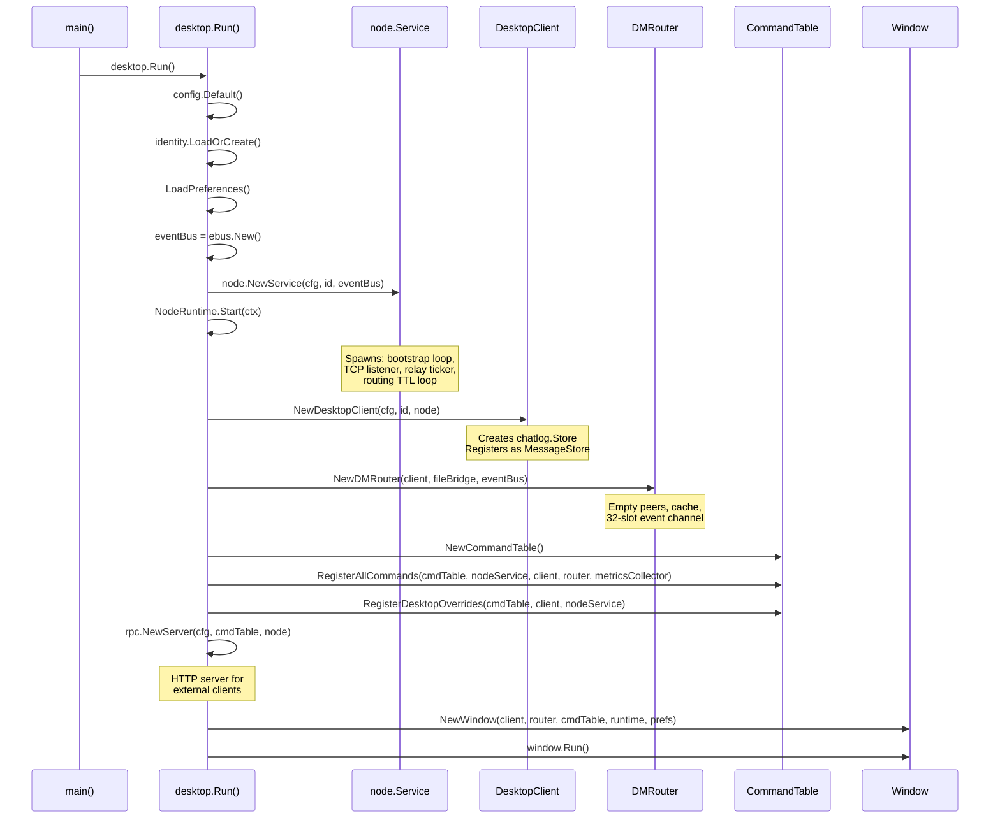
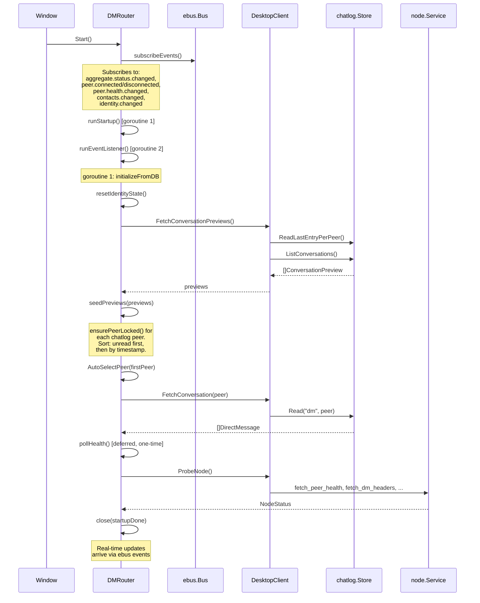
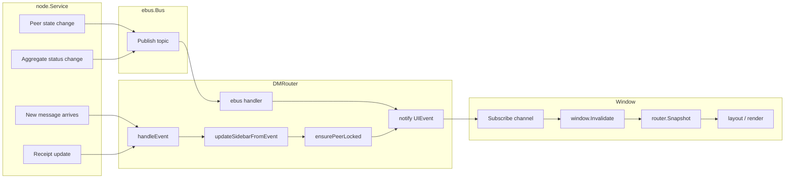
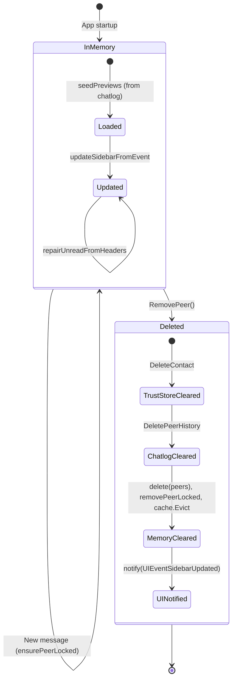
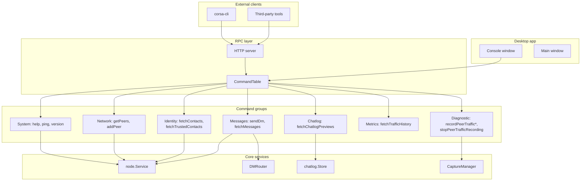
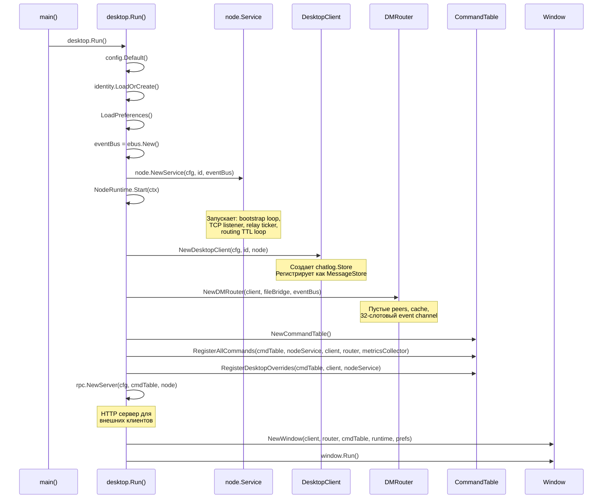
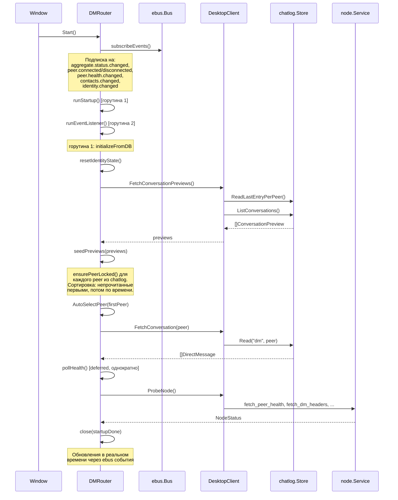
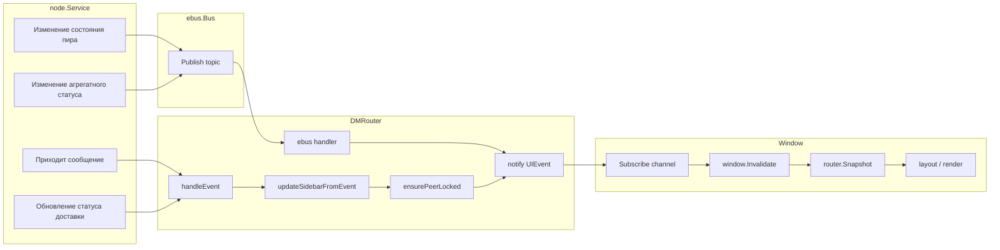
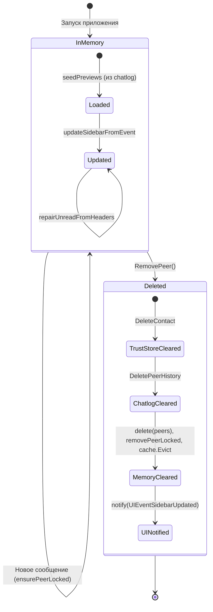

# CORSA Desktop UI

## English

### Overview

The desktop UI is built with [Gio](https://gioui.org) — a portable immediate-mode GUI library for Go. The UI layer is thin: it reads state from the `DMRouter` via atomic snapshots and delegates all business logic to the service layer.

### Component hierarchy

```
Window (Gio event loop)
  ├── Header (language selector, update badge)
  ├── Sidebar (contacts card)
  │   ├── My identity card (fingerprint, fully wrapped address, known count)
  │   │   └── Identity details overlay
  │   │       ├── QR contact link + full address
  │   │       ├── Copy identity / Share contact actions
  │   │       └── Centered modal on desktop; opaque full-screen view in compact mode
  │   ├── Identity search (short visual hint, descriptive accessibility label)
  │   ├── Known identity list (from router peers)
  │   │   └── Presence avatar (green/gray/outline) + last-online timestamp
  │   └── Context menu (right-click, 500 ms long-press, or the card's ⋯ button: copy, alias, delete)
  ├── Chat area
  │   ├── Message list (scrollable)
  │   └── Message bubbles (with delivery status)
  │       ├── Author + timestamp (DD.MM.YYYY HH:MM)
  │       ├── Reply quote (if reply): sender · date + quoted text
  │       │   └── Click scrolls to original message
  │       ├── Message body (selectable text)
  │       ├── File card, with an image preview for image attachments
  │       │   └── Click opens the image viewer over the whole window
  │       ├── Reaction chips (real state: what this node holds for the message)
  │       ├── Delivery status (sent/delivered/seen)
  │       └── Context menu (right-click, 500 ms long-press, or the bubble's ⋯ button)
  │           ├── Quick reaction pill above the card (7 emoji + more)
  │           │   └── Emoji panel in reaction mode (Escape steps back to the pill)
  │           └── Reply, Copy, Delete
  └── Composer card
      ├── Recipient display
      ├── Reply preview banner (when replying)
      ├── Message input (vertically centered single-line text, upright attachment icon, emoji picker, inline send action)
      │   └── Emoji picker (categories, keyword search aligned with its icon, recently used)
      ├── Status line (send/delete/sync feedback)
      └── Footer (flexible shielded network status, chart-icon console toolbar button on the same desktop row down to 360dp, on every platform)
```

The emoji picker is non-modal. Opening it and selecting an emoji keep keyboard
focus in the message editor; `Escape` and system `Back` close the picker before
chat or Activity navigation. On touch input, opening the picker hides the soft
keyboard without blurring the editor. Only the opening layout suppresses the
focus-triggered show command: tapping the message editor while the picker is
open can raise the keyboard normally. Closing restores the keyboard state that
was active before opening, independently of whether the picker button was
pressed by touch or mouse, and clears the search query and the grid's scroll
offset: a query that outlived its picker would reopen it on a single cell with
no category highlighted, explained only by small text in a field nobody is
looking at. Opening the picker scrolls the chip row to the selected category,
which is what keeps a scrolling row from highlighting none of the chips it has
room for.
Search is global across categories and matches prefixes at keyword boundaries;
every catalog entry has individual English and Russian names, so incremental
queries such as `piz` work without arbitrary infix matches. Category selection
is not highlighted while a global query is active. Up to 12 recently used emoji
are stored in desktop preferences, with rapid selections coalesced into one
write and the pending snapshot flushed on shutdown, then restored on the next
start.

The composer measures the rendered footer once and uses that exact height when
sizing the emoji picker. Below the picker's own chrome plus one row of emoji
the surface is not drawn at all: it stays open, asks for the touch keyboard to
be taken away, and appears once that room does — a clipped strip with no
reachable cell would be worse than the wait. `Escape`, system `Back` and the
picker button keep closing it while it waits, since they are handled outside
the layout. A dismissal key wins over a toggle tap delivered in the same
frame — one gesture, one outcome.

The row of category chips spreads across the picker when all nine fit at full
size and scrolls them at full size when they do not, the way the grid below it
already works. Shrinking them to fit was the alternative and it is worse: at
140dp of row the icon would be 15dp, at 40dp it would be 4dp — overlapping
nothing and hittable by nobody — and unlike vertical room, horizontal room
cannot be asked for by dismissing the keyboard. Each emoji in the grid is centred on its INK
rather than on its line box, because an emoji's ink ends on the baseline and
the font descent below it is empty — centring the box lifts every glyph off the
middle of the hover highlight drawn around it. A blocked send action shows its localized reason next
to the arrow instead of exposing it only to accessibility. Editor height and
scrollbar visibility use the same 21sp line-height metric as text rendering,
and the height cap is floored to a whole number of those lines, so a capped
editor never shows the top slice of a line that cannot be read;
the Gio line-height scale is explicitly `1` instead of its 1.2 default.

The identity details overlay owns keyboard focus while it is open. Focus starts
on Close, Tab and Shift+Tab cycle through Close, Copy identity, and Share
contact, and Escape closes the overlay. This prevents the search editor or
composer underneath from receiving text and shortcuts. Closing from the
keyboard returns focus to the My identity card.

### Fonts

Both font families ship inside the binary: the Go faces for text, and Noto
Color Emoji for emoji, registered under the family name `Corsa Emoji`. The
theme asks for `Go, Corsa Emoji`, and an exact family match beats anything on
the host, so the emoji a user sees are the ones this build carries.

The family name matters as much as the file. `emoji` is a GENERIC family in the
font matcher, alongside `serif` and `monospace`, and the fontconfig
substitution table indexes the host's own emoji font under it — registering the
bundled font as `emoji` therefore queued it behind Segoe UI Emoji on Windows,
and the bundled bytes were never reached. A name nothing else can claim ends
that competition, at the price of no longer falling back to the platform font
for an emoji this build does not carry.

The emoji font is bundled because the platform fonts are not interchangeable
for this renderer. Gio draws outlines, SVG and BITMAP glyphs and skips anything
else without a word, while Windows keeps the colour glyphs of Segoe UI Emoji in
a COLR table: on Windows every emoji rendered as blank space, and the regional
indicator pairs behind flags fell back to their plain letter outlines and
showed as `UA`, `DE` and so on. Windows ships no flag glyphs at all, so nothing
done on the host side could have produced them.

The file must therefore stay a BITMAP build (CBDT/sbix). The Noto Color Emoji
served by Google Fonts is COLRv1 and would restore the blank-emoji bug; the
bitmap build lives in the `googlefonts/noto-emoji` repository as
`fonts/NotoColorEmoji.ttf`. Two tests hold that contract: one reads the table
directory of the embedded bytes and refuses a font without a bitmap table, the
other shapes every emoji the picker offers and fails on any that comes back as
`.notdef` — shaping rather than a `cmap` lookup, because flags are ligatures of
two regional indicators and the rainbow flag is a ZWJ sequence.

The cost is about ten megabytes in every binary, the Android package included,
where the platform font would have done. That is the price of the same emoji
everywhere and of not depending on what the host happens to have installed —
a Linux desktop without an emoji font had the identical blank-glyph problem.
The font is parsed once per process and its face shared between windows, which
the Gio API explicitly allows; the licence travels with it as
`internal/app/desktop/assets/fonts/OFL.txt`.

### Shared UI components

Seven pieces of the interface are single components rather than per-call-site
assemblies, and they live in their own package, `internal/app/desktop/ui`. They
came out of `docs/design/CHANGES.md` and `CHANGES1.md`, which are the
designer's task files and are re-exported wholesale — this section is where the
implementation is described, so a new export cannot erase it.

The package boundary is the point. Every one of these started as a method on
`*Window`, which meant a component could reach any state the window had. A
component now takes a `ui.Kit` — a theme and an icon — plus its own arguments,
and the compiler refuses anything else; a "component" that needs the peer list
is a screen, and this is what says so.

`ui.Chip` is the rounded clickable fill under the tab pill, the toolbar button
and the popup row, and `ui.Filled` the rounded fill under all of those plus the
popup card. Both exist because a fill painted from `Constraints.Max` covers the
room a widget was OFFERED rather than the room it took: that put an opaque
column down the console window under the open tab menu, and squared off every
pill's corners, since the rounded corners landed outside the enclosing clip.
Chips also go through `widget.Clickable` rather than `material.Clickable`,
which drops Gio's ink: its hover wash is clipped square and showed as four pale
dots at a rounded pill's corners, and its ripple flashed a white ring on every
click. Neither is in the design.

**Modal shell** (`modal_shell.go`) is every modal window: backdrop, card,
header with title and close button, and the sizing rules. Identity details and
the console use it. The backdrop covers the whole window and consumes EVERY
press on it, which is two separate guarantees: a press beside the card closes
the modal, and a press on a blank patch of card — its padding, the gap under
short content, the whole screen in the compact layout — reaches neither the
modal nor the application underneath. Desktop sizing is either a centred
384×520dp card (identity) or the window less a 6dp margin (console); the
compact layout gives every modal the full screen, without border or radius.

**Round icon button** is one component (`RoundIconButton`) behind every
circular control the design draws as the same thing: a modal's close button
and all seven of the image viewer's. A 44dp circle with a 1dp ring, in two
states — resting and hovered — plus a disabled look at 40% that keeps its
place in the row and wraps no `Clickable` at all, so it neither highlights nor
takes a press. The ring is an outer disc with the fill laid over it inset by
its width, not a stroked outline: a stroke is centred ON the path, so half of
it falls outside the button's bounds, and `widget.Clickable` clips to exactly
those bounds. Keyboard focus deliberately does NOT highlight it: the identity
panel focuses its close button on open, so a focus-driven highlight left that
one button permanently in the hovered look while every other modal's reacted
to the pointer.

The viewer drew its own circles first, and that is precisely how its buttons
ended up with no hover at all — a component copied by eye is a component whose
states are copied by eye. Only the palette varies now: the destructive delete
button carries its own pair, everything else takes the shared one.

**Toolbar button** (`toolbar_button.go`) is the language selector in the header
and the Console button in the footer. Content-sized, icon on either side,
active while the surface it owns is open.

**Menu popup** (`menu_popup.go`) is every dropdown: the language selector and
the console tabs that do not fit a narrow strip. The component is the card and
its backdrop; where the card goes is the caller's, because the two anchors have
nothing in common — one hangs under a header button in window coordinates, the
other under a tab strip inside the console modal. Both anchor to the RIGHT edge
of the button that opened them, clamped into the area they are drawn in.

The backdrop is what makes a press aimed at empty space dismiss the menu
instead of selecting whatever sits underneath it. Catching that press and
tinting the background are separate: the console's tab menu dims the card it
covers, the language menu does not — a wash over every contact and message for
the sake of a six-row dropdown reads as a modal dialogue, which it is not.

The card hugs its rows in both directions. Its height is capped by the room
under the anchor and scrolls past that, never stretched to it; its width is
either fixed (language, 220dp) or measured from the widest row (tabs), and
every row is then laid out at that width so two rows in one card cannot come
out different sizes. The scrollbar overlays the rows rather than reserving a
gutter, which is Gio's default and made the card visibly lopsided.

The fill of a small selectable control — console tab pill, toolbar button,
popup row — is one shared pair (`chipFill`), because the design describes each
of them by pointing at the others. The idle label colour is not shared: the tab
strip is deliberately dimmer than the other two.

Neither the modal card's shadow nor the popup's is implemented. Gio has no
box-shadow primitive, and faking one with stacked translucent rectangles draws
over the backdrop and reads worse than its absence.

**Message bubble** (`message_bubble.go`) is the frame around one chat message
and, above all, the ORDER of the five things it can hold: reply quote, header,
body, reaction chips, delivery status, with 4/4/8/6dp between them. It used to
be a sequence of appends inside one 180-line function, where a fifth part could
be added in four places and three of them would have looked almost right. A
slot the caller leaves nil takes its spacer with it, so a message with no
reactions pays nothing for the slot. What goes IN the slots stays with the
screen: the quote resolves a message by ID, the body may be a file card, the
status line reads delivery receipts. Only the border colour and the author
colour follow the sender; which side of the chat the bubble sits on is the
list's business, not the bubble's.

**Emoji panel** (`emoji_picker.go`) is one component drawn in two places: under
the composer, where a choice is inserted into the draft, and over a message,
where it becomes a reaction. The mode changes exactly two things — a header
with a title and a close button appears, and the caller closes the panel after
a choice instead of leaving it open. The CATALOGUE is not in the package: what
emoji exist, what they are called in six languages, which of them match a query
and which twelve were used most recently are application data, so the screen
filters and hands the result over. `EmojiPickerChromeHeight` counts the mode's
header, so the reaction panel reserves room the composer's does not need.

The composer's panel is as wide as the composer; the reaction one is placed by
hand and so has to be told how wide to be. It takes the width that holds the
design's seven columns (`EmojiPickerWidthForColumns`), not the width of the
reaction pill it replaces — matching the pill looked tidy and cost a column, 365
minus 18dp of frame and padding being six cells of 52dp rather than seven. That
width includes the 8dp the scrollbar occupies, and the column COUNT is taken
against the same post-gutter width: `material.List` reserves its gutter out of
the row it lays out, so counting first and reserving second draws every cell a
pixel narrow with the count one rounding step from dropping a column.

The category chip is a rounded SQUARE, drawn by hand rather than through
`material.IconButton`: that style paints its background as an ellipse, so the
selected category read as a blue dot where the design asks for a 7dp slot, the
same shape as every other small selectable control here.

One emoji is drawn by `Kit.EmojiGlyph`, which reports its whole LINE box.
Reporting the ascent alone is the right thing for text and the wrong thing for
an emoji, which does not sit on the baseline but straddles it: measured from the
bundled font at 22sp, the line box is 27px with the baseline 6px off the bottom
and the ink running from 20.4px above that baseline to 5.4px below it. Centring
the 21px ascent therefore centred a box the ink overflows downwards and pushed
every glyph ~2.5px low in its cell, measurably off the hover highlight drawn
around it.

The two panels are one component but two STATES. Both can be on screen at once
— a message menu opens over a composer whose picker is already up — and sharing
a state aliased their search fields and their grid buttons; worse, the
composer's click handler runs before the overlay is laid out, so a tap meant as
a reaction was inserted into the draft. Only the recents are shared: which emoji
a person reaches for does not depend on whether they are writing or reacting.

The pill takes as many quick choices as the window holds, longest first: the
design's seven need 365dp, and nothing clips a surface that is drawn at its own
size and placed by an anchor, so a fixed seven-slot row on a 320dp phone put its
"more" button entirely past the right edge. Below one quick choice the pill is
not drawn at all. Which slots were drawn is recorded before the focus ring is
built, for the same reason the "did the pill fit vertically" answer is.

Both floating surfaces — the pill and the panel — swallow every press that
lands on them (`SwallowPresses`). Without it only their interactive widgets
register for input, so a press on padding, on the panel's header or in the gap
between two blocks fell through to the backdrop, whose job is to dismiss: the
user pressed the middle of an open panel and it vanished. The modal shell
answers the same question by testing the press against the card's bounds, which
a surface placed by an offset cannot do.

Swallowing PRESSES is all any of them filter for, and it is enough for the
wheel too: a Gio area that registers an `event.Op` is opaque to pointer routing,
so nothing below it is considered for any pointer event whatever filters that
area declared. The chat cannot be scrolled through an open overlay, and adding
`pointer.Scroll` to these filters would only deliver events they have nothing to
do with.

A window with no usable width takes the same path as one with no usable height:
nothing drawn, an empty focus ring, and both Escape and a press still working.
The backdrop stays — it is what a press dismisses against — but it stops
TINTING, because a 40% wash over a chat with no menu on it reads as an
application that has hung rather than one waiting for room.

The floor is the menu card's own chrome, because `layout.Inset` floors its
subtraction at zero and hands back a card WIDER than it was allowed — the trap
`menuMinUsableDp` names on the other axis. It is summed in PIXELS from the terms
the card draws rather than converted from their total in dp: at 1.5 px/dp the
card's own 2×`Dp(1)` + 2×`Dp(6)` is 22px while `Dp(14)` is 21, so a gate written
the short way admitted a window that left the card's content exactly nothing.
`emojiPickerChromeHeight` states the same rule for the other axis.

All three surfaces the message overlay places — the pill, the panel and the menu
card — are sized by `msgOverlayWidth` and placed by `placeMsgOverlay`, which is
`placeMenu` plus the same 8dp edge. One rule for each, because the two halves
have to agree: reserving the edge when counting quick reactions and ignoring it
when placing them made the reservation a fiction, and sizing the pill and the
panel to the window while the card kept a flat 180dp ran the card off the edge
under the two surfaces it is placed with.

The pill drains the presses of the slots it drew LAST frame as well as the ones
it is about to draw, and it drains them whether or not it has room this frame — including on the frame
where the whole overlay is deferred for want of height: the quick list is recomputed for the new width before the
previous frame's events are read, so a window narrowed in between drops the slot
the user pressed — and a press nobody asks about is discarded at Frame time
rather than merely postponed.

**Reaction surfaces** (`reactions.go`) are the pill of quick choices that opens
with a message's context menu, and the chip row under a message that already has
some. The list is longest first and trimmed to what the window holds: seven slots
and the "more" button come to 365dp, which is what fits a 412dp phone with 8dp of
inset either side, so a phone shows the head of the list and the rest stays one
tap away behind "more". Neither surface knows
what a reaction IS: they are handed emoji and counts and report what was
pressed. The pill's shadow is not drawn, for the same reason the modal card's
and the popup's are not.

The pill and the menu card are placed as ONE block by the message overlay, and
the pill is dropped entirely when the two cannot both have room — the menu
comes first, since Reply, Copy and Delete are the only way to act on a message
while the pill is a shortcut to something the menu reaches anyway. Whether the
pill was given room is decided BEFORE the focus ring is built, because the ring
lists its slots: a ring holding an item the frame never draws loses its focus
at Frame time and pulls it back every frame after. With the emoji panel open
the ring is the panel's own controls: the search field, the close button, the
nine category chips, and ONE stop for the whole grid — the cell a keyboard
cursor sits on, moved by the arrows and activated by Enter, since a focused
`widget.Clickable` activates itself. The grid is one stop because listing every
cell would take a minute to Tab past; the categories are all nine because nine
is walkable, and leaving them out stranded a keyboard user in whichever category
the panel opened on. The search field is hoisted ahead of the close button drawn
above it, the same exception `peerMenuItems` makes for the alias editor.

Left and Right stay on their row: stepping the index by one lands on the first
cell of the next row, which is nowhere near where the user was pointing.
Stepping off the top of the grid returns to the search field; the other three
edges do nothing. Whatever the keyboard walks to — a grid cell or a category
chip on a row too narrow to spread — is scrolled into view, because Gio drops
the focus of any tag the frame does not draw and the ring would then pull focus
back to its first item every frame. The ring SAYS where it sent focus
(`menuFocusState.want` → `RevealTag`), the same contract `menuScroll` works
under, rather than the panel asking `gtx.Focused`: Gio applies a `FocusCmd`
immediately only while its event queue is not deferring, so reading the answer
back works on a quiet frame and stops working on a busy one. Escape steps back to the pill rather than
closing
the menu. The panel is keyed by the open MENU — by the pointer `openMsgMenu`
stores, not by the message's ID — so none of the nine paths that close that menu
has to remember to close the panel too. Keying it by ID looked equivalent and
was not: pressing the backdrop clears the menu and would leave the ID behind, so
reopening the menu on that same message came straight back up as a 250dp panel,
on the query the user had walked away from.

The chips draw real state. A tap means "the opposite of what I have now", and
which of the two that is gets decided by the service against what is stored,
not here against the chips on screen: the chips are a frame old, and two quick
taps read from them would both decide "set".

The decision is stored first and only then handed to the peer, over the
`dm_control` datagram type. The send is deliberately asynchronous — the node
batches a burst of taps into one frame about a second and a half later — so the
UI never blocks a tap on the network and never reports the send's outcome. The
one thing it does report is a peer whose build cannot receive reactions at all
(`ReactionsUnsupportedBy`): that reaction is never going to be seen by anyone
else, and saying nothing would make it look exactly like one that has been. See
`docs/refactoring/reactions-protocol.md`.

A peer's reactions arrive on the event-bus goroutine, which owns none of the
window's state. It therefore raises one atomic flag and asks for a frame; the
reload happens at the top of the next layout, on the goroutine that owns the
cache. Writing the cache from the subscriber is a concurrent map access — a hard
crash, not a stale value — and `Invalidate()` is not a barrier.

Sending a message closes every emoji surface: the composer's picker, the
reaction pill, the panel over it, and the message menu the pill belongs to.
Sending ends the composing gesture, and a surface that outlives its gesture is
one the user has to dismiss by hand before they can see what they just sent. The
press queued in the same frame is dropped with them, as on every other dismissal
path — otherwise a tap on a quick slot in the frame of a send would be answered
by the next menu to open, on whatever message that is.

A tap that does not reach storage is reported. The write can lose a race against
another decision on the same key, or cross one of the storage ceilings; both
leave the chips exactly as they were, so closing the surface silently would
leave the user believing they made a reaction that does not exist.

### Console

The console is a modal drawn over the main window, not a window of its own. It
has one instance for the life of the process, created when it is first opened,
so command history and the selected tab survive closing it; the ebus
subscriptions and the traffic ticker live only while it is open, and the temp
files holding oversized command output are removed at shutdown.

It reads the frame's router snapshot from the parent rather than taking its
own, so the console and the contact list beside it can never show two
generations of the same state.

Opening the console moves the keyboard into it. Gio leaves focus where it was,
which is the message composer the modal now covers: without the hand-over
everything typed went to a contact the user could not see, and Enter SENT it
instead of running the command. A pending "focus the composer" request is
voided while the console is up, the same rule the context menus follow.

Tab then stays inside, and it stays inside STRUCTURALLY: the window under the
modal is laid out with input disabled, so nothing there declares a
key.FocusFilter and Gio's traversal has only the modal's own widgets to walk.
Window.handleActions stops at its first line for the same reason, and it is the
less obvious half: Clickable.Clicked REGISTERS that filter, so merely reading
Send or Attach for clicks would have kept them Tab-reachable however the
widgets were later drawn — and Enter on a focused Send posts the hidden draft.
Only Back is read while a modal is up, because it is a key filter rather than a
widget and it is how Android dismisses the modal.
The first attempt did it the way the context menus do — a focus ring listing
the surface's items — and that cannot work here. A menu has four rows; the
console's tabs carry a Copy button per history entry, a
delete/download/restart set per file transfer, the donate rows and the
recording controls. Enumerating them made everything not enumerated
unreachable, and a ring that gave Tab back to the completion popup let
Shift+Tab out of the modal entirely, because the editor's own filter matches
Tab without the modifier. Removing what is outside scales; listing what is
inside does not.

The target focus lands on is the command line on the Console tab and the
header's close button everywhere else, because the command line is only laid out on that one tab —
and the selected tab survives a close, so the console can reopen on Peers or
Donate. Focusing a widget the frame does not draw is the same as focusing
nothing: Gio drops it at Frame time. The focus ring the modal still holds is used for one half of its contract, the
hand-back on close, and never driven. Switching between the Console tab and any
other re-aims focus for the same reason as above, and asks for the frame that
will apply the move — a dropped focus is a state change nobody filters for, so otherwise
it would wait on unrelated input. Closing hands the keyboard back to the
Console button through the ring's own restore, which waits one frame for the
focus to be dropped and asks for that frame — a close with no other invalidate
behind it, Escape or a press on the backdrop, would otherwise park the
hand-back until unrelated input woke the loop.

Escape and the system Back key back out one layer at a time and share the same
ladder: the More menu or the completion popup first, the modal itself once
neither is open. Whether the popup is showing is decided by what the user can
see — the suggestion list being non-empty, on the tab that actually draws it.
Its rows scroll: the panel is as tall as they are, and past that the list
scrolls rather than laying the tail out at zero height, which is what let arrow
navigation select and run a command that was not on screen. Stepping the
highlight scrolls only when the row is off screen, and to the near edge of the
visible span — scrolling to it unconditionally makes it the list's FIRST
element, and layout.List draws nothing before First, so Down to the second
suggestion used to hide the first.
Off the Console tab it reports nothing at all, so a stale popup cannot swallow
a key while nothing on screen moves. The first attempt asked instead
whether a frozen snapshot existed or the list had been hidden, which is inside
out: an ordinary filtered list has neither and answered "nothing to close", so
Escape took the whole modal; a list already dismissed by picking from it
answered "yes", swallowed the key and reset the editor, wiping the typed
command. They used to disagree — Back closed the whole console from
inside an open menu — and nothing open inside the console survives its close,
so a reopened console never restores a menu the user did not ask for.

The tab strip shows all six tabs on a desktop window. Below the compact
breakpoint it shows the first four and folds Info and Donate into a "More"
dropdown, whose button carries the selected tab's name when the selection is
inside it. Escape closes the dropdown first and the modal second; before the
console became a modal, an Escape with no completion popup showing fell through
and RAN the typed command.

Two surfaces of one window now carry an input row the on-screen keyboard must
not cover — the composer underneath and the console's command line on top. Only
the reachable one may decide how much room the keyboard has to leave, so the
frame's keyboard tail has an explicit owner (`keyboardTailOwner`): `layout.Stack`
lays Stacked children out BEFORE its Expanded one, so neither "first wins" nor
"last wins" falls out of the layout order by itself.

### Image viewer

Clicking an image preview opens it inside the application: one picture over
the whole window on an opaque backdrop, with every other image of the open
conversation reachable from it, save and delete under it (`image_viewer*.go`,
design screens 8a–8d). The backdrop is the one in this application that does
not let anything through: at the design's 88% a bright message bubble and its
white text stayed legible behind the picture, and a surface whose whole job is
to show one image ended up showing the chat through it.
Before it, a click handed the file to whatever the desktop opens images with,
and on Android it did nothing at all — `openFile` is a stub there, since gogio
ships no FileProvider, so the preview was not even a button. The external
application is now the fallback for a file the viewer cannot draw, and nothing
else.

Two surfaces open it: the preview inside a chat bubble, and the thumbnail in
the console's Files tab. They know different things — one has a message, the
other a transfer snapshot — so each builds the item it opens and the viewer
takes it as given.

**What it steps through.** The image attachments of the open conversation, in
message order: the ones whose file is on disk, plus the ones still arriving —
a download in flight holds its place in the strip with no path yet and is
drawn as the loading state, because the alternative is a picture that cannot
be looked at until it is finished and then appears from nowhere.

The list is rebuilt when the router's DM generation moves (a message
arriving, a deletion taking one away) and not per frame: walking a
conversation and stat-ing every attachment is per-open work. Finishing a
download moves none of that — it changes the disk, not the conversation — so
a list that holds an item with no file yet also re-resolves itself twice a
second until it has one, and asks for the frames that poll costs. A list
where everything is on disk is never rebuilt on a timer.

A rebuild keeps the picture on screen selected by its message id, and keeps
its ZOOM when the selection did not change — that generation moves for a
delivery receipt too, and resetting the zoom on each of those drops the user
out of a magnified picture. When the image is gone, the viewer lands on the
next one, on the previous one if it was the last, and closes on an empty
list. A file opened from the console can belong to a conversation that is not
the open one; the viewer then shows exactly that file, and re-resolves that
one path rather than rebuilding a list it does not own.

**How it is opened.** A chat bubble's image attachment opens it, and what
carries the click depends on what the card has: the preview when the
thumbnail is decoded, the file-name row when it is not. The console's Files
tab does the same with a tile: the picture when there is one, an
hourglass-or-broken-image placeholder when there is not. That second case is
not an edge — it is a file still downloading and a picture whose decode
failed, which are exactly the two states the viewer draws as "loading" and
"cannot display this file". Gating the click on a ready thumbnail made both
of them unreachable from either surface.

**Where it sits.** Not one more Stacked overlay beside the context menus and
the console: it covers the console too, so the whole window — the console
included — is laid out underneath it with input disabled
(`disableUnderImageViewer`), and `Window.handleActions` stops before the
window's own controls while it is up. That is the same pair of measures the
console modal takes over the window, and for the same two reasons: reading a
widget for clicks is what puts it in Gio's focus traversal, and a press beside
the picture must not reach a contact row through it. Escape and the system
Back key back out one layer at a time — the delete confirmation first, the
viewer second. Opening moves the keyboard onto the close button (the one
control every state draws); closing hands it back to the composer, and asks
the console to re-claim it when the console is what the viewer was covering,
because the composer under an open console is disabled and Gio would drop that
focus at Frame time.

**Two bitmap caches.** `thumbnailCache` holds pictures downscaled to 1024px
because its consumers draw them in a 260dp box. The viewer decodes at full
resolution into a cache of its own, and the only thing that bounds the size
is the hardware: Gio gives a painted image a texture of its own and PANICS if
the driver refuses to create it, so a bitmap wider than the device's
`GL_MAX_TEXTURE_SIZE` would not look bad, it would take the window down.
`viewerStoreMaxPx` is therefore 4096 — the floor OpenGL ES 3.0 guarantees,
which is the baseline for the Android minimum this application targets, and
below every desktop driver — and only a picture larger than that is
downscaled at all.

What it holds is the current image plus one neighbour on each side, bounded
by `viewerCacheMaxBytes`: full-resolution bitmaps are large (a 12MP photo is
48MB as NRGBA), so "three of them" is not a memory bound by itself and on
Android it is an out-of-memory kill. The picture on screen is never evicted —
the budget exists to bound the preload — and everything is released on close.
Widening the shared thumbnail cache instead would have made a scrolled
conversation decode every card at viewer size. What the two caches share is
what actually bounds the decode: `estimateDecodeBytes` reads the header and
rejects the bombs, and the byte-weighted `thumbDecodeAdmit` budget serializes
large decodes across both.

While the full bitmap is being decoded the thumbnail stands in, stretched —
it is the same picture at the same aspect ratio, so nothing moves when the
full one lands; with neither, the viewer says so, and a decode that fails
gives the "cannot display" fallback with the external-application link.

**Zoom and gestures.** 100% is the picture contained in the viewport and never
upscaled past its own pixels; the stops above it are 200% and 400%. A desktop
window steps them with the header buttons and Ctrl+wheel, and both controls
dim at the end they cannot pass rather than disappearing — a control that
vanishes moves everything laid out beside it, which is the same reason the
arrows dim at the ends of the strip. Touch has no zoom controls at all: a
pinch is continuous between the same two limits and a double tap toggles
100 ↔ 200 around the point touched. Every zoom keeps the point under the
pointer where it is, and stepping to another image goes back to fitted.

The picture, and not the box around it, is what the pointer works on: the
gesture area is the rectangle the image actually covers, so the space beside
a portrait or a small picture is backdrop and a press there closes the viewer.
The exception is the phone layout with nothing drawn yet — a file still
arriving, a picture that cannot be decoded — where the swipe across that space
is the only way to step to the next image.

While the picture is magnified one finger drags it, and only asks for the
neighbouring image once its edge is against the viewport — so a pan and a
swipe are the same gesture in a fixed order, not two gestures competing. There
is no mouse swipe: the mouse pans, and the arrows and keys step. The recogniser
(`viewerGestures`) is a state machine fed one pointer event at a time and
carries no viewer state of its own; what a drag means depends on the zoom and
the pan, which are handed to it per event. It is tested directly, because
pinch and double-tap have no equivalent in `gioui.org/gesture` and neither is
ever right by accident.

**Under the picture.** The thumbnail strip appears from two images and is
drawn from the thumbnail cache the chat has already filled, so opening the
viewer decodes one picture rather than a conversation.

Save copies the file into the platform's downloads folder under its own name,
without asking. Which folder that is, the platform decides. Windows is asked
(`FOLDERID_Downloads`), because there the folder is a Known Folder the user
can move, OneDrive redirects and policy relocates — and the old
`%USERPROFILE%\Downloads` usually still exists, so guessing saves into a
folder nobody looks at. Everywhere else it is the XDG chain: an exported
`XDG_DOWNLOAD_DIR`, then `~/.config/user-dirs.dirs` — where the XDG user dirs
actually live, and the only place that knows a folder the user moved or a
desktop-created localized one ("Загрузки") — then `~/Downloads`, which is also
the whole answer on macOS. Names never
collide: the file is created with `O_EXCL` under "photo.png", "photo (2).png",
"photo (3).png" until one takes, so two saves racing for the same name end up
as two files rather than one failure. Android has no such folder reachable by
an application — its files are app-private — so there, and anywhere the
folder cannot be found, the save falls back to the system document picker.

Delete removes THIS node's copy of the file and nothing else
(`FileBridge.DeleteLocalCopy`). The message stays in the conversation and
shows its attachment without a preview; on the receiving side it offers to
download it from the peer again. Deleting the message is a different action
with a different button — the message menu's Delete, which also asks the peer
to drop their copy — and the two must not be one control.

The button is inert on an image this node SENT, and the core refuses that
call as well (`ErrOutgoingCopy`). The sender's copy is the transmit blob the
recipient is still served from, it is shared by content between messages, and
nothing can restore it — see docs/dm-commands.md.

Even for a received file the deletion is behind a confirmation on the same
card the chat's destructive actions use, and it has no keyboard shortcut. The
question takes exactly one answer: a double click delivers two clicks to one
frame, and the second — aimed at a picture the first one already deleted —
is thrown away rather than acted on or left in the queue for the next time
the question is asked. While the question is up, nothing else in the viewer
moves: the surface under it is laid out disabled, and its own backdrop
dismisses the question alone — the card itself swallows the presses that land
on it (`ui.SwallowPresses`), so pressing its padding or the gap between the
question and the answers is not pressing the backdrop. An answered delete drops the file from both
bitmap caches before the erasure even starts, because the chat bubble behind
the viewer reads the same thumbnail entry; a delete that then fails puts the
image back on the next rebuild.

### Touch keyboard (Windows tablets)

Gio's Windows backend never invokes the on-screen keyboard itself, so the
desktop app drives it explicitly: tapping any editor with a finger shows
the keyboard (`InputPane.TryShow`, with a legacy TabTip/Toggle fallback on
old Win10 builds); while a **docked** keyboard is visible the window adds
bottom padding equal to the keyboard's `OccludedRect` height so the
composer/console input stays above it. A **floating** keyboard reports no
occlusion (zero height, per the `OccludedRect` contract) and — like other
Windows apps — the layout is not reflowed around it; the user moves the
floating keyboard themselves, and the app keeps tracking the session so
that re-docking reflows correctly. When every editor of the window loses
focus — including a tap outside
the editors — a keyboard that the app itself opened is hidden again
(`TryHide`), while a keyboard the user opened manually is left alone.
Ownership of the "app-opened" session follows the active window, so a
keyboard opened from the main window can be dismissed after switching to
the console and vice versa.

### Initialization sequence


```mermaid
sequenceDiagram
    participant Main as main()
    participant App as desktop.Run()
    participant Node as node.Service
    participant Client as DesktopClient
    participant Router as DMRouter
    participant Cmd as CommandTable
    participant Win as Window

    Main->>App: desktop.Run()
    App->>App: config.Default()
    App->>App: identity.LoadOrCreate()
    App->>App: LoadPreferences()

    App->>App: eventBus = ebus.New()
    App->>Node: node.NewService(cfg, id, eventBus)
    App->>App: NodeRuntime.Start(ctx)
    Note over Node: Spawns: bootstrap loop,<br/>TCP listener, relay ticker,<br/>routing TTL loop

    App->>Client: NewDesktopClient(cfg, id, node)
    Note over Client: Creates chatlog.Store<br/>Registers as MessageStore

    App->>Router: NewDMRouter(client, fileBridge, eventBus)
    Note over Router: Empty peers, cache,<br/>32-slot event channel

    App->>Cmd: NewCommandTable()
    App->>Cmd: RegisterAllCommands(cmdTable, nodeService, client, router, metricsCollector)
    App->>Cmd: RegisterDesktopOverrides(cmdTable, client, nodeService)

    App->>App: rpc.NewServer(cfg, cmdTable, node)
    Note over App: HTTP server for<br/>external clients

    App->>Win: NewWindow(client, router, cmdTable, runtime, prefs)
    App->>Win: window.Run()
```

*Initialization sequence*

### DMRouter startup


```mermaid
sequenceDiagram
    participant Win as Window
    participant Router as DMRouter
    participant eBus as ebus.Bus
    participant Client as DesktopClient
    participant DB as chatlog.Store
    participant Node as node.Service

    Win->>Router: Start()
    Router->>eBus: subscribeEvents()
    Note over Router: Subscribes to:<br/>aggregate.status.changed,<br/>peer.connected/disconnected,<br/>peer.health.changed,<br/>contacts.changed,<br/>identity.changed
    Router->>Router: runStartup() [goroutine 1]
    Router->>Router: runEventListener() [goroutine 2]

    Note over Router: goroutine 1: initializeFromDB

    Router->>Router: resetIdentityState()
    Router->>Client: FetchConversationPreviews()
    Client->>DB: ReadLastEntryPerPeer()
    Client->>DB: ListConversations()
    DB-->>Client: []ConversationPreview
    Client-->>Router: previews

    Router->>Router: seedPreviews(previews)
    Note over Router: ensurePeerLocked() for<br/>each chatlog peer.<br/>Sort: unread first,<br/>then by timestamp.

    Router->>Router: AutoSelectPeer(firstPeer)
    Router->>Client: FetchConversation(peer)
    Client->>DB: Read("dm", peer)
    DB-->>Router: []DirectMessage

    Router->>Router: pollHealth() [deferred, one-time]
    Router->>Client: ProbeNode()
    Client->>Node: fetch_peer_health, fetch_dm_headers, ...
    Node-->>Router: NodeStatus

    Router->>Router: close(startupDone)
    Note over Router: Real-time updates<br/>arrive via ebus events
```

*DMRouter startup sequence*

### Event-driven UI updates

The node layer pushes state changes via an internal event bus (`ebus.Bus`). The DMRouter subscribes to relevant topics and updates its snapshot on each event. Messages and receipts are still delivered via the legacy `SubscribeLocalChanges` channel during migration.


```mermaid
flowchart LR
    subgraph Node["node.Service"]
        MSG[New message arrives]
        RCV[Receipt update]
        PEER[Peer state change]
        AGG[Aggregate status change]
    end

    subgraph eBus["ebus.Bus"]
        PUB[Publish topic]
    end

    subgraph Router["DMRouter"]
        EVT[handleEvent]
        EBUS_H[ebus handler]
        SIDE[updateSidebarFromEvent]
        ENSURE[ensurePeerLocked]
        NOTIFY[notify UIEvent]
    end

    subgraph Window["Window"]
        SUB[Subscribe channel]
        INV[window.Invalidate]
        SNAP[router.Snapshot]
        LAYOUT[layout / render]
    end

    MSG --> EVT
    RCV --> EVT
    PEER --> PUB
    AGG --> PUB
    PUB --> EBUS_H
    EBUS_H --> NOTIFY
    EVT --> SIDE
    SIDE --> ENSURE
    ENSURE --> NOTIFY
    NOTIFY --> SUB
    SUB --> INV
    INV --> SNAP
    SNAP --> LAYOUT
```

*Event-driven UI update flow*

### Identity lifecycle


```mermaid
stateDiagram-v2
    [*] --> InMemory: App startup
    InMemory --> InMemory: New message (ensurePeerLocked)

    state InMemory {
        [*] --> Loaded: seedPreviews (from chatlog)
        Loaded --> Updated: updateSidebarFromEvent
        Updated --> Updated: repairUnreadFromHeaders
    }

    InMemory --> Deleted: RemovePeer()

    state Deleted {
        [*] --> TrustStoreCleared: DeleteContact
        TrustStoreCleared --> ChatlogCleared: DeletePeerHistory
        ChatlogCleared --> MemoryCleared: delete(peers), removePeerLocked, cache.Evict
        MemoryCleared --> UINotified: notify(UIEventSidebarUpdated)
    }

    Deleted --> [*]
```

*Identity lifecycle*

Identity enters the system through two paths:

1. **Startup** — `seedPreviews` reads conversation previews from the chatlog database and calls `ensurePeerLocked` for each peer address.
2. **Runtime** — when a new message arrives from an unknown identity, `updateSidebarFromEvent` and `repairUnreadFromHeaders` call `ensurePeerLocked` to add the peer.

Identity exits through `RemovePeer`:

1. `DeleteContact` — removes from the node trust store (persisted JSON file)
2. `DeletePeerHistory` — removes all chat messages from SQLite
3. In-memory cleanup — `peers`, `peerOrder`, `cache` cleared
4. UI notification — sidebar rebuilds from `peers` immediately

A failure of step 2 is not the same as a failure of the final history sweep
that closes the removal, and the window separates them with
`errors.Is(err, service.ErrHistorySweepFailed)`. The first leaves the contact
intact — the composer draft, the attachment, the alias and the selection stay
with it. The second leaves the contact gone and only its history in doubt:
the window finishes its own cleanup (`forgetPeerComposerState`, the alias,
the neighbour selection) and shows the error, because a draft belonging to a
conversation the user can no longer open, and a deleted chat left selected,
are worse than a reported failure.

### Sidebar data source

The sidebar recipient list is built exclusively from the router's in-memory `peers` map. There is no dependency on polling or external contact sources:

```
snapRecipients()
  └── snap.Peers (router in-memory state)
      ├── Seeded from chatlog at startup
      ├── Updated by incoming messages in real-time
      └── Cleaned on RemovePeer
```

### UIEvent types

| Event | Trigger | UI effect |
|-------|---------|-----------|
| `UIEventMessagesUpdated` | New message, receipt update, conversation switch | Chat area redraws |
| `UIEventSidebarUpdated` | Peer added/removed, unread count changed, preview updated | Sidebar redraws |
| `UIEventStatusUpdated` | Health poll completed | Network status indicator updates |
| `UIEventBeep` | New incoming message (not during startup replay) | System notification sound |

### Contact presence

Each contact in the sidebar displays a person avatar with three states:

- **Green filled** — at least one route exists (identity is reachable through the mesh)
- **Gray filled** — no route is available (identity is unreachable)
- **Gray outline** — reachability data is unavailable (probe failed or node not connected)

The sidebar starts directly with “My identity”; there is intentionally no extra “Clients” heading above it. This keeps the hierarchy aligned with the compact design and avoids repeating what the panel already communicates.

Reachability is computed once alongside every immutable routing snapshot and stored as a cached identity set. In embedded mode, `NodeProber.BuildReachableIDs()` clones that set directly (no RPC round-trip); remote TCP mode (`localNode == nil`) receives the same cached set through `fetch_reachable_ids`. It covers all identities in the routing table — not just those from `fetch_identities` — so sidebar peers that entered through chatlog or DM headers also get the correct status. Snapshot-published events keep `NodeStatus.ReachableIDs` current between full `ProbeNode` cycles.

Offline rows also show the latest available online observation; online rows rely on the green avatar instead of displaying a moving current time. `identity.presence.changed` is an offline-only observation containing the observing node in `Source`, the affected identity batch, and the transition time. A clean remote EOF on the final direct session is attributed at the lifecycle path that performs `RemoveDirectPeer`, so the normal two-node Alice↔Bob topology records Bob even when the routing table becomes empty. The timestamp is captured when the session closes and carried through withdrawal grace; the grace delay never shifts `last_online_at`. A deliberate local eviction/shutdown, reset, and timeout are not attributed: they may mean that the observing node lost its own interface, NAT mapping, firewall path, or route. `RemoveDirectPeer` returns the peer's post-mutation reachability under the routing-table lock and with the same selectable-route predicate as `Snapshot.ReachableIdentitiesWithTransit`, avoiding a second clock read and a racy `Lookup`. For transit identities the routing-snapshot comparison remains necessary; it records a final-route loss only while another remote route witnesses that the local node still has network reachability, and never turns a total collapse into a mass offline event. A serialized presence projection remembers whether each previously reachable identity had selectable direct and/or transit sources. Direct removal consumes the direct source in the same serialized interval as snapshot capture: a clean EOF consumes the whole final transition only when lifecycle actually publishes it, while an ambiguous close leaves any transit source snapshot-owned. Therefore a direct loss and a later transit loss produce the same durable result whether they land in one snapshot generation or two, without a cross-goroutine dedup marker. Both paths timestamp their observations through the same `presenceClock` provider.

The observing node queues `last_online_at` persistence exactly once in its tracked background runner before publishing the best-effort event; the event bus is a notification channel, not a command path back into the node. The desktop subscriber accepts only events whose `Source` equals its own node identity and updates contacts only. `ReachableIDs` has one writer: the snapshot-reason route event. If the desktop event is dropped, the next probe repairs the UI from durable state.

The field survives a restart and is separate from `last_seen_at`, which describes key-material observation. `peers.json` v3 also persists each known address-to-identity binding, so identity-matched `PeerHealth` activity/disconnect evidence remains usable immediately after restart instead of waiting for a new handshake. Durable contact time and peer health are compared by timestamp and the newest wins; **incoming** conversation activity is not in that comparison and is spent only as a fallback, described below. An outgoing message is never evidence that its recipient was online. Conversation activity is never read from the sidebar preview: the preview is the last row of the thread, which is our own message in every conversation we answered last, so a preview-derived reading loses the contact's message behind the reply.

The node-owned sources are the durable `last_online_at` on the contact and the `PeerHealth` activity timestamps. Both are this node's own observations, stamped with its own clock, and they are compared by recency — newest wins. The node is the only writer of `last_online_at`: it stamps a contact when the final route to it is lost, and when a DM arrives over that peer's own authenticated session. The arrival path also publishes `identity.presence.observed`, because the desktop probes the node once at startup and lives on events afterwards — without the event the durable write would not reach the running sidebar until the next launch. The monitor applies that topic and `identity.presence.changed` through one handler: they differ in what was observed, not in what the UI does with it, and neither touches `ReachableIDs`. An observation about an identity the monitor has no contact row for yet is held aside rather than dropped — the topics and `contact.added` run on independent subscriber goroutines — and the contact-added handler or the startup probe claims it. The hold is capped, entries expire after five minutes, and when it is full the entry evicted first is one that came from `identity.presence.changed`: those carry routing-table identities, most of which will never be contacts, while `identity.presence.observed` carries the sender of an accepted DM, whose contact row is already on its way.

`RouterPeerState.LastIncomingAt` is not one of those sources and never competes with them. It is the newest message this contact wrote — the SENDER's clock — recomputed by the router from the chatlog and deliberately never persisted: a durable copy would be a second thing to keep in step with the first, and ordering their writers needs a version that a sidebar label does not justify. The router recomputes it at startup, advances it on every incoming message (including startup replay and the open conversation, which the unread badge deliberately skips), and recomputes it again on the delete path, where the evidence legitimately moves backwards because the message that carried it is gone. It is spent only when the node-owned sources know nothing at all; letting it win on recency would let a peer push their own timestamp over an observation this node actually made.

A timestamp in the future is refused on the way in — the sender is the one party who gains from appearing recently online. Refusing a row never refuses the conversation: the chatlog query skips future rows while still returning the honest message behind them, so a forged date costs the forger their own last-online line rather than erasing it.

The node writes `last_online_at` at most once per contact per minute on the DM path. Persisting means marshalling every contact and rewriting the trust file, and an inbound DM — including the retries and re-gossips that arrive before the dedup gate — would otherwise buy one of those each. The durable value only has to survive a restart, so a minute of resolution costs nothing there, while the running sidebar still learns of every arrival through `identity.presence.observed`. Today is shown as local `HH:MM`, then “Yesterday”, a localized plural phrase for 2–6 calendar days, and a locale-specific short date. On compact rows the visual timestamp is hidden before it can steal space from the contact name, while accessibility keeps the full value. The clickable contact row emits one authoritative description (“Online”, “Last online: …”, or an unknown-status combination), so child avatar and timestamp operations cannot overwrite each other. This avatar/timestamp treatment is scoped to contact rows; the compact chat header keeps its small reachability dot.

### Counted phrases (plural forms)

A caption that contains a number has to agree with it, and which words
change is a property of the language: Russian needs three forms
("1 сообщение ждёт", "2 сообщения ждут", "5 сообщений ждут"), Arabic six,
Chinese one. `Window.tCount(key, count, …)` picks the catalogue entry for
the count's plural form — `key.one`, `key.few`, `key.many`, `key.other` —
and formats it with the count as the first argument. The rules live in
`i18n_plural.go` and follow the CLDR categories for the shipped languages.

A missing form falls back to `key.other` in the same language, then to
English, so a half-translated catalogue renders an awkward sentence rather
than a raw key; a key with no plural entries at all falls through to the
plain `translate`, so `tCount` is safe to use on any key.

Adding a language means adding its rule to `pluralFormFor` and its forms to
the catalogue. Only phrases whose wording actually changes need forms —
`"Known peers: %d"` reads correctly at any count and stays a plain entry.

### Contact list sorting

The sidebar contact list uses 4-tier priority sorting. This is a UI/product concern — the router provides data (peers, unread counts, reachability), and the presentation layer (`sidebar_sort.go`) decides display order. Sorting runs on every frame render using the current `RouterSnapshot`, so any state change (unread cleared, preview refreshed, reachability updated) is immediately reflected without explicit re-sort triggers.

| Tier | Condition | Sort key |
|------|-----------|----------|
| 1 | Online + unread messages | Unread count descending |
| 2 | Online, no unread | Last message timestamp descending |
| 3 | Offline + unread messages | Unread count descending |
| 4 | Offline, no unread | Last message timestamp descending |

"Online" means `ReachableIDs[identity] == true` — at least one live route exists in the routing table.

The sort pipeline in `snapRecipients()`:

1. `mergeRecipientOrder()` — merges peers from `Peers` map with `PeerOrder` (router's internal ordering, used as stable tiebreaker)
2. `sortSidebarPeers()` — applies 4-tier sort using `RouterSnapshot.Peers` and `RouterSnapshot.NodeStatus.ReachableIDs`

When `ReachableIDs` is nil (probe not completed or failed), all peers are treated as offline, and the sort degrades gracefully to 2-tier (unread first, then by timestamp).

### Фразы со счётчиком (формы множественного числа)

Подпись, в которой есть число, обязана с ним согласовываться, и какие
именно слова меняются — свойство языка: русскому нужны три формы
(«1 сообщение ждёт», «2 сообщения ждут», «5 сообщений ждут»), арабскому
шесть, китайскому одна. `Window.tCount(key, count, …)` выбирает запись
каталога под нужную форму — `key.one`, `key.few`, `key.many`, `key.other`
— и форматирует её, подставляя счётчик первым аргументом. Правила лежат в
`i18n_plural.go` и следуют категориям CLDR для поддерживаемых языков.

Отсутствующая форма откатывается к `key.other` того же языка, затем к
английскому, поэтому недопереведённый каталог даёт корявую фразу, а не
голый ключ; ключ, у которого форм нет вовсе, уходит в обычный `translate`,
поэтому `tCount` безопасен для любого ключа.

Добавить язык — значит добавить его правило в `pluralFormFor` и его формы
в каталог. Формы нужны только фразам, у которых действительно меняются
слова: `«Известных пиров: %d»` читается при любом числе и остаётся обычной
записью.

### Сортировка списка контактов

Sidebar список контактов использует 4-уровневую приоритетную сортировку. Это UI/продуктовая логика — роутер предоставляет данные (peers, счётчики непрочитанных, доступность), а слой представления (`sidebar_sort.go`) определяет порядок отображения. Сортировка выполняется на каждом кадре рендеринга из текущего `RouterSnapshot`, поэтому любое изменение состояния (очистка непрочитанных, обновление preview, изменение доступности) немедленно отражается без явных триггеров пересортировки.

| Уровень | Условие | Ключ сортировки |
|---------|---------|-----------------|
| 1 | Online + есть непрочитанные | Число непрочитанных по убыванию |
| 2 | Online, нет непрочитанных | Время последнего сообщения по убыванию |
| 3 | Offline + есть непрочитанные | Число непрочитанных по убыванию |
| 4 | Offline, нет непрочитанных | Время последнего сообщения по убыванию |

"Online" означает `ReachableIDs[identity] == true` — хотя бы один живой маршрут существует в таблице маршрутизации.

Конвейер сортировки в `snapRecipients()`:

1. `mergeRecipientOrder()` — объединяет peers из `Peers` map с `PeerOrder` (внутренний порядок роутера, используется как стабильный tiebreaker)
2. `sortSidebarPeers()` — применяет 4-уровневую сортировку используя `RouterSnapshot.Peers` и `RouterSnapshot.NodeStatus.ReachableIDs`

Когда `ReachableIDs` равен nil (проба не завершена или не удалась), все peers считаются offline, и сортировка корректно деградирует до 2-уровневой (непрочитанные первыми, затем по timestamp).

### RPC architecture


```mermaid
flowchart TD
    subgraph External["External clients"]
        CLI[corsa-cli]
        API[Third-party tools]
    end

    subgraph Desktop["Desktop app"]
        CON[Console window]
        WIN[Main window]
    end

    subgraph RPC["RPC layer"]
        HTTP[HTTP server]
        CMD[CommandTable]
    end

    subgraph Commands["Command groups"]
        SYS[System: help, ping, version]
        NET[Network: getPeers, addPeer]
        ID[Identity: fetchContacts,<br/>fetchTrustedContacts]
        MSG[Messages: sendDm,<br/>fetchMessages]
        CHAT[Chatlog: fetchChatlogPreviews]
        METRICS[Metrics: fetchTrafficHistory]
        DIAG[Diagnostic: recordPeerTraffic*,<br/>stopPeerTrafficRecording]
    end

    subgraph Core["Core services"]
        NODE[node.Service]
        ROUTER[DMRouter]
        CHATLOG[chatlog.Store]
        CAP[CaptureManager]
    end

    CLI --> HTTP
    API --> HTTP
    HTTP --> CMD
    CON --> CMD
    CMD --> SYS
    CMD --> NET
    CMD --> ID
    CMD --> MSG
    CMD --> CHAT
    CMD --> METRICS
    CMD --> DIAG
    SYS --> NODE
    NET --> NODE
    ID --> NODE
    MSG --> NODE
    MSG --> ROUTER
    CHAT --> CHATLOG
    DIAG --> CAP
```

*RPC architecture*

The `CommandTable` is a single registry of all available commands. Desktop UI calls `Execute()` directly (no HTTP round-trip). External clients go through the HTTP server which wraps the same `CommandTable`.

### Console modal — Traffic Recording Indicators

The console modal (opened via the composer footer console button) displays per-peer diagnostic information. When a capture session is active, the following UI elements appear:

- **Recording dot** — a small red ellipse on the peer card header next to the peer address. Visible when `NodeStatus.CaptureSessions` contains an `Active` entry whose `ConnID` matches the peer row.
- **Recording info row** — displayed below the peer card health data. Shows scope (`conn_id` / `ip` / `all`), file path (selectable text), capture start time, and dropped event count if non-zero. An error string is shown if the capture writer encountered a disk error.
- **Stop all recording banner** — a red banner at the top of the peers tab. Visible when `NodeStatus.CaptureSessions` contains any `Active` entry. Contains a "Stop all" button that dispatches `stopPeerTrafficRecording scope=all` via `CommandTable.Execute()`.

Capture sessions live in a dedicated `map[domain.ConnID]service.CaptureSession` field on `NodeStatus` — separate from `PeerHealth`. This separation guarantees that capture bookkeeping cannot corrupt peer-health rows: capture-start never materializes a peer row, and capture-stop never strips fields from one. The UI derives recording visibility by looking up the peer's `ConnID` in that map.

State is seeded from `ProbeNode` at startup — `captureSessionsFromFrame` extracts one `CaptureSession` per `fetch_peer_health` entry whose `Recording` flag is set — and kept live via two ebus topics published from `traffic_capture_bridge.go`:

- `TopicCaptureSessionStarted` inserts a `CaptureSession` keyed by the event's `ConnID` with `Active=true`, `FilePath`, `StartedAt`, `Scope`, and `Format` copied from the event. Unknown/empty `Format` falls back to `domain.CaptureFormatCompact`. A restart on the same `ConnID` overwrites any lingering stopped entry so diagnostic counters reset.
- `TopicCaptureSessionStopped` marks the matching entry `Active=false`, stamps `StoppedAt` from the monitor's injectable clock, and records the terminal `Error` / `DroppedEvents`. Stopped entries linger for `NodeStatusMonitor.captureRetention` (default 60 seconds) so the UI can surface the failure reason after the writer goes away. A stop event for an unknown `ConnID` is logged and ignored — no peer-row side effects.

The lazy TTL sweep runs at the start of every `applyCaptureStarted` and at the end of every `applyCaptureStopped`: entries whose `StoppedAt` is older than `captureRetention` are deleted in-place. There is no background goroutine — retention is bounded by the frequency of capture-handler invocations, which is acceptable because a stopped session only matters to the UI while the user is still looking at it.

The `CaptureSessionStarted` payload carries the overlay identity envelope (`Address`, `PeerID`, `Direction`) so the UI can still label a recording when the corresponding `PeerHealth` row has not yet arrived — the label is read directly off the `CaptureSession` rather than from a cross-referenced peer row. This removes the earlier class of bugs where capture-only placeholder rows survived after stop, accidentally graduated via address-scoped traffic events, or silently overwrote real health state.

The payload contract permits an empty `Address` when the publisher could not resolve the connection (torn down between `StartCapture` and the publish, or never tracked). The session is still stored on `NodeStatus.CaptureSessions` so the writer stays visible to the "Stop all recordings" path, but the desktop fallback treats such sessions as unlabeled: `captureHasIdentity` returns false when both `Address` and `PeerID` are empty, and `mergeCapturesIntoPeers` / `countUniquePeers` / `countConnectedPeers` all skip them. Without this gate, unresolved captures would render as blank peer cards and all collapse into a single phantom entry under the empty-string dedup key (`peerIdentityKey("", "") == ""`), inflating `known_peers` / `connected_peers` by exactly one regardless of how many unresolved captures are active.

`mergeCapturesIntoPeers` reconciles each active capture against `peers` with three ordered rules: (1) an existing row with the same `ConnID` is authoritative and the capture is skipped; (2) otherwise, if a `ConnID=0` address-level placeholder (seeded by `applySlotStateDelta` or `applyPeerPendingDelta`) shares the capture's `Address`, the placeholder is promoted in place — `ConnID`, `Direction`, and `Connected` come from the capture, while `SlotState`, `PendingCount`, and any already-observed `PeerID` are preserved; (3) otherwise a fresh synthetic row is appended via `synthesizePeerHealthFromCapture`. Promotion prevents the split-state duplicate where a slot-only placeholder and an orphan capture for the same peer would render as two separate cards until a later health delta reconciles them. The function still honors the "does not mutate the caller's slice" contract via copy-on-write: the input slice is cloned the first time a promotion is required so diagnostic snapshots keep reading the original placeholder unchanged.

---

## Русский

### Обзор

Desktop UI построен на [Gio](https://gioui.org) — кроссплатформенной immediate-mode GUI библиотеке для Go. UI-слой тонкий: читает состояние из `DMRouter` через атомарные снимки и делегирует всю бизнес-логику в сервисный слой.

### Иерархия компонентов

```
Window (Gio event loop)
  ├── Header (выбор языка, бейдж обновления)
  ├── Sidebar (карточка контактов)
  │   ├── Карточка «Мой identity» (fingerprint, полный адрес с переносом, число известных identity)
  │   │   └── Оверлей сведений об identity
  │   │       ├── QR-ссылка контакта + полный адрес
  │   │       ├── Действия «Скопировать identity» / «Поделиться контактом»
  │   │       └── Центрированная модалка на desktop; непрозрачный полноэкранный вид в compact-режиме
  │   ├── Поиск identity (короткий визуальный hint, расширенный accessibility label)
  │   ├── Список известных identity (из peers роутера)
  │   │   └── Аватар присутствия (зелёный/серый/контурный) + время последнего online
  │   └── Контекстное меню (правый клик, долгое удержание 500 мс или кнопка ⋯ на карточке: копировать, псевдоним, удалить)
  ├── Область чата
  │   ├── Список сообщений (скроллируемый)
  │   └── Пузыри сообщений (со статусом доставки)
  │       ├── Автор + дата (ДД.ММ.ГГГГ ЧЧ:ММ)
  │       ├── Цитата ответа (если ответ): отправитель · дата + текст
  │       │   └── Клик прокручивает к оригинальному сообщению
  │       ├── Тело сообщения (выделяемый текст)
  │       ├── Карточка файла, с превью для вложений-изображений
  │       │   └── Клик открывает просмотр изображения на всё окно
  │       ├── Чипы реакций (настоящее состояние по этому сообщению)
  │       ├── Статус доставки (отправлено/доставлено/прочитано)
  │       └── Контекстное меню (правый клик, долгое удержание 500 мс или кнопка ⋯ на пузыре)
  │           ├── Пилюля быстрых реакций над карточкой (7 эмодзи + «ещё»)
  │           │   └── Панель эмодзи в режиме реакции (Escape возвращает к пилюле)
  │           └── Ответить, Копировать, Удалить
  └── Карточка ввода
      ├── Отображение получателя
      ├── Баннер предпросмотра ответа (при ответе)
      ├── Поле ввода (однострочный текст выровнен по вертикали, вертикальная скрепка, выбор эмодзи, встроенная кнопка отправки)
      │   └── Выбор эмодзи (категории, поиск по ключевым словам с выравниванием по лупе, недавние)
      ├── Строка статуса (обратная связь по отправке/удалению/синхронизации)
      └── Нижняя строка (гибкий статус защищённой сети со щитом, toolbar-кнопка консоли с иконкой графика в той же desktop-строке до 360dp, на всех платформах)
```

Пикер эмодзи немодальный. При открытии и выборе эмодзи фокус
остаётся в редакторе сообщения; `Escape` и системный `Back`
сначала закрывают пикер, а не чат или Activity. При сенсорном вводе пикер
скрывает экранную клавиатуру без потери фокуса. Команда показа гасится только в layout
открытия: тап по тексту сообщения при открытом пикере снова поднимает клавиатуру. При закрытии
восстанавливается состояние до открытия независимо от того, была ли кнопка нажата пальцем или мышью,
а поисковый запрос и позиция прокрутки сетки сбрасываются: переживший закрытие
запрос открывал бы пикер на одной ячейке без подсвеченной категории, и
объяснял бы это только мелкий текст в поле, на которое никто не смотрит. При
открытии ряд чипов подскролливается к выбранной категории — иначе прокручиваемый
ряд не подсвечивает ни один из чипов, которые в нём поместились.
Поиск глобальный по всем категориям и совпадает с началом ключевого слова;
каждая запись каталога имеет свои английские и русские имена. Поэтому `piz`
уже находит pizza, но произвольная подстрока в середине слова не даёт ложного совпадения.
При активном глобальном запросе категория не подсвечивается. До 12 недавних эмодзи
хранятся в desktop-настройках: быстрые выборы объединяются в одну запись,
ожидающий снимок сохраняется при завершении, а при следующем запуске список восстанавливается.

Композер один раз измеряет отрисованный footer и использует его точную
высоту при расчёте пикера. Если остатка не хватает на собственный хром пикера
плюс один ряд эмодзи, поверхность не рисуется вовсе: пикер остаётся открытым,
просит убрать сенсорную клавиатуру и появляется, когда место освободится, —
обрезанная полоса без единой доступной ячейки была бы хуже ожидания. Всё это
время `Escape`, системный `Back` и кнопка пикера продолжают его закрывать:
они обрабатываются вне layout. Клавиша закрытия побеждает тап по тумблеру,
пришедший в том же кадре, — один жест, один результат.

Ряд категорий распределяет чипы по ширине пикера, когда все девять помещаются
в полный размер, и прокручивает их полноразмерными, когда не помещаются, — так
же, как устроена сетка под ним. Альтернатива — ужимать чипы — хуже: при ширине
ряда 140dp иконка становится 15dp, при 40dp — 4dp, наезда нет, но и попасть по
такому чипу нельзя, а горизонтальное место, в отличие от вертикального, не у
кого попросить убиранием клавиатуры. Каждое эмодзи в сетке центрируется по своим
чернилам, а не по строчному боксу: чернила эмодзи заканчиваются на базовой
линии, а нижний выносной элемент шрифта под ней пуст, поэтому центровка бокса
поднимала глиф выше центра ховер-подсветки. Заблокированная отправка показывает
локализованную причину рядом со стрелкой, а не только в accessibility.
Высота редактора и видимость скроллбара считаются из той же высоты
строки 21sp, которую использует отрисовка текста, а предельная высота
округляется вниз до целого числа таких строк, поэтому упёршийся в предел
редактор не показывает верхний срез нечитаемой строки; масштаб высоты строки Gio
явно равен `1`, а не значению 1,2 по умолчанию.

Пока оверлей identity открыт, он владеет клавиатурным фокусом. Сначала фокус
получает кнопка закрытия, Tab и Shift+Tab циклически переключают «Закрыть»,
«Скопировать identity» и «Поделиться контактом», а Escape закрывает оверлей.
Поэтому поиск и поле сообщения под ним не получают текст и сочетания клавиш.
При закрытии с клавиатуры фокус возвращается на карточку «Мой identity».

### Шрифты

Оба семейства едут внутри бинаря: Go-начертания для текста и Noto Color Emoji
для эмодзи, зарегистрированный под именем семейства `Corsa Emoji`. Тема просит
`Go, Corsa Emoji`, а точное совпадение семейства выигрывает у любого
установленного в системе шрифта, поэтому пользователь видит те эмодзи, которые
несёт эта сборка.

Имя семейства важно не меньше самого файла. `emoji` — это ОБЩЕЕ (generic)
семейство в подсистеме подбора шрифтов, наравне с `serif` и `monospace`, и
таблица подстановок fontconfig заводит под него системный эмодзи-шрифт:
регистрация встроенного файла как `emoji` ставила его в очередь за Segoe UI
Emoji на Windows, и до встроенных байтов дело не доходило. Имя, на которое
никто больше не претендует, снимает эту конкуренцию — ценой того, что для
эмодзи, которого в сборке нет, отката на системный шрифт больше не будет.

Эмодзи-шрифт встроен потому, что системные шрифты для нашего рендерера не
взаимозаменяемы. Gio рисует контуры, SVG и БИТМАПЫ, а всё остальное молча
пропускает, тогда как Windows хранит цветные глифы Segoe UI Emoji в таблице
COLR: на Windows каждое эмодзи выводилось пустым местом, а пары региональных
индикаторов, из которых состоят флаги, откатывались на обычные контуры букв и
показывались как `UA`, `DE` и так далее. Флагов в шрифтах Windows нет вовсе,
поэтому со стороны системы их получить было нельзя.

Значит, файл обязан оставаться БИТМАПНОЙ сборкой (CBDT/sbix). Noto Color Emoji
с Google Fonts — это COLRv1, он вернул бы баг с пустыми эмодзи; битмапная
сборка лежит в репозитории `googlefonts/noto-emoji` как
`fonts/NotoColorEmoji.ttf`. Контракт держат два теста: один читает каталог
таблиц встроенных байтов и отвергает шрифт без битмапной таблицы, второй
шейпит каждое эмодзи пикера и падает на тех, что вернулись как `.notdef`, —
именно шейпинг, а не поиск в `cmap`, потому что флаги это лигатуры двух
региональных индикаторов, а радужный флаг — ZWJ-последовательность.

Цена — около десяти мегабайт в каждом бинаре, включая Android-пакет, где
хватило бы системного шрифта. Это плата за одинаковые эмодзи везде и за
независимость от того, что установлено у пользователя: Linux-десктоп без
эмодзи-шрифта имел ровно ту же проблему с пустыми глифами. Шрифт разбирается
один раз на процесс, а его face переиспользуется между окнами — Gio это прямо
разрешает; лицензия едет рядом с ним в
`internal/app/desktop/assets/fonts/OFL.txt`.

### Общие компоненты интерфейса

Семь частей интерфейса — отдельные компоненты, а не сборка на каждом месте
использования, и лежат они в собственном пакете `internal/app/desktop/ui`. Они
пришли из `docs/design/CHANGES.md` и `CHANGES1.md`; те файлы — задание
дизайнера и перегенерируются целиком, поэтому реализация описана здесь, где
следующий экспорт её не затрёт.

Граница пакета и есть смысл. Каждый из компонентов начинался методом на
`*Window`, то есть мог дотянуться до любого состояния окна. Теперь компонент
получает `ui.Kit` — тему и иконку — и свои аргументы, а всё остальное запрещает
компилятор: «компонент», которому нужен список пиров, — это экран, и вот это
теперь так и говорит.

`ui.Chip` — скруглённая кликабельная заливка под пилюлей вкладки,
toolbar-кнопкой и строкой попапа, `ui.Filled` — скруглённая заливка под всем
этим плюс карточка попапа. Оба появились потому, что заливка по
`Constraints.Max` покрывает место, которое виджету ПРЕДЛОЖИЛИ, а не которое он
занял: отсюда непрозрачная полоса вниз по окну консоли под открытым меню
вкладок и прямые углы у всех пилюль — скругления оказывались за пределами
внешнего клипа. Чипы идут через `widget.Clickable`, а не `material.Clickable`,
и тем самым теряют Material-ink: его hover-заливка обрезается прямоугольником и
вылезала четырьмя светлыми точками по углам скруглённой пилюли, а ripple давал
белое кольцо на каждый клик. Ни того, ни другого в макете нет.

**Modal shell** (`modal_shell.go`) — любое модальное окно: подложка, карточка,
шапка с заголовком и кнопкой закрытия, правила размера. На нём identity-панель
и консоль. Подложка накрывает всё окно и съедает КАЖДОЕ нажатие по себе, и это
две разные гарантии: нажатие мимо карточки закрывает модалку, а нажатие по
пустому месту самой карточки (padding, зазор под коротким содержимым, весь
экран на телефоне) не доходит ни до модалки, ни до приложения под ней. На
desktop размер — либо карточка 384×520dp по центру (identity), либо окно минус
6dp по краям (консоль); в компактной раскладке модалка занимает весь экран, без
рамки и радиуса.

**Круглая кнопка с иконкой** — один компонент (`RoundIconButton`) под всеми
круглыми контролами, которые макет рисует как одно и то же: кнопка закрытия
модалки и все семь кнопок просмотрщика изображений. Круг 44dp с рамкой 1dp,
два состояния — обычное и под курсором — плюс недоступный вид на 40%, который
сохраняет своё место в ряду и не оборачивает `Clickable` вовсе, так что не
подсвечивается и не принимает нажатие. Рамка рисуется внешним кругом с залитым
поверх внутренним, а не обводкой: `clip.Stroke` кладёт линию ПО ЦЕНТРУ пути,
половина уходит за границы кнопки, а `widget.Clickable` обрезает ровно по ним.
Клавиатурный фокус подсветку НЕ включает: identity-панель отдаёт фокус своей
кнопке закрытия сразу при открытии, и подсветка по фокусу оставляла именно её
навсегда в hover-состоянии, пока остальные реагировали на мышь.

Просмотрщик сначала рисовал свои круги сам — и именно так остался вообще без
hover: компонент, скопированный на глаз, — это компонент, чьи состояния
скопированы на глаз. Теперь различается только палитра: у деструктивной кнопки
удаления своя пара, у остальных общая.

**Toolbar button** (`toolbar_button.go`) — кнопка языка в шапке и кнопка
консоли в футере. Ширина по содержимому, иконка с любой стороны, активна пока
открыта поверхность, которой она владеет.

**Menu popup** (`menu_popup.go`) — любое выпадающее меню: выбор языка и
вкладки консоли, не поместившиеся на узкую полосу. Компонент — это карточка и
подложка; куда карточку поставить, решает вызывающий, потому что у двух меню
нет ничего общего в привязке: одно висит под кнопкой шапки в координатах окна,
другое — под полосой вкладок внутри модалки консоли. Оба привязаны к ПРАВОМУ
краю своей кнопки и подрезаются по границам области, в которой рисуются.

Именно подложка делает так, что нажатие по пустому месту закрывает меню, а не
выбирает то, что под ним. Поймать нажатие и затемнить фон — разные задачи: меню
вкладок затемняет карточку, которую накрывает, меню языка — нет: заливка поверх
всех контактов и сообщений ради выпадающего списка из шести строк читается как
модальный диалог, которым оно не является.

Карточка обжимает содержимое в обе стороны. Высота ограничена местом под якорем
и дальше прокручивается, но никогда не растягивается до него; ширина либо
фиксированная (язык, 220dp), либо измеряется по самой широкой строке (вкладки),
и все строки затем раскладываются на эту ширину, чтобы две строки в одной
карточке не вышли разного размера. Скроллбар рисуется поверх строк, а не
резервирует жёлоб, — по умолчанию в Gio наоборот, и карточка выглядела
кособокой.

Фон маленького выбираемого элемента — пилюли вкладки, toolbar-кнопки, строки
попапа — общий (`chipFill`): макет описывает каждый из них через остальные.
Цвет текста в неактивном состоянии не общий: полоса вкладок намеренно тусклее.

Тени карточки модалки и попапа не реализованы. В Gio нет примитива box-shadow,
а имитация слоями рисуется поверх подложки и выглядит хуже, чем её отсутствие.

**Пузырь сообщения** (`message_bubble.go`) — рамка вокруг одного сообщения и,
главное, ПОРЯДОК пяти его частей: цитата, шапка, тело, чипы реакций, статус
доставки, с промежутками 4/4/8/6dp. Раньше это была череда append внутри
функции на 180 строк, где пятую часть можно было вставить в четыре разных
места, и три из них выглядели бы почти правильно. Слот, оставленный nil,
забирает с собой и свой отступ, поэтому сообщение без реакций за слот не
платит. Что именно лежит В слотах — дело экрана: цитата разрешает сообщение по
ID, телом может быть карточка файла, строка статуса читает квитанции. От
отправителя зависят только цвет рамки и цвет автора; на какой стороне чата
стоит пузырь — дело списка, а не пузыря.

**Панель эмодзи** (`emoji_picker.go`) — один компонент в двух местах: под
композером, где выбор вставляется в черновик, и над сообщением, где он
становится реакцией. Режим меняет ровно две вещи: появляется шапка с заголовком
и кнопкой закрытия, и вызывающий закрывает панель после выбора, а не оставляет
открытой. КАТАЛОГА в пакете нет: какие эмодзи существуют, как они называются на
шести языках, какие из них подходят под запрос и какие двенадцать использовались
последними — данные приложения, поэтому фильтрует экран и отдаёт готовый список.
`EmojiPickerChromeHeight` учитывает шапку режима, так что панель реакции
резервирует место, которое композеру не нужно.

Панель композера шириной с композер; панель реакции ставится вручную, и её
ширину нужно задать. Берётся та, в которую влезают семь колонок макета
(`EmojiPickerWidthForColumns`), а не ширина пилюли, которую панель заменяет:
подгонка под пилюлю выглядела аккуратно и стоила колонки — 365dp минус 18dp
рамки и отступов дают шесть ячеек по 52dp, а не семь. В эту ширину входят и 8dp
под скроллбар, а число колонок считается от той же ширины ЗА вычетом жёлоба:
`material.List` забирает жёлоб из строки, которую раскладывает, поэтому «сначала
посчитать, потом зарезервировать» рисует каждую ячейку на пиксель уже, и колонка
теряется на первом же округлении.

Слот категории — скруглённый КВАДРАТ, нарисованный руками, а не через
`material.IconButton`: тот рисует фон эллипсом, и выбранная категория читалась
синей точкой там, где в макете слот радиусом 7dp — та же форма, что у всех
остальных маленьких выбираемых элементов.

Один эмодзи рисует `Kit.EmojiGlyph`, и он отдаёт ВСЮ строку целиком. Отдавать
только ascent правильно для текста и неправильно для эмодзи: тот не стоит на
базовой линии, а сидит на ней верхом. Замеры по встроенному шрифту на 22sp:
строка 27px, базовая линия в 6px от низа, чернила идут от 20.4px над ней до
5.4px под ней. Центрирование 21px ascent центрировало коробку, из которой
чернила вылезают вниз, и опускало каждый глиф примерно на 2.5px ниже середины
ячейки — заметно мимо подсветки под курсором.

Панелей две: один компонент, но два СОСТОЯНИЯ. Обе могут быть на экране
одновременно — меню сообщения открывается поверх композера с уже поднятым
пикером, — и общее состояние склеивало их поля поиска и кнопки сетки; хуже того,
обработчик кликов композера отрабатывает раньше, чем раскладывается оверлей, и
тап, задуманный как реакция, вставлялся в черновик. Общие только недавние: какие
эмодзи человек берёт чаще, не зависит от того, пишет он или реагирует.

Пилюля берёт столько быстрых вариантов, сколько влезает в окно, начиная с
первых: семь из макета требуют 365dp, а поверхность, нарисованную в собственный
размер и поставленную по якорю, никто не обрезает — фиксированный ряд из семи на
телефоне 320dp уносил кнопку «ещё» целиком за правый край. Меньше одного
быстрого варианта — пилюля не рисуется вовсе. Какие слоты нарисованы,
записывается до сборки кольца фокуса — по той же причине, что и ответ «влезла ли
пилюля по высоте».

Окно без пригодной ширины идёт по тому же пути, что и без пригодной высоты:
ничего не рисуется, кольцо фокуса пустое, работают и Escape, и нажатие.
Подложка остаётся — против неё нажатие и закрывает, — но перестаёт ЗАТЕМНЯТЬ:
40-процентная заливка поверх чата, на котором нет меню, читается как зависшее
приложение, а не как ожидание места.

Пол — собственная обвязка карточки меню: `layout.Inset` обрезает вычитание нулём
и возвращает карточку ШИРЕ, чем ей разрешили, — та же ловушка, которую
`menuMinUsableDp` называет для высоты. Складывается она в ПИКСЕЛЯХ из тех же
слагаемых, что рисует карточка, а не переводом их суммы из dp: при 1.5 px/dp
собственные 2×`Dp(1)` + 2×`Dp(6)` дают 22px, а `Dp(14)` — 21, и проверка,
написанная коротко, пропускала окно, где содержимому карточки не оставалось
ничего. Для другой оси то же правило формулирует `emojiPickerChromeHeight`.

Все три поверхности, которые ставит оверлей сообщения — пилюля, панель и карточка
меню, — получают ширину через `msgOverlayWidth` и позицию через
`placeMsgOverlay` (это `placeMenu` плюс тот же отступ 8dp от краёв). По одному
правилу на каждое, потому что половины обязаны сходиться: зарезервировать отступ
при подсчёте быстрых реакций и не применить его при размещении — значит сделать
резерв фикцией, а подогнать под окно пилюлю с панелью, оставив карточке плоские
180dp, — значит увести карточку за край под теми самыми поверхностями, вместе с
которыми она ставится.

Обе плавающие поверхности — пилюля и панель — съедают каждое нажатие по себе
(`SwallowPresses`). Без этого на ввод регистрируются только их интерактивные
виджеты, и нажатие по отступу, по шапке панели или в промежутке между блоками
проваливалось на подложку, задача которой — закрыть: пользователь жал в середину
открытой панели, и она исчезала. Оболочка модалки решает то же самое проверкой
попадания в границы карточки, а поверхность, поставленная офсетом, так не может.

Фильтруются только НАЖАТИЯ, и колеса это тоже касается: область Gio, которая
зарегистрировала `event.Op`, непрозрачна для маршрутизации указателя — всё, что
под ней, не рассматривается ни для какого события указателя, какие бы фильтры эта
область ни объявила. Прокрутить чат сквозь открытый оверлей нельзя, а добавление
`pointer.Scroll` в эти фильтры только выдавало бы им события, с которыми им
нечего делать.

Пилюля вычитывает нажатия и тех слотов, которые нарисовала на ПРОШЛОМ кадре, и
делает это независимо от того, нашлось ли ей место сейчас, — в том числе на
кадре, где из-за нехватки высоты отложен весь оверлей:
список быстрых вариантов пересчитывается под новую ширину раньше, чем читаются
события прошлого кадра, поэтому сузившееся окно убирает как раз тот слот, по
которому нажали, — а нажатие, о котором никто не спросил, Gio выбрасывает в
конце кадра, а не откладывает.

**Поверхности реакций** (`reactions.go`) — пилюля быстрых вариантов,
открывающаяся вместе с контекстным меню сообщения, и ряд чипов под сообщением, у
которого реакции уже есть. Список идёт от начала и обрезается по ширине окна:
семь слотов и кнопка «ещё» дают 365dp, что и влезает в телефон 412dp с инсетами
по 8dp, поэтому на телефоне видно начало списка, а остальное — в одном нажатии
за кнопкой «ещё». Ни одна из поверхностей не знает, ЧТО такое
реакция: им дают эмодзи и счётчики, они сообщают, что нажали. Тень пилюли не
рисуется — по той же причине, что и тени карточки модалки и попапа.

Пилюлю и карточку меню оверлей ставит ОДНИМ блоком, а при нехватке места пилюля
не рисуется вовсе: меню важнее, потому что «Ответить», «Скопировать» и
«Удалить» — единственный способ что-то сделать с сообщением, а пилюля лишь
короткий путь к тому, что меню и так достаёт. Получила ли пилюля место, решается
ДО сборки кольца фокуса, потому что кольцо перечисляет её слоты: кольцо с
элементом, которого нет в кадре, теряет фокус на Frame и вытягивает его обратно
каждый следующий кадр. При открытой панели эмодзи кольцо — только поле поиска и
кнопка закрытия, девять кнопок категорий и ОДИН стоп на всю сетку — ячейка, на
которой стоит клавиатурный курсор: его двигают стрелки, а Enter срабатывает сам,
потому что `widget.Clickable` в фокусе активируется по Return. Сетка одним
стопом, потому что перечислить все ячейки — это минута на Tab; категории все
девять, потому что девять пройти можно, а без них клавиатура застревала в той
категории, на которой панель открылась. Поле поиска поднято вперёд кнопки
закрытия, нарисованной выше него, — то же исключение, что `peerMenuItems` делает
для редактора имени.

Left и Right не уходят со своей строки: шаг по индексу на единицу кладёт курсор
в первую ячейку следующей строки — не туда, куда показывал пользователь. Шаг
вверх за край сетки возвращает в поле поиска, остальные три края не делают
ничего. Всё, до чего дошла клавиатура, — ячейка сетки или чип категории на
слишком узкой строке — подкручивается в видимую область: Gio роняет фокус тега,
которого нет в кадре, и кольцо тогда каждый кадр утаскивало бы фокус на первый
элемент. Кольцо СООБЩАЕТ, куда отправило фокус (`menuFocusState.want` →
`RevealTag`) — тот же контракт, по которому работает `menuScroll`, — а не панель
спрашивает `gtx.Focused`: Gio применяет `FocusCmd` немедленно только пока его
очередь событий не в defer-режиме, так что чтение ответа работает на спокойном
кадре и перестаёт на загруженном. Escape возвращает к пилюле, а не закрывает меню. Панель привязана к ОТКРЫТОМУ МЕНЮ — к указателю, который
кладёт `openMsgMenu`, а не к ID сообщения, — поэтому ни одному из девяти путей
закрытия меню не нужно помнить про закрытие панели. Привязка по ID выглядела тем
же самым и им не была: нажатие по подложке гасит меню и оставило бы ID, так что
повторное открытие меню на том же сообщении поднималось сразу панелью — и с тем
запросом, от которого пользователь ушёл.

Чипы рисуют настоящее состояние. Тап означает «противоположное тому, что у меня
сейчас», и что именно из двух — решает сервис по сохранённому состоянию, а не
экран по чипам: чипы отстают на кадр, и два быстрых тапа, прочитанных с них,
оба решили бы «поставить».

Решение сначала сохраняется и только потом уходит пиру — типом датаграмм
`dm_control`. Отправка намеренно асинхронна: узел собирает пачку тапов в один
кадр примерно через полторы секунды, поэтому UI не блокирует тап на сети и не
сообщает исход отправки. Сообщает он ровно одно — что сборка собеседника вообще
не умеет принимать реакции (`ReactionsUnsupportedBy`): такую реакцию никто,
кроме автора, не увидит никогда, а молчание сделало бы её неотличимой от
доставленной. Подробности — `docs/refactoring/reactions-protocol.md`.

Реакции пира приходят в горутине шины событий, которой не принадлежит ничего из
состояния окна. Поэтому она поднимает один атомарный флаг и просит кадр, а
перезагрузка происходит в начале следующего layout — в горутине-владельце кэша.
Запись кэша из подписчика — это конкурентный доступ к map, то есть падение
процесса, а не устаревшее значение; `Invalidate()` барьером не является.

Отправка сообщения закрывает все эмодзи-поверхности: пикер композера, пилюлю
реакций, панель над ней и меню сообщения, которому пилюля принадлежит. Отправка
завершает жест набора, а поверхность, пережившая свой жест, — это то, что
пользователю приходится убирать руками, прежде чем он увидит отправленное.
Нажатие, стоявшее в очереди на том же кадре, снимается вместе с ними — как на
любом другом пути закрытия: иначе тап по быстрому слоту в кадре отправки
ответило бы следующее открытое меню, на каком угодно сообщении.

Тап, не доехавший до хранилища, сообщается. Запись может проиграть гонку другому
решению по тому же ключу или упереться в потолок хранения; и то и другое
оставляет чипы ровно как были, поэтому молча закрыть поверхность значит оставить
пользователя с уверенностью в реакции, которой нет.

Открытые вопросы вёрстки — в `docs/design/CHANGES-reactions.md`
§5.

### Консоль

Консоль — модальное окно поверх главного, а не отдельное окно. Экземпляр один
на процесс и создаётся при первом открытии, поэтому история команд и выбранная
вкладка переживают закрытие; подписки ebus и тикер трафика живут только пока
консоль открыта, а временные файлы слишком большого вывода снимаются при
завершении приложения.

Снапшот роутера консоль берёт у родителя, а не запрашивает свой, — иначе
консоль и список контактов рядом с ней могли бы показывать разные поколения
одного состояния.

Открытие консоли переносит клавиатуру в неё. Gio оставляет фокус там, где он
был, — то есть в composer-е, который модалка накрыла: без передачи всё
набранное уходило контакту, которого пользователь не видит, а Enter это
ОТПРАВЛЯЛ вместо выполнения команды. Отложенный запрос «сфокусировать composer»
пока консоль открыта аннулируется — то же правило, что у контекстных меню.

Дальше Tab не выходит наружу, и держится это СТРУКТУРНО: окно под модалкой
раскладывается с отключённым вводом, поэтому там никто не объявляет
key.FocusFilter и обходу Gio доступны только виджеты самой модалки. По той же
причине Window.handleActions при открытой модалке останавливается на первой
строке, и это менее очевидная половина: Clickable.Clicked РЕГИСТРИРУЕТ этот
фильтр, так что одно только чтение кликов Send или Attach оставляло бы их
достижимыми по Tab, как бы их потом ни рисовали, — а Enter на Send отправляет
скрытый черновик. Пока модалка открыта, читается только Back: это фильтр
клавиши, а не виджет, и именно им модалка закрывается на Android. Первая
попытка сделала это так же, как в контекстных меню, — кольцом со списком
элементов, — и здесь так нельзя. В меню четыре строки; во вкладках консоли —
кнопка Copy на каждую запись истории, набор delete/download/restart на каждую
передачу файла, строки донатов и управление записью. Перечисление сделало
недостижимым всё, что в список не попало, а кольцо, отдающее Tab списку
подсказок, выпускало Shift+Tab наружу: фильтр редактора совпадает с Tab без
модификатора. Убирать то, что снаружи, масштабируется; перечислять то, что
внутри, — нет.

Цель фокуса — командная строка на вкладке Console и кнопка закрытия в шапке на
всех остальных: командная строка раскладывается только на одной вкладке, а
выбранная вкладка переживает закрытие, так что консоль может открыться на Peers
или Donate. Сфокусировать виджет, которого в кадре нет, — то же самое, что не
фокусировать ничего: Gio снимет фокус на Frame. Кольцо фокуса у модалки осталось ради одной половины контракта — возврата
клавиатуры при закрытии — и не «драйвится». Переход с вкладки Console и на
неё перенаводит фокус по той же причине, что выше, и запрашивает кадр, который этот
перенос применит: снятый фокус — изменение состояния, на которое никто не
подписан, иначе он ждал бы постороннего ввода. Закрытие возвращает клавиатуру
кнопке Console через восстановление того же кольца: оно ждёт кадр, пока фокус
снимут, и этот кадр запрашивает — иначе закрытие, за которым нет другого
invalidate (Escape или нажатие по подложке), оставило бы возврат висеть до
постороннего ввода.

Escape и системный Back выходят по одному слою за раз и идут одной лестницей:
сначала меню «Ещё» или список подсказок, и только потом сама модалка. Открыт ли
список, решается по тому, что видит пользователь: по непустому списку подсказок
и на той вкладке, которая его рисует. Вне вкладки Console список не
существует — иначе он съедал бы клавишу, а на экране ничего не менялось бы.
Строки списка прокручиваются: панель ровно по высоте строк, а дальше список
скроллится, а не раскладывает хвост нулевой высоты, — именно это позволяло
стрелками выбрать и выполнить команду, которой нет на экране. Перемещение
выделения прокручивает список, только если строка вне экрана, и к ближней
границе видимого участка: безусловная прокрутка делает строку ПЕРВЫМ элементом
списка, а layout.List не рисует ничего до First, из-за чего Down ко второй
подсказке прятал первую. Первая версия спрашивала, есть ли замороженный снапшот или скрыт ли
список, и это наизнанку: у обычного отфильтрованного списка нет ни того, ни
другого, он отвечал «закрывать нечего», и Escape забирал всю модалку; а список,
уже закрытый выбором из него, отвечал «да», съедал нажатие и сбрасывал
редактор, стирая набранную команду. Раньше
они расходились — Back закрывал всю консоль из открытого меню; и ничто открытое
ВНУТРИ консоли не переживает её закрытие — ни меню, ни список подсказок, — так
что заново открытая консоль не восстанавливает поверхность, которой
пользователь не просил. То, что он НАБРАЛ, поверхностью не является и
сохраняется, как и история команд, — в том числе посреди навигации по
подсказкам, когда в редакторе стоит выделенная команда, а настоящий ввод
отложен: закрытие возвращает настоящий ввод.

На desktop полоса показывает все шесть вкладок. Ниже компактного breakpoint —
первые четыре, а Info и Donate уезжают в выпадающее меню «Ещё», кнопка которого
берёт имя выбранной вкладки, если выбранная среди них. Escape закрывает сначала
меню, потом модалку; до перевода консоли в модалку Escape при закрытом списке
подсказок проваливался дальше и ВЫПОЛНЯЛ набранную команду.

Теперь в одном окне две поверхности с полем ввода, которое не должна закрывать
экранная клавиатура: composer снизу и командная строка консоли сверху. Решать,
сколько места оставить клавиатуре, должна только достижимая из них, поэтому у
keyboard-tail кадра есть явный владелец (`keyboardTailOwner`): `layout.Stack`
раскладывает Stacked-детей ДО Expanded, так что ни «первый выигрывает», ни
«последний выигрывает» из порядка раскладки сами не следуют.

### Просмотр изображения

Клик по превью открывает изображение внутри приложения: одна картинка на всё
окно поверх непрозрачного фона, из неё достижимы все остальные изображения
открытого чата, под ней — сохранение и удаление (`image_viewer*.go`, экраны
макета 8a—8d). Этот фон — единственный в приложении, который не пропускает
ничего: при заданных макетом 88% яркий пузырь сообщения и его белый текст
оставались читаемыми за картинкой, и поверхность, вся задача которой —
показать одно изображение, показывала сквозь него переписку. Раньше клик
отдавал файл тому, чем система открывает изображения, а на Android не делал
ничего: `openFile` там заглушка (gogio не поставляет FileProvider), и превью
не было даже кнопкой. Внешнее приложение осталось только запасным вариантом
для файла, который просмотрщик нарисовать не может.

Открывают его две поверхности: превью в бабле чата и миниатюра во вкладке
Files консоли. Они знают разное — у одной есть сообщение, у другой снапшот
передачи, — поэтому каждая собирает открываемый элемент сама, а просмотрщик
принимает его как есть.

**Что он листает.** Вложения-изображения открытого чата в порядке сообщений:
те, чей файл лежит на диске, плюс те, что ещё качаются, — идущая загрузка
держит своё место в полосе без пути и рисуется состоянием загрузки, потому что
иначе картинку нельзя посмотреть до конца передачи, а потом она появляется
ниоткуда.

Список пересобирается, когда сдвинулась DM-генерация роутера (пришло
сообщение, удаление забрало одно из них), а не каждый кадр: обойти переписку и
сделать stat каждому вложению — работа на открытие, а не на кадр. Завершение
загрузки не двигает ничего из этого — оно меняет диск, а не переписку, —
поэтому список, в котором есть элемент без файла, дополнительно перерешает
себя дважды в секунду, пока файл не появится, и сам просит нужные для этого
кадры. Список, где всё уже на диске, по таймеру не пересобирается никогда.

Пересборка оставляет выбранной ту же картинку по id сообщения и сохраняет
МАСШТАБ, если выбор не изменился: генерация двигается и от квитанции о
доставке, и сброс масштаба на каждой такой выбрасывал бы пользователя из
увеличенного изображения. Если картинки больше нет, просмотрщик переходит к
следующей, к предыдущей — если удалена была последняя, и закрывается на пустом
списке. Файл, открытый из консоли, может принадлежать не открытому чату; тогда
просмотрщик показывает ровно этот файл и перерешает только этот один путь, а
не пересобирает список, которым не владеет.

**Как он открывается.** Его открывает вложение-изображение в бабле чата, а что
именно принимает клик, зависит от того, что у карточки есть: превью, когда
миниатюра декодирована, и строка с именем файла, когда нет. Вкладка Files в
консоли делает то же самое плиткой: картинка, если она есть, и заглушка с
песочными часами или «битым изображением», если нет. Второй случай — не
экзотика: это качающийся файл и картинка с упавшим декодом, ровно те два
состояния, которые просмотрщик рисует как «загрузка» и «нельзя показать этот
файл». Пока клик был привязан к готовой миниатюре, оба были недостижимы с
обеих поверхностей.

**Где он находится.** Это не ещё один Stacked-оверлей рядом с контекстными
меню и консолью: он накрывает и консоль, поэтому всё окно вместе с консолью
раскладывается под ним с отключённым вводом (`disableUnderImageViewer`), а
`Window.handleActions` при поднятом просмотрщике не доходит до собственных
контролов окна. Это те же две меры, которые модалка консоли принимает по
отношению к окну, и по тем же причинам: чтение виджета на клики — это то, что
помещает его в обход фокуса Gio, а нажатие рядом с картинкой не должно
доставать до строки контакта под ней. Escape и системный Back снимают по
одному слою: сначала подтверждение удаления, затем сам просмотрщик. Открытие
переводит клавиатуру на кнопку закрытия (единственный контрол, который рисуют
все состояния), закрытие возвращает её в composer и просит консоль забрать
фокус себе, если просмотрщик накрывал именно её: composer под открытой
консолью отключён, и Gio сбросил бы этот фокус на Frame.

**Два кэша битмапов.** `thumbnailCache` хранит картинки, уменьшенные до
1024px, потому что его потребители рисуют их в коробке 260dp. Просмотрщик
декодирует в полном разрешении в собственный кэш, и единственное, что
ограничивает размер, — железо: Gio выдаёт рисуемому изображению отдельную
текстуру и ПАДАЕТ, если драйвер отказался её создать, так что битмап шире
`GL_MAX_TEXTURE_SIZE` устройства не выглядел бы плохо — он уронил бы окно.
Поэтому `viewerStoreMaxPx` равен 4096: это нижняя граница, гарантированная
OpenGL ES 3.0 (базовая для минимальной версии Android, на которую нацелено
приложение) и не превышающая возможности ни одного настольного драйвера;
уменьшается только картинка крупнее неё.

Держит он текущее изображение плюс по одному соседу с каждой стороны, в
пределах `viewerCacheMaxBytes`: полноразмерные битмапы велики (снимок 12 Мп —
это 48 МБ в NRGBA), так что «три штуки» сами по себе памятью не ограничены, а
на Android это OOM-kill. Картинку на экране бюджет не вытесняет никогда — он
существует, чтобы ограничить предзагрузку, — а на закрытии отдаётся всё.
Расширить вместо этого общий кэш миниатюр означало бы декодировать каждую
карточку прокрученной переписки в размере просмотрщика. Общим у двух кэшей
остаётся то, что реально ограничивает декод: `estimateDecodeBytes` читает
заголовок и отсекает бомбы, а байтовый бюджет `thumbDecodeAdmit` сериализует
крупные декоды сразу для обоих.

Пока полный битмап декодируется, его подменяет растянутая миниатюра — это то
же изображение с тем же соотношением сторон, поэтому при появлении полного
кадра ничего не сдвигается; если нет и её, просмотрщик так и говорит, а
упавший декод даёт состояние «нельзя показать» со ссылкой на внешнее
приложение.

**Масштаб и жесты.** 100% — это изображение, вписанное в область и никогда не
растянутое выше собственных пикселей; ступени над ним — 200% и 400%. Настольное
окно шагает по ним кнопками шапки и колесом с Ctrl, и обе кнопки гаснут на том
краю, за который не могут выйти, а не исчезают: исчезнувший контрол сдвигает всё,
что разложено рядом, — по той же причине гаснут стрелки на краях списка. У
сенсорного ввода кнопок масштаба нет вовсе: пинч плавно ходит между теми же
границами, а двойной тап переключает 100 ↔ 200 в точке касания. Любое изменение
масштаба удерживает точку под указателем на месте, а переход к соседнему
изображению возвращает вписанный размер.

Указатель работает по самой картинке, а не по коробке вокруг неё: область
жестов — прямоугольник, который изображение реально занимает, поэтому место
сбоку от портретной или небольшой картинки — это backdrop, и нажатие там
закрывает просмотрщик. Исключение — телефонная раскладка, когда рисовать
нечего (файл ещё идёт, картинку не удалось декодировать): там свайп по этому
месту — единственный способ перейти к следующему изображению.

Пока изображение увеличено, один палец возит его и просит соседнее только после
того, как край доведён до границы области, — так что панорамирование и свайп это
один жест в фиксированном порядке, а не два конкурирующих. Свайпа мышью нет:
мышь возит, а листают стрелки и клавиши. Распознаватель (`viewerGestures`) —
конечный автомат, которому скармливают по одному событию указателя, и своего
состояния просмотрщика он не держит: что означает перетаскивание, зависит от
масштаба и сдвига, и они передаются ему на каждом событии. Он проверяется
тестами напрямую, потому что пинча и двойного тапа нет в `gioui.org/gesture`, и
ни один из них не бывает правильным случайно.

**Под изображением.** Полоса миниатюр появляется от двух изображений и
рисуется из того же кэша миниатюр, который уже наполнил чат, так что открытие
просмотрщика декодирует одну картинку, а не переписку.

Сохранение копирует файл в папку загрузок платформы под его собственным именем
и ничего не спрашивает. Какая это папка, решает платформа. Windows спрашивают
(`FOLDERID_Downloads`): там папка — Known Folder, её переносит пользователь,
перенаправляет OneDrive и релоцирует политика, а старый
`%USERPROFILE%\Downloads` обычно остаётся на месте, так что догадка сохраняет
в папку, в которую никто не смотрит. Во всём остальном — цепочка XDG:
экспортированная переменная `XDG_DOWNLOAD_DIR`, затем `~/.config/user-dirs.dirs`
— где XDG user dirs на самом деле и живут, и единственное место, знающее про
перенесённую пользователем или созданную рабочим столом локализованную папку
(«Загрузки»), — затем `~/Downloads`, который на macOS и есть весь ответ. Имена не конфликтуют: файл создаётся с
`O_EXCL` под именами «photo.png», «photo (2).png», «photo (3).png», пока одно
не возьмётся, так что два одновременных сохранения дают два файла, а не одну
ошибку. На Android такой доступной приложению папки нет — его файлы
приватны, — поэтому там, как и везде, где папку не удалось найти, сохранение
уходит в системный document picker.

Удаление удаляет копию файла на ЭТОМ узле и больше ничего
(`FileBridge.DeleteLocalCopy`). Сообщение остаётся в переписке и показывает
вложение без превью; на приёмной стороне оно снова предлагает скачать файл у
собеседника. Удаление сообщения — другое действие с другой кнопкой (Delete в
меню сообщения, которое ещё и просит собеседника удалить свою копию), и эти
два не должны быть одним контролом.

На ОТПРАВЛЕННОМ этим узлом изображении кнопка неактивна, и ядро такой вызов
тоже отклоняет (`ErrOutgoingCopy`): копия отправителя — это transmit-блоб, из
которого обслуживается получатель, он общий по содержимому между сообщениями,
и вернуть его нечем — см. docs/dm-commands.md.

Даже для полученного файла удаление закрыто подтверждением на той же карточке,
что и деструктивные действия чата, и горячей клавиши у него нет. Вопрос
принимает ровно один ответ: двойной клик приносит в один кадр два клика, и
второй — нацеленный на картинку, которую удалил первый, — выбрасывается, а не
исполняется и не остаётся в очереди до следующего открытия вопроса. Пока
вопрос открыт, в просмотрщике ничего не двигается: поверхность под ним
разложена с отключённым вводом, а его собственный backdrop закрывает только
вопрос — сама карточка поглощает попадающие в неё нажатия
(`ui.SwallowPresses`), так что нажать её отступ или промежуток между вопросом
и ответами не значит нажать backdrop. Подтверждённое удаление выбрасывает файл из обоих кэшей битмапов ещё
до начала стирания, потому что бабл чата за просмотрщиком читает ту же запись
миниатюры; а если удаление не удалось, картинка возвращается на следующей
пересборке списка.

### Сенсорная клавиатура (Windows-планшеты)

Windows-бэкенд Gio сам экранную клавиатуру не вызывает, поэтому приложение
управляет ею явно: тап пальцем в любое поле ввода показывает клавиатуру
(`InputPane.TryShow`, на старых сборках Win10 — legacy-путь TabTip/Toggle);
пока видна **пристыкованная** (docked) клавиатура, окно добавляет нижний
отступ, равный высоте её `OccludedRect`, чтобы поле ввода не перекрывалось.
**Плавающая** (floating) клавиатура окклюзию не даёт (нулевая высота — так
определено контрактом `OccludedRect`), и, как и другие приложения Windows,
компоновка под неё не подстраивается: пользователь двигает плавающую
клавиатуру сам, а приложение продолжает отслеживать сессию, чтобы
повторная стыковка снова дала отступ. Когда все редакторы окна теряют фокус —
включая тап вне полей ввода — клавиатура, открытая самим приложением,
скрывается (`TryHide`), а открытая пользователем вручную не трогается.
Владение «приложенческой» сессией следует за активным окном: клавиатуру,
открытую из главного окна, можно закрыть и после перехода в консоль, и
наоборот.

### Последовательность инициализации


```mermaid
sequenceDiagram
    participant Main as main()
    participant App as desktop.Run()
    participant Node as node.Service
    participant Client as DesktopClient
    participant Router as DMRouter
    participant Cmd as CommandTable
    participant Win as Window

    Main->>App: desktop.Run()
    App->>App: config.Default()
    App->>App: identity.LoadOrCreate()
    App->>App: LoadPreferences()

    App->>App: eventBus = ebus.New()
    App->>Node: node.NewService(cfg, id, eventBus)
    App->>App: NodeRuntime.Start(ctx)
    Note over Node: Запускает: bootstrap loop,<br/>TCP listener, relay ticker,<br/>routing TTL loop

    App->>Client: NewDesktopClient(cfg, id, node)
    Note over Client: Создает chatlog.Store<br/>Регистрирует как MessageStore

    App->>Router: NewDMRouter(client, fileBridge, eventBus)
    Note over Router: Пустые peers, cache,<br/>32-слотовый event channel

    App->>Cmd: NewCommandTable()
    App->>Cmd: RegisterAllCommands(cmdTable, nodeService, client, router, metricsCollector)
    App->>Cmd: RegisterDesktopOverrides(cmdTable, client, nodeService)

    App->>App: rpc.NewServer(cfg, cmdTable, node)
    Note over App: HTTP сервер для<br/>внешних клиентов

    App->>Win: NewWindow(client, router, cmdTable, runtime, prefs)
    App->>Win: window.Run()
```

*Последовательность инициализации*

### Запуск DMRouter


```mermaid
sequenceDiagram
    participant Win as Window
    participant Router as DMRouter
    participant eBus as ebus.Bus
    participant Client as DesktopClient
    participant DB as chatlog.Store
    participant Node as node.Service

    Win->>Router: Start()
    Router->>eBus: subscribeEvents()
    Note over Router: Подписка на:<br/>aggregate.status.changed,<br/>peer.connected/disconnected,<br/>peer.health.changed,<br/>contacts.changed,<br/>identity.changed
    Router->>Router: runStartup() [горутина 1]
    Router->>Router: runEventListener() [горутина 2]

    Note over Router: горутина 1: initializeFromDB

    Router->>Router: resetIdentityState()
    Router->>Client: FetchConversationPreviews()
    Client->>DB: ReadLastEntryPerPeer()
    Client->>DB: ListConversations()
    DB-->>Client: []ConversationPreview
    Client-->>Router: previews

    Router->>Router: seedPreviews(previews)
    Note over Router: ensurePeerLocked() для<br/>каждого peer из chatlog.<br/>Сортировка: непрочитанные<br/>первыми, потом по времени.

    Router->>Router: AutoSelectPeer(firstPeer)
    Router->>Client: FetchConversation(peer)
    Client->>DB: Read("dm", peer)
    DB-->>Router: []DirectMessage

    Router->>Router: pollHealth() [deferred, однократно]
    Router->>Client: ProbeNode()
    Client->>Node: fetch_peer_health, fetch_dm_headers, ...
    Node-->>Router: NodeStatus

    Router->>Router: close(startupDone)
    Note over Router: Обновления в реальном<br/>времени через ebus события
```

*Последовательность запуска DMRouter*

### Event-driven обновление UI

Слой node.Service отправляет изменения состояния через внутреннюю шину событий (`ebus.Bus`). DMRouter подписывается на нужные топики и обновляет свой снапшот при каждом событии. Сообщения и квитанции доставки пока доставляются через legacy-канал `SubscribeLocalChanges` в процессе миграции.


```mermaid
flowchart LR
    subgraph Node["node.Service"]
        MSG[Приходит сообщение]
        RCV[Обновление статуса доставки]
        PEER[Изменение состояния пира]
        AGG[Изменение агрегатного статуса]
    end

    subgraph eBus["ebus.Bus"]
        PUB[Publish topic]
    end

    subgraph Router["DMRouter"]
        EVT[handleEvent]
        EBUS_H[ebus handler]
        SIDE[updateSidebarFromEvent]
        ENSURE[ensurePeerLocked]
        NOTIFY[notify UIEvent]
    end

    subgraph Window["Window"]
        SUB[Subscribe channel]
        INV[window.Invalidate]
        SNAP[router.Snapshot]
        LAYOUT[layout / render]
    end

    MSG --> EVT
    RCV --> EVT
    PEER --> PUB
    AGG --> PUB
    PUB --> EBUS_H
    EBUS_H --> NOTIFY
    EVT --> SIDE
    SIDE --> ENSURE
    ENSURE --> NOTIFY
    NOTIFY --> SUB
    SUB --> INV
    INV --> SNAP
    SNAP --> LAYOUT
```

*Поток event-driven обновлений UI*

### Жизненный цикл Identity


```mermaid
stateDiagram-v2
    [*] --> InMemory: Запуск приложения
    InMemory --> InMemory: Новое сообщение (ensurePeerLocked)

    state InMemory {
        [*] --> Loaded: seedPreviews (из chatlog)
        Loaded --> Updated: updateSidebarFromEvent
        Updated --> Updated: repairUnreadFromHeaders
    }

    InMemory --> Deleted: RemovePeer()

    state Deleted {
        [*] --> TrustStoreCleared: DeleteContact
        TrustStoreCleared --> ChatlogCleared: DeletePeerHistory
        ChatlogCleared --> MemoryCleared: delete(peers), removePeerLocked, cache.Evict
        MemoryCleared --> UINotified: notify(UIEventSidebarUpdated)
    }

    Deleted --> [*]
```

*Жизненный цикл identity*

Identity попадает в систему двумя путями:

1. **При запуске** — `seedPreviews` читает превью разговоров из chatlog БД и вызывает `ensurePeerLocked` для каждого адреса.
2. **В рантайме** — когда приходит сообщение от неизвестного identity, `updateSidebarFromEvent` и `repairUnreadFromHeaders` вызывают `ensurePeerLocked`.

Identity удаляется через `RemovePeer`:

1. `DeleteContact` — удаляет из trust store ноды (JSON файл)
2. `DeletePeerHistory` — удаляет все сообщения из SQLite
3. Очистка памяти — `peers`, `peerOrder`, `cache`
4. Уведомление UI — sidebar перестраивается из `peers` мгновенно

Падение шага 2 и падение финальной зачистки истории в конце удаления — разные
случаи, и окно различает их через
`errors.Is(err, service.ErrHistorySweepFailed)`. Первое оставляет контакт на
месте: черновик композера, вложение, алиас и выбор остаются с ним. Второе
оставляет контакт удалённым, и под вопросом только его история: окно доводит
свою очистку (`forgetPeerComposerState`, алиас, выбор соседнего диалога) и
показывает ошибку, потому что черновик диалога, который уже нельзя открыть, и
выбранным оставшийся удалённый чат хуже, чем сообщённая ошибка.

### Источник данных для sidebar

Список получателей в sidebar строится исключительно из in-memory map `peers` роутера. Нет зависимости от polling или внешних источников контактов:

```
snapRecipients()
  └── snap.Peers (in-memory состояние роутера)
      ├── Загружается из chatlog при старте
      ├── Обновляется входящими сообщениями в реальном времени
      └── Очищается при RemovePeer
```

### Типы UIEvent

| Event | Триггер | Эффект в UI |
|-------|---------|-------------|
| `UIEventMessagesUpdated` | Новое сообщение, обновление статуса доставки, переключение разговора | Перерисовка области чата |
| `UIEventSidebarUpdated` | Peer добавлен/удален, счетчик непрочитанных изменен, превью обновлено | Перерисовка sidebar |
| `UIEventStatusUpdated` | Завершен health poll | Обновление индикатора сети |
| `UIEventBeep` | Новое входящее сообщение (не во время стартового replay) | Системный звук уведомления |

### Статус присутствия контакта

Каждый контакт в sidebar отображает аватар пользователя с тремя состояниями:

- **Зелёный заполненный** — маршрут есть (identity достижим через mesh-сеть)
- **Серый заполненный** — маршрутов нет (identity недоступен)
- **Серый контурный** — данные о достижимости недоступны (probe не удался или нода не подключена)

Sidebar сразу начинается с карточки «Мой identity»: отдельного заголовка «Клиенты» над ней намеренно нет. Так иерархия соответствует компактному дизайну и не повторяет уже очевидное назначение панели.

Достижимость вычисляется один раз вместе с каждым immutable routing snapshot и хранится как кэшированный набор identity. В embedded-режиме `NodeProber.BuildReachableIDs()` напрямую клонирует этот набор (без RPC round-trip), а remote TCP-режим (`localNode == nil`) получает тот же кэш через `fetch_reachable_ids`. Набор строится по всей routing table — не только из `fetch_identities` — поэтому sidebar peers, попавшие через chatlog или DM headers, тоже получают корректный статус. События публикации снапшота поддерживают `NodeStatus.ReachableIDs` актуальным между полными циклами `ProbeNode`.

В offline-строке также показано последнее доступное наблюдение online; для online-контакта достаточно зелёного аватара, поэтому бегущие текущие часы не выводятся. `identity.presence.changed` — offline-only наблюдение: оно несёт ноду-наблюдателя в `Source`, батч затронутых identity и время перехода. Чистый удалённый EOF последней direct-сессии атрибутируется в lifecycle-пути, который выполняет `RemoveDirectPeer`: поэтому обычная двухузловая схема Алиса↔Боб записывает уход Боба даже при опустевшей routing table. Timestamp захватывается при закрытии сессии и переносится через withdrawal grace, поэтому задержка grace не сдвигает `last_online_at`. Намеренный local eviction/shutdown, reset и timeout не атрибутируются — они могут означать потерю интерфейса, NAT mapping, firewall-path или маршрута самой ноды-наблюдателя. `RemoveDirectPeer` возвращает post-mutation reachability peer-а под локом routing table и с тем же selectable-route предикатом, что `Snapshot.ReachableIdentitiesWithTransit`, поэтому второй clock-read и гоняющийся `Lookup` не нужны. Для transit identity сравнение routing snapshot по-прежнему нужно: исчезновение последнего маршрута записывается, только пока другой удалённый маршрут подтверждает сетевую доступность локальной ноды; тотальный коллапс не превращается в массовый offline. Сериализованная presence-проекция помнит, какие selectable-источники — direct и/или transit — обеспечивали достижимость каждой identity в предыдущем наблюдаемом состоянии. Direct removal потребляет direct-источник в том же сериализованном интервале, что и snapshot capture: clean EOF потребляет весь финальный переход только когда lifecycle действительно его публикует, а при ambiguous close остававшийся transit-источник сохраняется за snapshot-путём. Поэтому последовательность direct-loss, затем transit-loss даёт одинаковую durable-запись независимо от того, попали изменения в одно поколение снапшота или в два, без cross-goroutine dedup marker. Оба пути ставят время наблюдения через общий провайдер `presenceClock`.

Нода-наблюдатель ровно один раз ставит `last_online_at` в свой tracked background runner до публикации best-effort события; event bus служит каналом уведомления, а не командным путём обратно в node. Desktop subscriber принимает только события, чей `Source` совпадает с identity его ноды, и меняет только контакты. У `ReachableIDs` остаётся единственный writer — route event с snapshot reason. Если desktop-событие потеряно, следующий probe восстановит UI из durable-состояния.

Поле переживает перезапуск и не связано с `last_seen_at`, который описывает наблюдение ключевого материала. `peers.json` v3 дополнительно сохраняет связь address→identity, поэтому identity-связанные activity/disconnect timestamps из `PeerHealth` доступны сразу после рестарта, а не только после нового handshake. Durable timestamp контакта и PeerHealth сравниваются по времени — выбирается самое свежее значение; последняя **входящая** активность диалога в этом сравнении не участвует и тратится только как fallback, описанный ниже. Собственное исходящее сообщение никогда не доказывает, что получатель был online. Активность диалога никогда не берётся из превью сайдбара: превью — это последняя строка треда, то есть наше собственное сообщение в любом диалоге, где мы ответили последними, поэтому чтение из превью теряет сообщение контакта за нашим ответом.

Источники, принадлежащие ноде, — это durable `last_online_at` в контакте и activity-таймстемпы `PeerHealth`. Оба являются собственными наблюдениями этой ноды, поставленными её часами, и сравниваются по свежести: побеждает самое новое. Единственный писатель `last_online_at` — нода: она штампует контакт при потере последнего маршрута и при приходе DM по собственной аутентифицированной сессии этого peer-а. Путь прихода дополнительно публикует `identity.presence.observed`: desktop опрашивает ноду один раз при старте и дальше живёт на событиях, поэтому без события durable-запись не дошла бы до работающего сайдбара до следующего запуска. Монитор применяет этот топик и `identity.presence.changed` одним обработчиком: они отличаются тем, что наблюдалось, а не тем, что с этим делает UI, и ни один не трогает `ReachableIDs`. Наблюдение об идентичности, для которой у монитора ещё нет строки контакта, откладывается, а не выбрасывается — топики и `contact.added` работают на независимых горутинах-подписчиках, — и его забирает обработчик contact-added или стартовая проба. Отложенное ограничено по объёму, записи протухают через пять минут, а при переполнении первой вытесняется запись из `identity.presence.changed`: она несёт идентичность из таблицы маршрутизации, которая контактом может не стать никогда, тогда как `identity.presence.observed` несёт отправителя принятого DM, чья строка контакта уже в пути.

`RouterPeerState.LastIncomingAt` в число этих источников не входит и никогда с ними не конкурирует. Это самое свежее написанное контактом сообщение, то есть время с часов ОТПРАВИТЕЛЯ; роутер пересчитывает его из chatlog и намеренно нигде не сохраняет: durable-копия была бы вторым значением, которое надо согласовывать с первым, а упорядочивание их писателей требует версии, которой строчка в сайдбаре не оправдывает. Роутер пересчитывает поле при старте, продвигает на каждом входящем сообщении (включая startup replay и открытый диалог, которые счётчик непрочитанного намеренно пропускает) и пересчитывает заново на пути удаления, где значение законно уходит назад, потому что подтверждавшее его сообщение удалено. Тратится оно, только когда источники ноды не знают ничего вообще; победа по свежести позволила бы peer-у продавить собственный timestamp поверх наблюдения, которое нода действительно сделала.

Время в будущем отвергается на входе — отправитель единственный, кому выгодно выглядеть недавно онлайн. Отказ от строки никогда не означает отказа от диалога: запрос chatlog пропускает будущие строки, но возвращает честное сообщение за ними, поэтому подделка стоит подделывающему его собственной строки last-online, а не стирает её.

Нода пишет `last_online_at` не чаще одного раза на контакт в минуту на DM-пути. Запись означает маршалинг всех контактов и перезапись trust-файла, а входящий DM — включая ретраи и повторный gossip, приходящие до гейта дедупликации — покупал бы по такой записи каждый. Durable-значению достаточно пережить рестарт, поэтому минутное разрешение там ничего не стоит, а работающий сайдбар всё равно узнаёт о каждом приходе через `identity.presence.observed`. Сегодняшнее время отображается локальным `HH:MM`, затем используются «Вчера», локализованная plural-форма для 2–6 календарных дней и соответствующая локали короткая дата. В компактной строке визуальный timestamp скрывается раньше, чем начнёт отнимать место у имени; accessibility по-прежнему получает полное значение. Clickable-строка контакта публикует одно итоговое описание («Онлайн», «Последний раз онлайн: …» либо комбинацию с неизвестным статусом), поэтому дочерние avatar/timestamp операции не затирают друг друга. Такой аватар и timestamp применяются только к строкам контактов; компактный заголовок чата сохраняет маленькую точку достижимости.

### Архитектура RPC


```mermaid
flowchart TD
    subgraph External["Внешние клиенты"]
        CLI[corsa-cli]
        API[Сторонние инструменты]
    end

    subgraph Desktop["Desktop приложение"]
        CON[Модалка консоли]
        WIN[Главное окно]
    end

    subgraph RPC["RPC слой"]
        HTTP[HTTP сервер]
        CMD[CommandTable]
    end

    subgraph Commands["Группы команд"]
        SYS[System: help, ping, version]
        NET[Network: getPeers, addPeer]
        ID[Identity: fetchContacts,<br/>fetchTrustedContacts]
        MSG[Messages: sendDm,<br/>fetchMessages]
        CHAT[Chatlog: fetchChatlogPreviews]
        METRICS[Metrics: fetchTrafficHistory]
        DIAG[Diagnostic: recordPeerTraffic*,<br/>stopPeerTrafficRecording]
    end

    subgraph Core["Core сервисы"]
        NODE[node.Service]
        ROUTER[DMRouter]
        CHATLOG[chatlog.Store]
        CAP[CaptureManager]
    end

    CLI --> HTTP
    API --> HTTP
    HTTP --> CMD
    CON --> CMD
    CMD --> SYS
    CMD --> NET
    CMD --> ID
    CMD --> MSG
    CMD --> CHAT
    CMD --> METRICS
    CMD --> DIAG
    SYS --> NODE
    NET --> NODE
    ID --> NODE
    MSG --> NODE
    MSG --> ROUTER
    CHAT --> CHATLOG
    DIAG --> CAP
```

*Архитектура RPC*

`CommandTable` — единый реестр всех доступных команд. Desktop UI вызывает `Execute()` напрямую (без HTTP round-trip). Внешние клиенты работают через HTTP сервер, который оборачивает тот же `CommandTable`.

### Модалка консоли — индикаторы записи трафика

Окно консоли (открывается кнопкой консоли в нижней строке карточки ввода) отображает диагностическую информацию по каждому peer'у. Когда capture-сессия активна, появляются следующие UI-элементы:

- **Точка записи** — маленький красный эллипс на заголовке peer-карточки рядом с адресом. Виден когда `NodeStatus.CaptureSessions` содержит запись с `Active=true` и `ConnID`, совпадающим со строкой пира.
- **Строка информации о записи** — отображается под данными здоровья peer-карточки. Показывает scope (`conn_id` / `ip` / `all`), путь к файлу (выделяемый текст), время старта записи и количество потерянных событий если ненулевое. Строка ошибки показывается если capture writer столкнулся с ошибкой диска.
- **Баннер остановки записи** — красный баннер вверху вкладки peers. Виден когда `NodeStatus.CaptureSessions` содержит хотя бы одну запись с `Active=true`. Содержит кнопку "Stop all", которая отправляет `stopPeerTrafficRecording scope=all` через `CommandTable.Execute()`.

Capture-сессии хранятся в отдельном поле `map[domain.ConnID]service.CaptureSession` на `NodeStatus` — независимо от `PeerHealth`. Это разделение гарантирует, что capture-bookkeeping не может повредить строки peer-health: capture-start никогда не материализует строку пира, а capture-stop никогда не вычищает поля. UI определяет видимость записи, обращаясь по `ConnID` пира к этой карте.

Состояние изначально заполняется из `ProbeNode` при старте — `captureSessionsFromFrame` извлекает по одной `CaptureSession` на каждую запись `fetch_peer_health` с выставленным флагом `Recording` — и поддерживается актуальным через две ebus-темы, публикуемые из `traffic_capture_bridge.go`:

- `TopicCaptureSessionStarted` вставляет `CaptureSession` по ключу `ConnID` со значениями `Active=true`, `FilePath`, `StartedAt`, `Scope`, `Format`, скопированными из события. Неизвестный/пустой `Format` подменяется на `domain.CaptureFormatCompact`. Перезапуск на том же `ConnID` перезатирает любую "залежавшуюся" остановленную запись, чтобы сбросить диагностические счётчики.
- `TopicCaptureSessionStopped` помечает соответствующую запись как `Active=false`, фиксирует `StoppedAt` через инжектируемые часы монитора и записывает терминальные `Error` / `DroppedEvents`. Остановленные записи живут `NodeStatusMonitor.captureRetention` (по умолчанию 60 секунд), чтобы UI мог показать причину сбоя после ухода writer'а. Stop для неизвестного `ConnID` логируется и игнорируется — никаких побочек на peer-строки.

Ленивая чистка по TTL запускается в начале каждого `applyCaptureStarted` и в конце каждого `applyCaptureStopped`: записи, у которых `StoppedAt` старше `captureRetention`, удаляются in-place. Фоновой goroutine нет — частота чистки ограничена частотой вызовов capture-обработчиков, что приемлемо: остановленная сессия важна для UI ровно до тех пор, пока пользователь смотрит на неё.

Payload `CaptureSessionStarted` несёт overlay-идентичность (`Address`, `PeerID`, `Direction`), чтобы UI мог подписать запись, даже когда соответствующая строка `PeerHealth` ещё не пришла — лейбл читается прямо из `CaptureSession`, а не через cross-reference с peer-строкой. Это устраняет прежний класс багов, когда capture-only placeholder-строки выживали после stop, ошибочно "graduate"-или через address-scoped traffic-события или молча перезатирали реальное health-состояние.

Контракт payload разрешает пустой `Address`, если publisher не смог разрешить соединение (оно было закрыто между `StartCapture` и публикацией или никогда не отслеживалось). Сессия всё равно сохраняется в `NodeStatus.CaptureSessions`, чтобы writer оставался виден для пути "Stop all recordings", но desktop-fallback считает такие сессии неопознанными: `captureHasIdentity` возвращает false, когда оба поля `Address` и `PeerID` пусты, и `mergeCapturesIntoPeers` / `countUniquePeers` / `countConnectedPeers` их пропускают. Без этого фильтра неопознанные captures рендерились бы как пустые peer-карточки и все коллапсировали бы в единственную фантомную запись под пустым ключом дедупа (`peerIdentityKey("", "") == ""`), раздувая `known_peers` / `connected_peers` ровно на один элемент вне зависимости от количества активных неопознанных captures.

`mergeCapturesIntoPeers` сверяет каждую активную capture со списком `peers` по трём упорядоченным правилам: (1) строка с тем же `ConnID` авторитетна и capture пропускается; (2) иначе, если существует address-level placeholder с `ConnID=0` (создан `applySlotStateDelta` либо `applyPeerPendingDelta`) и совпадающим `Address`, placeholder promote'ится на месте — `ConnID`, `Direction` и `Connected` берутся из capture, а `SlotState`, `PendingCount` и уже наблюдаемый `PeerID` сохраняются; (3) иначе через `synthesizePeerHealthFromCapture` добавляется новая синтетическая строка. Promotion исключает split-state дубликат, при котором slot-only placeholder и сиротская capture для одного и того же peer'а рендерились бы как две отдельные карточки до прихода следующей health-delta. При этом инвариант "не мутировать слайс вызывающего" сохраняется через copy-on-write: входной слайс клонируется при первой же promotion, чтобы диагностические снапшоты продолжали видеть исходный placeholder без изменений.
